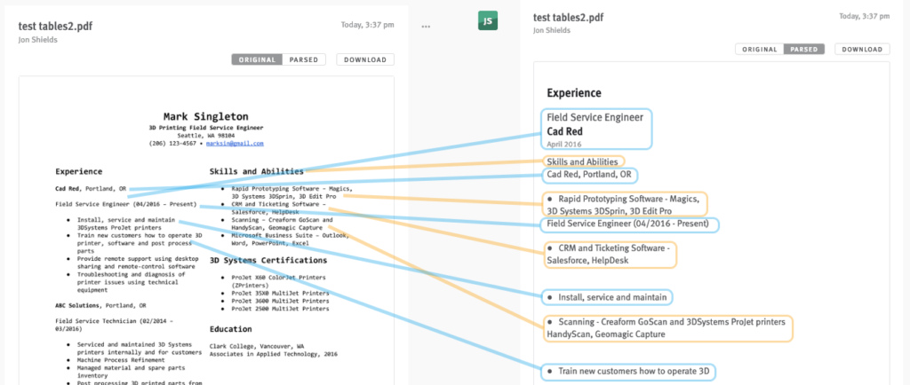
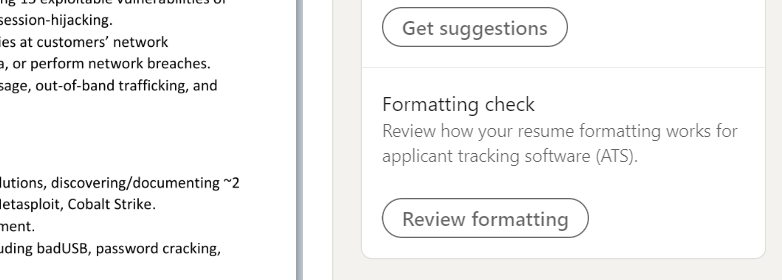
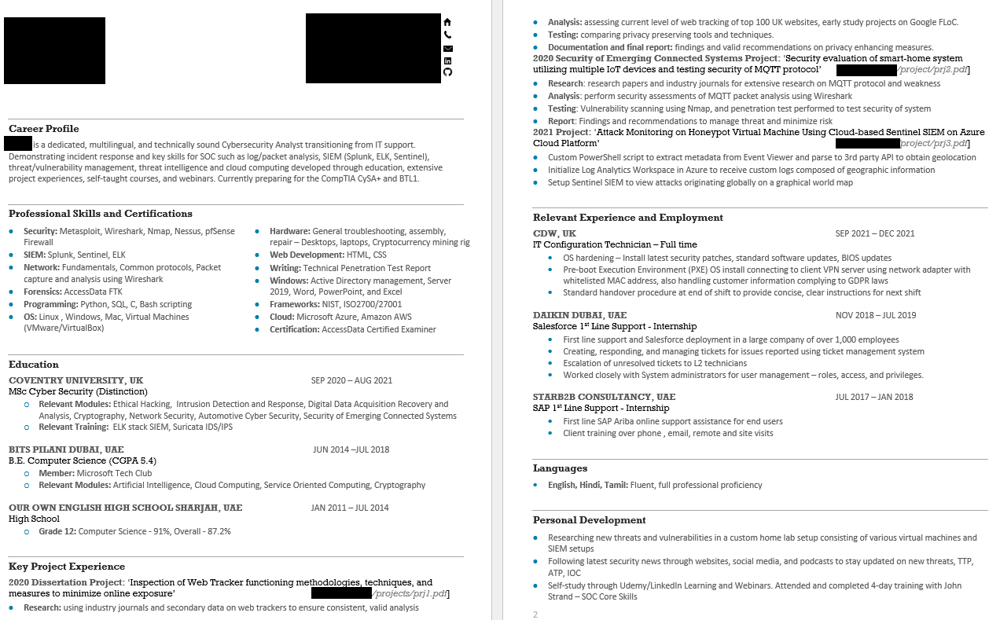
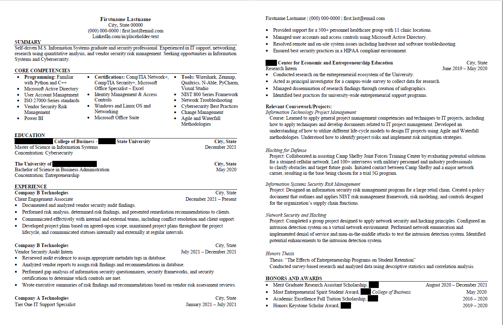
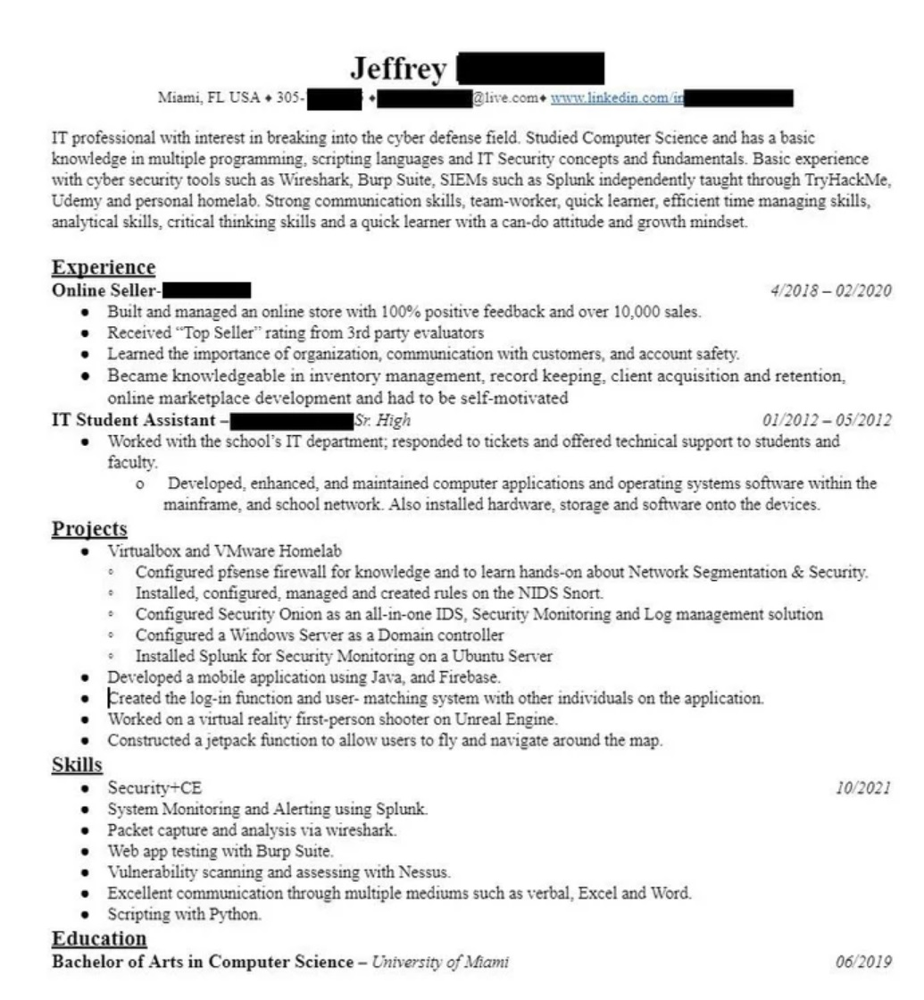
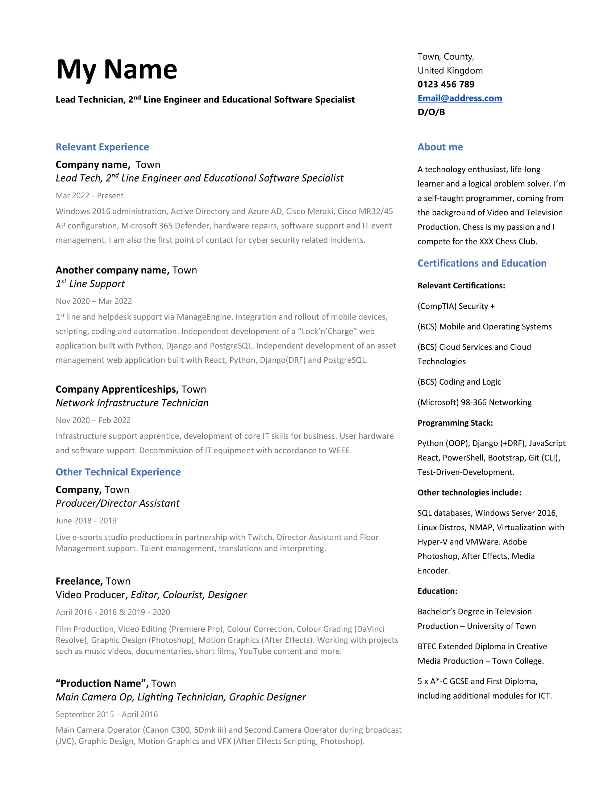

Writing an effective resumé doesn’t come naturally for many people. It’s also really easy to write a bad one. Therefore, it’s important that you set aside some time to deliberately go over yours. Failing to appropriately draft your resume doesn’t simply put you at a disadvantage, it can potentially remove you altogether from consideration before any human eyes have even seen it.

In the post below, I’ll go over some of the steps you can adopt in crafting your cybersecurity resume. I’ll also cover some of the common mistakes I see in resumes for you to look out for in yours.

## ATS-friendly formatting

If you haven’t built a professional resume recently, you may be unfamiliar with Applicant Tracking Systems (ATS). Most large companies and recruiting agencies don’t rely on manually parsing through the hundreds of resumes they receive for every position they open-up. Instead, they utilize ATS software to automate the process of ingesting, parsing, and flagging resumes that match the qualities they’re looking for.

_Example of how a multi-columned resume can get processed by ATS_

When choosing a resume template, you want to make sure that your format can reasonably be expected to be appropriately handled by ATS.

**ATS-friendly formats use:**

* Microsoft Word or Google Docs to create and edit the resume, not photoshop or other graphic-editing software.
* Final drafts in \*.pdf formats in order to retain your formatting, which can be saved/exported from MS Word and Google Docs. Submitting in editable formats (\*.doc, \*.docx, \*.txt) leave open the potential for your resume to be inadvertently altered before a human sees it. Other non-standard formats (\*.html, \*.rtf, \*.svg, etc) are neither expected nor advisable.
* Empty header/footer sections; squeezing in extra sections in these areas of the page can cause complications, especially if you shift your first/last blocks into these areas in an effort to conserve space.
* Standard linear layouts vs. table-separated columns; tables can result in all kinds of ingestion errors, such as incorrectly pulling from wrong portions of the resume, missing blocks altogether, or producing unsearchable keywords.
* Use common fonts (Times New Roman, Tahoma, Verdana, Arial, Helvetica, Calibri, Georgia, Cambria, Gill Sans, or Garamond) and size 10 or larger text.
* Adopt predictable headings/orderings; ATS is looking for typical block areas, such as “Education” or “Work Experience”, not “Level-ups” or “Previous Tasks”. Ordering of blocks is typically your contact information, summary, skills, work experience (or alternatively flipped in position with education), education, projects, and certifications; it’s important to note that not every one of these sections necessarily needs to be included in your final draft. Headings may be different sizes (and even different colors) but should not be different fonts or denoted by banners, symbols, or graphics.
* Text only; ATS resumes are free from images, symbols, or graphics. This includes headshots.

After ATS ingestion, it will likely be reviewed at least two (2) more times by human eyes: once by an initial screener (who generally is the first human point of contact in the interview cycle) and at least once more by someone closer to the work. In the first pass, we're talking about a person with a resume pile of hundreds to dozens who needs to narrow down the count to a handful that actually get interviewed. Therefore, the first set of human eyes that look at your resume are generally looking not just for positive qualities but reasons to discard your resume from further consideration.

Humans who glance over English resumes (vs. automated software that ingest/scan keywords) allocate between 6-12 seconds to review your entire document. Their eyes follow a kind of “F-pattern”, seen in the heatmap below:

_Heatmap study showing where a screener's eyes were focused the longest_

The key takeaways from this research are: lead with your most important/relevant/impactful information and be succinct.

Only after ATS and the first human pass will anyone potentially bother to read your resume in-depth. Bear this in mind as you are fleshing out your resume.

## Resume Content Guidance

Cybersecurity is rooted in engineering as a discipline. There’s a number of terms, phrases, and experiences which are generally expected/understood. Moreover, there are some unique aspects and qualities of technical resumes that should likewise be observed.

Let’s step through some of the common blocks that typically make up a resume.

### Professional Summary (“Summary” or [Job Title])

A professional summary brings upfront the most important and impactful facets of your resume, highlighting your best traits for a human reader to quickly pick up on. Your summary is also an excellent opportunity to explain away facets that wouldn’t otherwise be plainly apparent (such as a work history gap as a result of stay-at-home parenthood, illness/injury, career change, etc.). It’s generally most useful for interviewers who may or may not have time to prep ahead and read over your entire resume.

However, professional summaries are the most frequently misused sections of a resume.

* I frequently see people add erroneous filler text which doesn’t inform the reader whether you are any more qualified than the next candidate. Example includes text like: “Aspiring, down-to-earth performer with a passion for cybersecurity,” which doesn’t provide anything of substance.
* I see too much implied information which the interviewer can gather from context. Example includes text like: “Looking to apply technical skills in an InfoSec capacity,” which is assumed by virtue of the job application.
* People excessively stuff content into the summary, making it a kind of over bloated mini-copy of your resume.

> [!TIP]
> Personal bias: I think a properly formatted resume can speak for itself. Since the people who primarily benefit from a summary are your interviewers, this is a section that you can afford to cut altogether; your interview is a whole separate opportunity to vocalize and highlight your best qualities (with many of them starting with a kind of brief summary anyway). Cutting this section helps conserve page space, which is a constant battle in trying to limit your resume to the standard 1 page length.

### Skills

Choosing the right skills to put on your resume can be a straightforward way for getting past rudimentary ATS configurations. Ostensibly, they are opportunities for you to list out a number of keywords to match against the given job listing. Hitting enough of the prioritized keywords can rack-and-stack your resume in a better position relative to your fellow applicants.

When trying to build out your skills block, start by listing the tasks you complete daily, weekly, and monthly. Then walk through your methodology for each task and list the techniques and technologies used to complete each one. While soft skills (“Adaptability”, “Communication”, “Leadership”, etc.) are okay, your cybersecurity resume should highlight more of the hard skills wherever possible; your soft skills are more readily demonstrable in the course of your interviews.

Your final list of skills for inclusion in your tailored resume should match as close as possible (verbatim) with keywords pulled from the actual job listing.

Your format for your skills block can adopt a number of layouts.

1. **A Bulletized List**: the most straightforward way to list skills. It’s also one of the most space-expensive in a standard linear layout, since you’re dedicating a handful of words for each newline drop. You might consider inviting some risk and using a table for exclusively your skills bullets, but you’re still inviting a non-zero amount of ATS risk in doing so. An example of what this might look like below:

_Example of a multi-columned skills block_

2. **A comma-separated list, sorted by category**: this is similar to the previous listing but instead of dedicating 1 skill per bullet, you list a category of skills per bullet and follow it with a list of related skills. An example might look like:

* Software development (PHP, Javascript, CSS, HTML, Node.js)

3. **As a comma-separated addendum to the bottom of a work experience entry**: in this case, you’d append a line like the following after listing out all of your impact bullets: “Additional skills used: malware analysis, forensics, reverse engineering.”

> [!TIP]
> ATS software generally doesn’t care where it finds a keyword, just so long as it’s eventually found. This means you can get away with merging your skills keywords into other areas of your resume (vs. having a dedicated section), such as in your work experience or projects blocks. Doing this also has the added benefit of providing context around your skills, informing a reader not just HOW you used them but to WHAT EFFECT. 

## Work Experience

In the long-term of your career, this block is going to be the most substantive and most impactful. Year-over-year, cybersecurity employers consistently give the most weight to an applicant’s relevant work history. It’s important then that you convey this information appropriately.

Typically, your experience block is split up into subsections delineated by each job you’ve held, with jobs listed from most recent (top of the block) to least (bottom of the block). Every job should include the following information:

* Company or Organization
* Location
* Job Title
* Start and end dates
* Descriptive impact/accomplishment bullets

Here is some general guidance on drafting up your job subsections:

* If your employer is notable (ex: big tech, government, etc.) or you are listing series of promotions, it’s generally appropriate to list your employer first, then your job title(s).
* Space permitting, it might be better to offset the alignment of your start/end dates to the right of the page to improve readability.
* Don’t simply copy/paste your job description into your bullets; your prospective employer(s) are not interested in comparing job descriptions. They want to know if you can do the job they listed.
* Wherever possible, your impact/accomplishment bullets should include [quantifiable metrics](https://smetrics.lavenix.com/) in terms of hours, endpoints, tickets, incidents, dollars, etc. Saying “Actioned user incidents” is not nearly as impactful/informative as “Responded to X incidents on average per week across an enterprise Active Directory network of over 200+ end-users, including account lockouts, trojan viruses, and phishing emails.”
* We generally want to write more than just our responsibilities. We want to write how you achieved these functions and to what effect. In other words, were you any good at your job?
* Remember that you are applying for a cybersecurity position, not another IT/Software role. Many applicants make the mistake of retaining bullets that that aren’t representative, meaningful, or tailored to the roles that they are applying for (although you should certainly be proud of your accomplishments!). Ask yourself: will your employer care that you did X? Will they have heard of Y? Present your bullets in security contexts wherever possible.
* Limit the number of bullets you include for each role to no more than 5. Recall the “F-pattern” comment from above; given how briefly a human reviewer will glance over your resume in the first pass, they might read parts of bullets 1 and 2, but they aren’t getting to bullet 8 through 12. * Order your bullets to have the most impactful ones towards the top of their respective lists.
* It’s not necessary to include every job you’ve ever held. This is a tailored resume, not a CV. If you have a long work history – even one that includes relevant technical experience – the most pertinent experiences are going to be the most recent ones, not the techniques/technologies you haven’t used in over a decade.
* Ensure your verb tenses are consistent. In most cases, I encourage you to adopt the past-tense verb (“Actioned” vs. “Action”). Some people opt to use the present tense for their current position only, which is also appropriate.
* Avoid using verbs like “Assisted…”, “Helped…”, “Collaborated…”, “Worked with…” to describe your accomplishments. It dilutes your accomplishments and is suggestive that at least some of your work is attributable to other people. Your prospective employer is wants to know what you are capable of, not the team you worked with.

### Education

Education sections are expected to include degrees and diplomas. If you are a student or recent graduate and lacking a strong work experience block, you would be excused in ordering this block above your work experience.

Entries in your education block typically include:

* The degree conferred/working towards (AS, BS, MS, PhD).
* The major area of study
* The [month, year] the degree was awarded or the estimated date if still a student (ex: “Aug 2022 (est.)”)
* The college/university.

The most common errors in an education block include:

* Allocating too many lines to convey the above information; you don’t need 1 line for each of the above bullets – doing so would just take up too much space.
* Including high school diploma when you have a university education. If you have attended university, you can drop the high school diploma from your resume altogether. You may consider the same with regard to Associate’s degrees, assuming your Bachelor’s degree is in the same subject (this is a personal decision, your call).
* Tacking-on trainings and certifications. These should really be reserved for a dedicated Certifications block, although you might consider this exception if you only have 1 certification.

> [!TIP]
> Personal bias: I generally don’t think you should bother including your GPA or extracurriculars in this block. I certainly don’t think you should if you have graduated; generally speaking, in our industry such facets aren’t pertinent to the jobs you are applying for outside of academic positions and maybe internships.

Most of the time, I discourage applicants from listing relevant coursework for many of the same reasons I don’t care for for “Skills” sections. Your prospective employer isn’t going to have context as to what you did in those classes nor are they going to audit your coursework. It would be okay to link your thesis (if you have had one in your program), but that would probably be more appropriate in your Projects block.

### Projects

Listing projects on a resume can help you in a myriad of ways. They provide you an independent opportunity to display your professional expertise; they create added spaces to work in ATS-flaggable keywords and buzz-terms; they add a layer of engagement, suggesting a CV with depth. There’s a lot of benefits.

There’s also a lot of ways to drop the ball on incorporating them into your resume, so it’s good to apply some deliberate effort on how to craft this section.

As an optional block in your resume (one that is often dropped as your work history matures), you should include at least two (2) projects you have contributed to, outlining your key contributions. You should also always provide a link to an external resource, such as your Github or website, in order to allow the reviewer to follow-up and learn more about the project.

Formatting-wise, you should typically adopt 1 of 2 layouts:

**Layout 1**

Project Title

A brief, paragraph-organized summary of the project, the technologies and skills used, and its functional purpose. No more than 1-2 sentences.

**Layout 2**

Project Title

\* A bulletized list format, wherein the first bullet provides the summary of the project, the technologies used, and the skills applied.

\* Your second bullet should denote the outcomes/impact of the project (ex: “Downloaded 200,000+ times in the first month since publicly made available on Github.”)

### Certifications

This block is relatively straightforward. You’re going to include your pertinent certifications relative to the role you are applying to. This means you should lead with the certifications you’ve attained that are explicitly named in the job listing (or potentially cut-out less impactful/pertinent ones to save space). Absent that, list them in either chronological order or in order of pertinence.

Space permitting, each certification should include:

* The name of the vendor.
* The long- and short-form names of the certification.
* The date acquired or renewed.

Example: “CompTIA Network+ (Net+) Aug 2022”.

Any certifications you list should have a means for verification. This typically means providing the appropriate certification number / verification URL either directly in your resume or – more often – in your LinkedIn profile.

Cybersecurity certifications are handled in binary conditions: you either have them or you don’t. Studying for a certification, scheduling a certification exam attempt, having ‘equivalent knowledge’, etc. is all the same as not having the certification. If you don’t have the certification, don’t list it. You’d be better off mentioning in your interview something to the effect of, “By the way, I’m not sure if it matters but I’m scheduled to sit for the [certification] exam on [date]”. It should go without saying, but don’t list certifications you don’t actually have and cannot verify in a background check.

Bootcamps, university certificate programs, and MOOCs are also appropriate to list here, but they should either be delineated in their own subsection within the block or listed last.

## Other General Rules of Thumb

### Tailor the Resume

If you really want to maximize your employability to convert applications to interviews, you’ll need to make sure that your resume is tailored to the role you are applying for. A generic resume simply isn’t as strong, and a resume more broadly littered with general cybersecurity themes is less impactful than one specifically fitted to a particular role.

> [!TIP]
> Tip: Since tailoring for dozens (or hundreds) of roles can be a drag to do (and very tedious), you can help yourself out by doing some research.
1. Collate a handful of jobs of the same type (e.g. 3-5 “SOC Analyst” roles from different employers) from sites like LinkedIn or Indeed.
2. Copy and paste them into a *.txt file and upload it into a [word/phrase frequency tool](https://www.online-utility.org/text/analyzer.jsp).
3. Incorporate those keywords into your “generic” template resume.

### Page Length

For almost every person that’s out there, your resume should not exceed 1 page. Notable exceptions include particularly stellar candidates, applications that expressly ask for a CV vs. a resume, and U.S. Federal Resumes (which have their own template you should follow instead of this post’s advise). Broadly speaking, a 2+ page resume does more harm then good, since most often people water-down their best content across multiple mediocre pages rather than refining one really good one.

### Deliver Value

Treat every word in every line on every page as needing to deliver as much value as possible. With limited space across pages, the opportunity cost of including any given word is the exclusion of every other word in that same space. Avoid redundancy & repetition and lean into implied knowledge. One notable exception: some ATS systems give added weight to defined Years of Experience (YoE) based on the number of times the keyword appears in your resume; when tailoring, it may be appropriate to have keywords that appeared in the job description re-appear elsewhere.

## Other Useful Tools

* The Resume Worded tool is great for gleaning insight on how your resume might be perceived by ATS.
* LinkedIn has a tool for you to see how their basic ATS system ingests your resume. Getting to it is a little contrived, so I’ve outlined the steps below:

From your LinkedIn profile, click on the “More” dropdown menu and select “Build a resume”.

_Build tool_

After uploading your resume and selecting “Next”, click on the “Review formatting” button on the right-side menu.

_Format check_

This will prompt you with a series of pop-ups, showing how their service has ingested your resume.

## Example Resumes & Feedback

Let's go over some examples of some real cybersecurity resumes and how these rules might apply to them:

### First Resume

_Resume 1_

This CV does several things right, including having a languages section. However, there’s a few things they could improve upon:

* The header is mostly empty (unused) negative white space.
* The career profile section contains mostly redundant information referenced elsewhere.
* The professional skills and certifications section runs some limited ATS complications.
* The applicant isn’t a new graduate (they have work recent and relevant work experience), so the education section arguably isn’t their strongest leading asset. It’s also odd to have their high-school education listed.
* The applicant has consumed their entire first page of the CV without having indicated how they have used their skills recently and to what effect.
* They’ve listed the order of their projects from oldest-to-recent (in contrast with their other sections).
* The relevant experience and employment section is lacking in metrics.
* Their personal development section is neither verifiable by recruiters nor quantifiable in impact. It would be better if the content had been incorporated into projects or a “trainings/certifications” section.
* This CV was posted in March 2022; the most recent activity listed is Dec 2021. What have they been up to in that time?

### Second Resume

_Resume 2_

As before, this one also does several things right: they are a new graduate looking to pivot into InfoSec, so leading early in their CV with an education section is great. However, as with the last, there’s room for improvement:

* The header could benefit from being an embedded hyperlink (vs. a URL); it’d also be nice to see their GitHub or blog if they had them.
* The summary section is relatively weak, including both redundant and implied information.
* The core competencies section is awkwardly arranged.
* While they have certifications buried in their core competencies, they could probably better display them alongside or as part of their education section or a non-existent certifications block.
* Since we’re always looking for ways to consolidate a 2-page resume to a 1-page resume, they could afford to avoid repeating “Company B Technologies” twice.
* The relevant coursework/projects section isn’t too bad; there’s actually some interesting content in some of the project descriptions. However, they could probably benefit from cutting the “coursework” and focusing on the “projects”. Moreover, the thesis isn’t relevant to the roles the applicant was applying for and should be cut.
* The honors and awards section isn’t meaningful outside of academic enrollment applications and internships; these should be cut.

### Third Resume

_Resume 3_

Like those before it, this one does several things right! First, they were able to constrain the CV to just one page. They also endeavored to include relevant metrics and keywords in their experience and projects sections. So how could we improve upon this?

* As with the ones before it, the content in the summary section don’t really make the section as a whole worthwhile. If anything, it could be an opportunity to explain the gap in their work history (02/2020 to 10/2021).
* The experience section doesn’t have a whole lot of relevant information (namely, the “online seller” entry). People work with what they have; however, it may be better then to lead with some other (more recent) development, such as certifications.
* The odd duck in the projects section are the last 2 bullets: it’s hard to see how these are relevant to the desired job roles.
* Again, the skills section could probably stand to benefit from rule merging into the rest of the resume to conserve space.

### Fourth Resume

_Resume 4_

As the others before it, this CV has done many things appropriately. They’ve highlighted their work experience prominently, they’ve constrained their CV to a single page, and they’ve created a recognizable block for their certifications. That being said, there is still some room for improvement:

* The “Other Technical Experience” section – while demonstrative of the applicant’s ability of having a diverse range of talents – is not really applicable to an InfoSec job application. You should strive to tailor your CV to each job you apply to rather than cast a single generic CV out and place the onus on the recruiter to make sense of what matters to them.
* The offset column on the right-hand side of the CV suggests that the applicant has used tables (in a program like MS Word) in order to both maximize the content on the page and stylize their CV for a human reader. While these intentions are good, the problem with this is that softcopy CVs are rarely directly processed by human readers. Rather, they get ingested by automated software (otherwise known as [Applicant Tracking Systems](https://www.jobscan.co/blog/20-ats-friendly-resume-templates/)) that re-compose your CV into a format that can be structured for the recruiter’s own database. As such, the [use of table can lead to some mangled/garbled output](https://www.jobscan.co/blog/resume-tables-columns-ats/) on the reader’s end.

## Need More Help?

You can always look to employ a professional CV writer to help with formatting. There's also a number of communities out there that you can reach out to for feedback, such as the [Mentorship Monday cybersecurity subreddit thread](https://www.reddit.com/r/cybersecurity/) or the [Black Hills InfoSec](https://discord.com/invite/bhis) career-chat channel. You can also look at [some of these ideas for help with getting started]() in InfoSec in building a CV with breadth and depth.