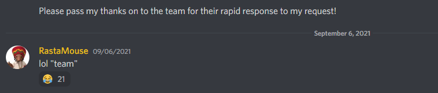

When I got interested in a career in offensive cybersecurity, [I looked around for some resources that would help train and develop my technical competencies](). Besides some of the obvious big-ticket items – such as Offensive Security’s OSCP certification – I quickly zeroed-in on Daniel Duggan’s [Certified Red Team Operator (CRTO) certification](https://training.zeropointsecurity.co.uk/courses/red-team-ops).

Duggan, more widely known in cybersecurity by his alias “[Rastamouse](https://twitter.com/_RastaMouse)“, has contributed to a variety of great training offerings such as [HackTheBox’s RastaLabs ProLab](https://www.hackthebox.com/newsroom/prolab-rastalabs). Unlike RastaLabs however, the CRTO is his brainchild: he is the course’s developer, maintainer, and champion, responding to all sorts of questions in [the course’s accompanying Discord channel](https://discord.gg/64DWZZvK).

## CRTO Training Material

The CRTO comes with lifetime access to its training materials; this alone is great due to the fact that the training materials are updated periodically with modern attack methodologies. The materials are broken into 26 different modules covering areas including (but not limited to):

* External Reconnaissance
* Host Persistence
* Kerberos
* Active Directory Domain Dominance
* and more!

Unlike my [previous certification/training which focused on identifying/exploiting vulnerabilities in web applications](), the CRTO focuses instead on attacking an Active Directory environment using a Command & Control (C2) platform. More specifically, you’re taught how to use Cobalt Strike – one of the premier C2 platforms used by professionals today. Even better, you’re taught how to actively avoid detection and bypass defenses. This shows you not just how to use your tools but why. As if that wasn’t enough, Duggan has gone out of the way to also provide an ELK-stack for you to see for yourself how your attacks would be tracked, flagged, and logged by a defender.

Accompanying the training material modules is a pay-and-pause lab environment, complete with a license of Cobalt Strike. The payment plan means you can learn at your own pace: spin up the lab, work through some of the modules’ content, then tear it down when life’s responsibilities pop-up; you only consume your paid hours while the lab is active (and it’s relatively cheap to add more hours to your lab time if you need them).

The lab environment is self-contained in an [Apache Guacomole](https://guacamole.apache.org/)-served browser gateway. This means everything is provided to you and accessible through your own web browser; no need to manage VPN connections or download/install any software. Just start your lab and get to it.

## Minor Issues, Great Value

While the content from the CRTO is phenomenal, the lab environment is easily accessible, and the Discord community is active and thriving, there are a number of issues that I experienced.

Most of my problems are ultimately tied to the supporting infrastructure that the CRTO is served on: Snap Labs. At the time of writing, your Snap Labs instances will automatically stop running after so many hours; this – I imagine – was intended as a means to prevent someone from burning too many hours of lab time if they were to forget to stop their lab and walk away from their computer. However, if – like me – you were in the middle of stepping through a really complicated portion of the lab, it was quite frustrating. Author’s note: Duggan reached out after publishing this article and informed me that the auto-shutdown can be mitigated by refreshing the dashboard periodically.

Another issue that manifested was some perceived bugs in the lab machines themselves; while in most cases problems I encountered were the consequence of (my) user error, there were a handful of instances where things simply didn’t work…until they did work. There really wasn’t much rhyme or reason as to why. This manifested once during my exam, which I could understand being a really huge source of friction for others who might fail because of such a circumstance.

Finally, while this course is truly a testament to the hard work that Duggan puts in, he is also the sole person responding to inquiries, trouble tickets, etc. This makes him the single point of failure for responding to any trouble you might be experiencing throughout your lab and exam. I greatly appreciate his dedication/effort, but anyone considering engaging with this work should be mindful of how thin the underlying ‘staff’ is to respond to problems.

## CRTO: The Exam

As with other certification exams, I won’t disclose any particular details concerning the exact content of the CRTO exam. Any of the contents discussed below are public knowledge shared through the website or by Duggan himself on the Discord channel.

Purchasing the course includes a voucher for one free exam attempt (with subsequent exam attempts priced at about $150 each). Exams can be scheduled within hours of your purchase, if desired.

Your exam, once purchased and initiated, is accessible through the same SnapLabs dashboard as the your course content. You’re given 48 hours of exam lab time divided however you like across 4 calendar days. This means you can pause your exam and tend to life’s responsibilities at any point throughout your 4 calendar day exam window; like HackTheBox’s CBBH exam, it’s great to be able to tackle these tests fully-rested and without the arbitrary time pressure. I found that the time that was afforded for me to take the exam was more than fair.

In order to pass the exam, you must find 6 of 8 ‘flags’ stored across the various machines in the exam environment. You can reasonably expect that the course’s contents are well-aligned to the exam. However, that doesn’t mean you won’t have to occasionally apply some rational analysis to problems that are slightly altered.

## CRTO vs. OSCP

Some people draw parallels between this exam and Offensive Security’s OSCP. Having passed both exams, I can say that there are certainly some aspects to this training/certification that will feel similar. Both cover Active Directory enumeration/lateral pivoting, both exams take over 24+ hrs to complete, and both are very technical certifications. However, unlike the OSCP, the CRTO:

* Expects you to utilize and become familiar with the Cobalt Strike C2 framework.
* Prohibits the use of external tooling; the SnapLabs environments do not have external internet connections, so you must work with what Duggan has provided on the machine instances.
* Doesn’t delve into exploit development.
* Emphasizes best practices, with techniques deliberately chosen for the purpose of teaching evasion and stealth (vs. more noisy, amateur approaches).
* Is more cost-effective.
* Is less stress-inducing; having 4 days (vs. the OSCP’s 24hr testing + 24hr reporting windows) to execute the exam provides greater flexibility of the student to get other things done and work the problems with a well-rested mind.
* Is less impactful on one’s employability; while the CRTO is certainly going to be a boon to my core competencies in the offensive space, it’s small footprint in the greater certification market isn’t likely to be recognized or appreciated.

## Closing Thoughts

Duggan’s course has a lot of great information to learn. A painstaking amount of effort has been made to contextualize the use of tools, to introduce someone to using Cobalt Strike, and make the whole experience more conducive to learning. The CRTO has incredible value-add to someone’s individual cyber skillset.