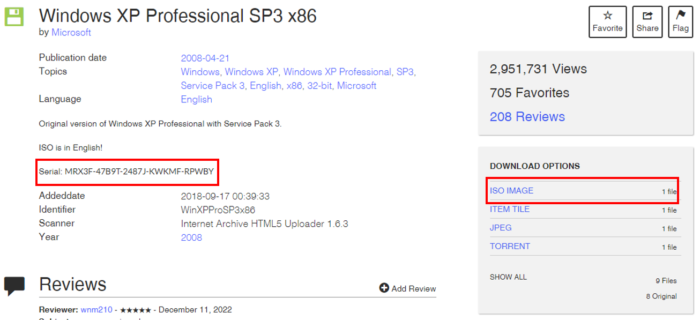
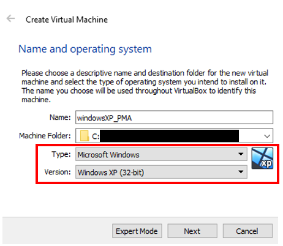
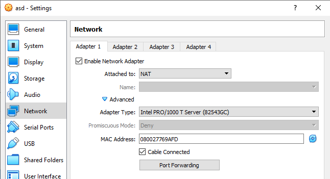
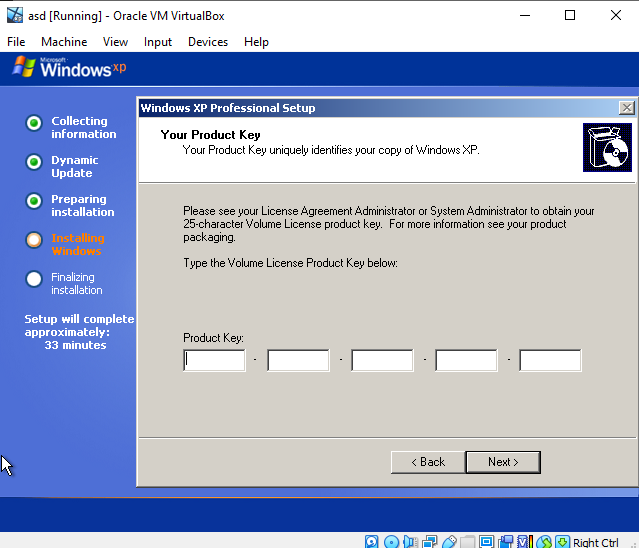
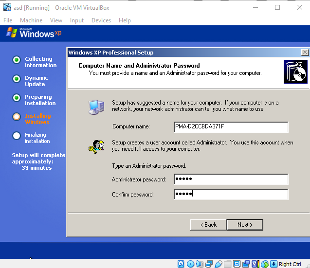
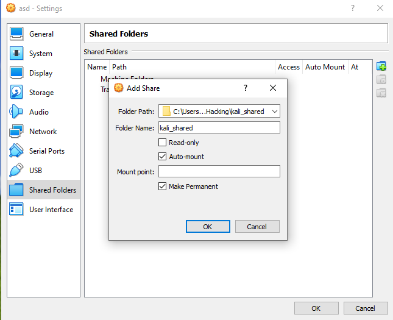
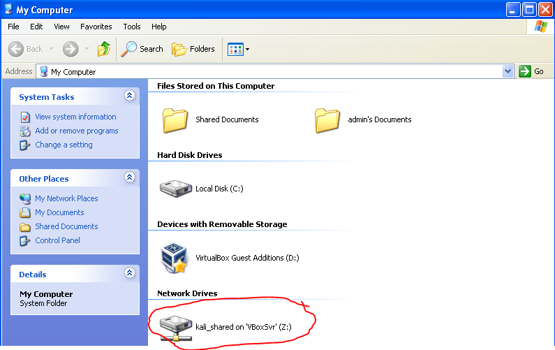

This post is going to be a deviation from my usual topics; I’m in the midst of stepping through the Practical Malware Analysis book cover-to-cover and found one of the earliest steps – setting up your environment – to be laborious enough to warrant some documentation.

This will be a step-by-step for how I got my “victim” Windows XP machine running. Note: these instructions assume that you already have Virtualbox installed:

## 1. Download Windows XP

Through Google and other searches, [I found an archived copy of Windows XP stored here](https://archive.org/details/WinXPProSP3x86). We’ll be downloading the *.ISO file. Note the Serial key that’s listed:

_Screenshot showing the serial key and ISO file download link_

> [!NOTE]
> I found later versions of VirtualBox really struggled with setting up this VM ISO in 2025. I've since shifted to importing [the OVA setup here](https://github.com/lucianoferrari/winxpimage). However, this OVA does throw an "Error loading operating system" error; this can be resolved by resizing the VDI and VMDK files post-import, respectively:
>
> `vbox-img.exe geometry --filename "C:\Users\Asa\VirtualBox VMs\vm\Windows_XP_Professional-disk1.vdi" --format VDI --cylinders 5874 --heads 255 --sectors 56`
> 
> `vbox-img.exe geometry --filename "C:\Users\Asa\VirtualBox VMs\vm\Windows_XP_Professional-disk1.vmdk" --format VMDK --cylinders 5874 --heads 255 --sectors 56`
>
> ...where `vbox-img.exe` (in Windows) resides in `C:\Program Files\Oracle\VirtualBox` by default.

## 2. Create a new Windows XP VM and mount the ISO image

Within Virtualbox, select the Machine dropdown menu and click New. Give the new VM an arbitrary (but recognizable) name and select the following values:

_Highlights of the appropriate settings for the new Windows XP VM_

For now, I left all the default settings for the box; much of what’s allocated can be altered later.

After the VM is instantiated, we’ll mount the ISO file by

1. Selecting our VM and clicking the Settings button
2. Clicking on the Storage menu
3. Selecting the “Empty” storage device
4. Clicking on the blue Disc icon dropdown menu and choosing “Choose a disc file”
5. Selecting our ISO image

_Demonstration of steps 1 through 4_

Afterwards, you’ll also want to ensure your NAT network is configured appropriately (in order to download other tools to the machine). Specifically, we want to ensure that your **Adapter Type is Intel PRO/1000 T Server (82543GC)**. Per the documentation:

> [!NOTE]
> Windows XP recognizes this adapter without installing additional drivers.
>
> [6.1 Virtual Networking Hardware](https://www.virtualbox.org/manual/ch06.html)

_Our network configuration; note the adapter type._

## 3. Boot up the VM and install the OS

After configuring everything in the previous step, Start the VM.

For the most part, we can just go with the default options that appear in the course of installation. Eventually, we’ll arrive at a screen that looks like this:

_The product key screen_

At this juncture, we want to enter the Serial Key that we noted back in step 1.

On the very next screen, enter in an appropriate Administrator password:

_Administrator password_

After this, continue going along with all of the default installation options (skipping over anything requiring you to register or check for updates; Windows XP is very, very old) until you arrive to this screen:

_User registration_

On this screen, we just need to register the username for our account. In this case, I've gone with "admin".

## 4. Get internet connectivity established

The version of Internet Explorer that ships with Windows XP is so old that it can’t really browse the modern internet with TLS/SSL. To that end, we’re first going to install Virtualbox’s guest tools by select the **Devices** dropdown menu, then **Insert Guest Additions CD**. Navigating to **My Computer** will then show the tools ready to be run as **Virtualbox Guest Additions**:

_Screenshot showing the guest tools staged_

Double click the tools to install them. Occasionally, we may come across error messages like this:

_Screenshot of the guest tools software installation error_

Just ignore the message and click “Continue Anyway”. This is likely to pop-up several times until installation is complete. Upon finishing, click “Finish” and allow the VM to reboot.

Having installed the tools, we’re now going to create a shared folder which we’ll use to pass content from our host machine to the Windows XP VM.

_The configuration settings for our shared folder_

Navigating to My Computer should show the mapped folder as a Network Drive:

_Screenshot of the shared folder as a mapped drive_

On our host machine, we’re going to go to this URL:

[https://download-origin.cdn.mozilla.net/pub/firefox/tinderbox-builds/mozilla-esr52-win32/1487881102/](https://download-origin.cdn.mozilla.net/pub/firefox/tinderbox-builds/mozilla-esr52-win32/1487881102/)

and download the installer executable.

_The particular installer executable to download_

We’ll move the executable to our shared folder and run it from the mapped drive in our Windows XP VM:

_Screenshot of the installer executable on the VM_

Perform all of the default installation steps, and you’ll now have a VM with internet connectivity and a web browser!