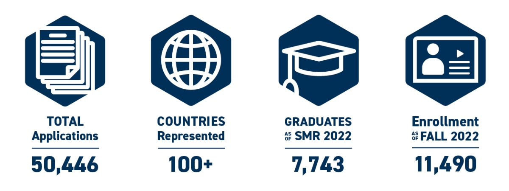

I'm finally graduating from [Georgia Tech's Online Master of Science Computer Science (OMSCS)](https://omscs.gatech.edu/home). For those of you interested, I've summarized my venture below (including pre-application preparatory actions for the many prospective students who lurk about [the subreddit](https://old.reddit.com/r/OMSCS/)). For those of you wanting to jump straight to the course impressions, skip down to the "OMSCS COURSES TAKEN & EXPERIENCES" section; for those of you wanting a more broader take about the program as a whole, skip down to "REFLECTIONS". You can also skip all the way to the bottom to "OUTCOMES" if you just want to know the pre- and post-OMSCS impacts.

## **BOILERPLATE GENERAL INFORMATION**

In an effort to be helpful to those getting oriented to the program in general, here's a list of resources that you may find value in that I personally referenced relatively frequently:

* [List of associated Slack Channels and amplifying info for classes](https://docs.google.com/spreadsheets/d/e/2PACX-1vRyHrRhH2V52bsYFEtm-8oJDaFOlyGYz6AKXm8WwsthN3fNP3KGkEx7O7D9ZHV3j2iKnzU2XHqoh4pQ/pubhtml)
* [Historical data for when select courses have been (not) available semester-by-semester.](https://omscs.gatech.edu/sites/default/files/documents/Other_docs/historical-course-offerings-sp23.pdf)
* [The list of courses currently offered by OMSCS](https://omscs.gatech.edu/current-courses)
* [List of course abbreviations/shorthands](https://www.reddit.com/r/OMSCS/comments/hiqlf8/course_abbreviations_cheat_sheet/); these help explain what abbreviations like "GA", "DC", or "IIS" mean, for example.
* [The GaTech Academic Calendar](https://registrar.gatech.edu/calendar/)
* [Peer reviews of OMSCS courses](https://www.omscentral.com/)
* [Alternative option for peer reviews](https://www.omshub.org/).
* [GaTech IT status conditions](https://status.gatech.edu/); as an online student, it's helpful to understand when an outage is taking place (vs. your own user error).

## **APPLICATION/ADMISSION**

Prospective applicants frequently get hung-up on the minutiae of their program application. There's a lot of "am I good enough" or "is this program right for me" -type questions that get asked. In service to those concerns, I want to be transparent with where I was and the steps I took in order to feel qualified as a candidate; my hope is that this context can help inform you of your own next steps if you're considering applying. While I'm not a member of GaTech's admissions staff (nor do I have any real insight into the process that goes on therein), my hope is that this transparency serves to help level-set applicant expectations (especially for those coming from an entirely unrelated, non-STEM -based background like mine).

At the time I learned of OMSCS, my applicant profile could be summarized as:

* Prior U.S. military, unrelated non-technical job function.
* B.A. undergraduate degree in the social sciences (namely: Political Science)
* 12 years since having last engaged academic math coursework
* 8 years since having completed undergraduate degree
* Married (first child born just months before start of 1st semester of OMSCS)

I was moving on from active duty military service in an effort to focus on family life; I had determined that I wanted to pivot my career into Tech more generally, but hadn't really understood what that meant at the time. Of the options available, I thought a Masters degree would be preferable, but I knew that there'd be some significant upfront work needed before I could pursue that. My (tangentially) pertinent undergraduate coursework included:

* Precalculus [2008, grade: B], as a high school student enrolled in preemptive university coursework.
* Computer Engineering Ethics [2009, grade A-], a course that was heavier on the philosophy of decision-making than anything technically substantive.
* Intro to CompSci [2009, grade B+], which I don't remember anything about, outside of the wood panelling in the lecture hall looking neat.

Based on information available from the program and other student posts/blogs, I settled on enrolling in [ASU's online Software Engineering undergraduate program](https://asuonline.asu.edu/online-degree-programs/undergraduate/bachelor-science-software-engineering/) as an intermediary step. I also managed to pickup work in a cybersecurity Governance, Risk, and Compliance (GRC) position for a DoD contractor. The coursework I took to prepare for OMSCS through ASU included (in order):

* Principles of Programming [grade A]
* Object-Oriented Program & Data Structures [grade A]
* Calculus for Engineers I [grade A]
* Calculus for Engineers II [grade A]
* Intro to Programming Languages [grade B+]
* Modern Differential Equations [grade A]
* Applied Linear Algebra [grade A]
* Discrete Math Structures [grade B+]
* Computer Systems Fundamentals [grade A-]
* Computer Organization & Assembly Language Programming [grade A]
* Design & Analysis of Data Structures and Algorithms [grade A]

My application statement of purpose was something to the effect of exploring the intersectionality of cybersecurity with emergent AI techniques as a means of addressing the ongoing staffing shortages reported in industry. My letters of recommendation I requested included one from my immediate supervisor, one from my manager, and one from a former military officer I reported to (however, I have reason to believe one of my references never sent their letter). I had not maintained contact with any of my former professors from my undergraduate program and I felt my online-only ASU instruction would be too impersonal to request a letter of rec from. If you're really hurting for letters, you could do worse than [getting one from Dr. Joyner himself](https://old.reddit.com/r/OMSCS/comments/173fow3/georgia_tech_omscs_hard_to_get_into/k4357h3/) (the [executive director of OMSCS](https://www.cc.gatech.edu/people/david-joyner)) by enrolling in his "[Introduction to Python Programming](https://www.edx.org/professional-certificate/introduction-to-python-programming)" course.

After being admitted into OMSCS, I suspended my enrollment at ASU indefinitely. I wanted to highlight ASU due to its acceptance of me as a post-bacc applicant and its online asychronous course delivery; however, I recognize that there are many alternatives available to applicants that may be preferrable, more affordable, more accessible, etc. (popular options named on the OMSCS subreddit include Foothill College and Oakton College, for example - although I cannot testify to their offerings). One of the others I had applied to - but was denied from - included [OSU's Post-Bacc program](https://ecampus.oregonstate.edu/online-degrees/undergraduate/computer-science-postbacc/).

As a career-changer from an unrelated, non-technical discipline the preparatory steps I took were - at times - excruciating, especially considering the hiatus in academic mathematics coursework. Making up for both the time and content of the requisite background materiel was a non-trivial, grueling effort. There is some speculation over whether [the preparatory actions outlined by Georgia Tech](https://omscs.gatech.edu/preparing-yourself-omscs) in-and-of themselves would be sufficient; my impression for *my circumstances* was that my application needed to demonstrate that I could stand up to the rigor/intensity of formal classroom instruction - not a MOOC. OMSCS admissions doesn't offer prescriptive transparency about where *your* particular admissions acceptance threshold may be; perhaps I didn't need all of the classes I named above to be accepted - I can only speculate. However, the transformative steps in developing my academic aptitude in CompSci from an entirely unrelated academic/professional background is meant to suggest a path (or at least a baseline) for those likewise wondering if such a venture is possible. The short version: it is, but it's not without significant cost and personal investment, and all of this occurs before you even take your first OMSCS class. You'll have a hard time getting in (and a harder time making it to graduation) if you're not adequately prepared.

## **OMSCS COURSES TAKEN & EXPERIENCES**

Unless otherwise noted, classes were taken sequentially one-per-semester (Fall, Spring, Summer). No semesters were skipped.

1. CS6262 (Network Security [NetSec])
2. CS6200 (Graduate Intro to OS [GIOS])
3. CS6250 (Computer Networks [CN])
4. CS6290 (High Performance Computer Architectures [HPCA])
5. CS6515 (Intro to Graduate Algorithms [GA])
6. CS6035 (Intro to Info Security [IIS])
7. CS6265 (Info Sec Lab: Binary Exploitation [ISL])
8. CS8803 (Quantum Computing [QC]) & CS8001 (Seminar: Usable Privacy and Security)
9. CS6747 (Advanced Malware Analysis [AMA])
10. CS6601 (Artificial Intelligence [AI])

_Graphical overview of my OMSCS experience_

The graphic above is meant to be a succinct summary of my OMSCS experience, including notable life events for context. I tracked the relative amount of effort I felt I had to put in for a class (blue), how happy I was with my course experience (red), how tired I was going *into* the semester (yellow), and how valuable I found the class to be coming *out of* it (green). In brief:

* Generally speaking, I slated easier courses for Summer semesters (CN, IIS).
* I found I was generally happier with my Free electives (ISL, QC, AMA) than my other courses.
* I had more energy for OMSCS earlier on in my program experience than towards the end of it. This was aggravated by life's externalities (chiefly: parenthood).
* As I have worked in cybersecurity throughout the program, I generally found the courses related to such subject-matter less challenging, more rewarding, and more pragmatic.

### 1. CS6262: Network Security

At the time of starting the program, I was already working in cybersecurity. I was anxious about the difficulty of the program and my first child had been born just a few months earlier. Based on the limited courses that were available at the time of enrollment, I picked this up to help ease in. I'm a few years removed from when I originally took it, but I remember enjoying most of the experience. My one stickler was some ambiguity surrounding generating unique XSS payloads to bypass an unknown filter - I had asked for clarity on what was considered sufficiently "unique" and was summarily chastised by a TA. This should be taken as an exceptional instance of TA engagement throughout the program, however; by-and-large, I've had really positive experiences working with the TAs.

> [!TIP]
> **admin note for those unfamiliar with the program:** your seniority grants you earlier enrollment tickets, which means as a new graduate student you're left with whatever's open for your first semester. There's generally a good breadth of offerings still available, but it's worth knowing that you shouldn't have your heart set on any particular course-ordering just in case the class you were hoping for is full by the time your enrollment ticket opens up. Look up the many related posts on this topic, including those mentioning "Free-for-all Friday".

### 2. CS6200: Graduate Intro to OS

As a career-changer, I took to heart some of the guidance offered in this subreddit and determined that the Computing Systems specialty was more to my benefit than the machine learning (ML) path I had originally envisioned. As such, I was really attracted to this course for its repeated descriptions of being a high value-add to non-CS backgrounds. However, this was my first real gut-check to the OMSCS program. I was wholely unfamiliar with multi-threading/concurrency and was immensely perplexed by gRPC. That said, none of the concepts were so far out-of-reach from comprehension that consulting outside materials to understand the technologies couldn't help. It turns out that our peers were right; there is a lot of value in the fundamental take-aways taught by this course. As an external factor, I started a new job during this class, still in cybersecurity.

> [!TIP]
> **admin note for those unfamiliar with the program:** in order to graduate from OMSCS, you need to complete one of the [five "specializations" offered by the program](https://omscs.gatech.edu/program-info/specializations). Each necessitates picking from a limited menu for about 5-6 of your 10 classes needed to graduate, with the remaining 4-5 classes open-ended as your choice of electives from the [CS/CSE/ECE/IYSE offerings](https://omscs.gatech.edu/current-courses).

### 3. CS6250: Computer Networks

Entering a shorter Summer session, I wanted an easier course to compensate. Computer Networks was appropriate. I learned some interesting concepts, applied some algorithms that I had heard of but never really understood, and made concrete various facets of networking that I had been exposed to but hadn't formally been taught. That said, I don't necessarily feel any more competent in Software Defined Networking or understanding BGP and ASNs than I was before I started, but at least I'm more aware that they are a thing. In the list of pros/cons of taking this course, its strongest assets for me were being a comfortable Summer course offering coupled with satisfying one of my Computing Systems specialization requirements.

> [!TIP]
> **admin note for those unfamiliar with the program:** the summer semesters are 4 weeks shorter than the Fall/Spring semesters; some courses cut content to compensate, many do not. Other courses are simply not available to take during the Summer semester; you can view [the program's historical offerings here](https://omscs.gatech.edu/sites/default/files/documents/Other_docs/historical-course-offerings-sp23.pdf) to evaluate the likelihood of its offering a given course in the future. Assuming you don't skip Summer semesters, you would do well to identify a handful of courses ahead of time that can be appropriately held-off for these abbreviated periods.

### 4. CS6290: High Performance Computer Architectures

For me personally, this course was another gut-check. If I hadn't taken GIOS earlier, I would not have as readily understood the concepts that were being talked about. There's a lot of technical abstractions spoken to including caching, virtualized memory, and pagination (that again, I do believe necessary and fundamental to a CS education), which really made things difficult for me. It's not a terribly complex course, but it was a lot for me to learn. I particularly appreciated the distinctions made between multi-processing vs. multi-threading as well as the unit on memory, storage, and fault tolerance; I also got the distinct impression that far more effort has gone into advancing memory and caching than I previously had an appreciation for (i.e. it's a problem domain that people build careers around).

### 5. CS6515: Intro to Graduate Algorithms

I hadn't expected to take this course this early in my course-ordering (many in the subreddit report not being able to get a seat until their 10th and final course), but when it was my time to enroll I got lucky and saw an open seat, jumping on it. I won't extoll anymore than what people have already said about the course - there are many opinions/reviews out there and I share in most of them. The stress (more than the actual difficulty of the class material) is what I remember. As someone who had the unusual opportunity to take it earlier in their program experience, I'd strongly advocate for others to do the same (given the opportunity). I also changed employers during this time, doing the same work but now 100% remote.

> [!TIP]
> **admin note for those unfamiliar with the program:** there are select "bottle-neck" courses for the various specialties in the program that students must take in order to graduate. Because there are no other options around taking them (or because they are so popular), the enrollment demand is incredibly high and most aren't able to secure a seat until they near graduation; see earlier admin note concerning seniority and enrollment tickets. GA is one such class for several specializations, making it very in-demand.

### 6. CS6035: Intro to Info Security

I hadn't ever planned on taking this course, but going into this semester I knew my 2nd child was due to be born around the window of final exams. Knowing this, I wanted a course that would lean into my existing professional expertise and had flexibility around the end of the semester; this granted me both. It was also liberating knowing I'd be completely finished with my [Computing Systems specialty requirements](https://omscs.gatech.edu/specialization-computing-systems) by the semester's end. I actually enjoyed the content, finding it neither overly challenging nor redundant. In fact, I enjoyed the content so much that I applied and was offered a TA position at the end of the semester. But my very-pregnant wife gently reminded me that I worked full-time, was a part-time student, and would have 2 children <= 2yo; I turned down the offer.

### 7. CS6265: Info Sec Lab - Binary Exploitation

Again, I leaned into my professional expertise when selecting this course since I had a newborn on my hands at the start of this semester. I was really excited to be enrolled in this class, since I had long been wanting to develop my competencies with reverse engineering and binary exploitation. This class delivered it in spades. It's also an exam-less class, so I didn't have to exhaust myself in late-night studies for midterms/finals with a baby and a toddler. That said, the course's material is anything but easy, especially if you aren't already familiar with capture-the-flag (CTF) stylized cybersecurity challenges. You're not going to be provided overt instruction on how to do the week-by-week work, the whole point is that you need to figure it out on your own; understandably, those unfamiliar with this kind of format did not handle it well - especially when they were likewise unfamiliar with the tools at hand. I loved it, but it's not for everyone. Incidentally, taking this class in the Fall (as I did) has the semester's 10th and final lab coincide with the [NSA's Codebreaker Challenge](https://nsa-codebreaker.org/challenge) - which in itself was an amazing learning opportunity; of the 4300+ competitors nationwide, [I was one of about 100 that completed the Codebreaker Challenge]() (1 of 19 at GaTech that year).

### 8. CS8803: Quantum Computing & CS8001: Usable Privacy and Security (Seminar)

I had a crisis of class selection going into this Spring semester; at this point in the program I knew that I had 2 full semesters (including this one) and 1 Summer semester left. I had wanted to take ECE-8843 (Side-Channels & Their Role in Cybersecurity), but it [turned out to be unceremoniously dropped from being offered that semester](https://www.reddit.com/r/OMSCS/comments/z27i9l/no_ece8843_sidechannels/) as was CS6264 (Information Security Lab: Network Defenses), which had been my backup (admin note: these courses are still offered through OMSCS, they just were pulled that semester due to low enrollment numbers). I waffled back-and-forth on taking CS6210 (AOS) or CS6601 (AI), but some self-inflection had me realize how tired I was between school, work, and the kids, so I caved on the perceived "easier" option: Quantum Computing. It was a really neat class that - out of all my classes - felt the closest to learning about the bleeding edge; quantum computing has an incredible amount of transformative potential and it was a great learning experience.

Between 1st phase and 2nd phase enrollment I also saw an announcement of a new 1 credit-hour seminar being offered: "Usable Privacy and Security" with Youngwook Do and Yuxi Wu. I had passed over some of the other seminars GTU had offered in earlier semesters - they seemed topically uninteresting and wouldn't otherwise progress me towards graduation any faster. However, this one sounded both manageable and in my wheelhouse. Ultimately, we ended up reading between 2-5 academic research papers each week, meeting together to talk about them the subsequent week; there were also three brief (2 page) papers that we wrote. The biggest incentive I'd name for taking a given seminar are the smaller cohorts: assuming you're interested in the subject-matter, you have an opportunity to critically engage with your peers that you just won't find outside of courses with group projects.

> [!TIP]
> **admin note for those unfamiliar with the program:** currently enrolled students - in addition to having earlier time tickets to pick classes - also get an early window of opportunity (1st phase) to enroll; newly admitted students don't get issued enrollment tickets until the 2nd phase. Students who have already completed a course get issued time tickets for both phases. Check out the [Academic Calendar](https://registrar.gatech.edu/calendar) to get a better understanding of when these phases take place.

> [!TIP]
> **admin note for those unfamiliar with the program:** as of Fall 2021, seminars became a new addition for OMSCS students; seminars go by the course number CS8001, they are 1 credit hour each (proportionally priced w.r.t. tuition), and do not count toward your graduation requirements. They are less formal classes structured around discussing and interacting on novel topics. Some seminars may be repeatedly offered semester-over-semester, but there is no guarantee that any given seminar will be available again in the future.

### 9. CS6747: Advanced Malware Analysis

Entering my final Summer Semester, I was weighing the pragmatism of engaging in more cybersecurity-centric coursework (which was pertinent to my profession) and my personal interest in more inter-disciplinary subjects (e.g. AI/ML topics, which I originally had enrolled in the program for). Pragmatism won out; this course was appealing because - like CS6265 - there are no exams. Being a project-based course made things really pleasant and predictable for planning Summer trips with the family. It also extended what I had picked up on in CS6265, diving immediately into scrutinizing assembly-level code. That said, while the course is certainly doable in the Summer, there just wasn't enough time to meaningfully digest the course's material in its entirety; some of the research papers and lecture content I really wanted to chew-on, but there simply wasn't enough time to do so; time/labor had to be prioritized towards completing the projects. In retrospect, I wish I had allocated a Spring/Fall semester to the course so that I could have engaged it more; I enjoyed the class that much! I also changed employers again, now working as a Sr. Application Security Engineer.

### 10. CS6601: Artificial Intelligence

I really was unsure about getting into this course this late into my OMSCS experience; the reviews and impressions of the course material was a little intimidating, and I felt the strong temptation to simply "coast" out on some more approachable subject-matter. Since none of my other courses really fed-into or otherwise overlapped with CS6601 (e.g. ML4T or KBAI), it was hard for me to evaluate my own aptitude going in. Ultimately however, I ended up going with AI to close out my program experience. The course is consistently quite a bit of work, with the underlying mathematics comprehension and need for numpy-based vectorization optimization escalating as the semester progresses; that said, I did come away with a more general understanding of classical AI algorithms. I ended up front-loading my work, completing the first five projects and abandoning the sixth (the course drops your lowest project grade). This effectively gave me a month off between when I finished project 5 and the final exam, which was nice. I didn't care for how the course was administratively handled; things felt adversarial between staff and students, possibly a consequence of the sheer class size (there were 706 students remaining by my semester's end). Administrative policies aside, I'm not sure this course was the best fit for my broader educational objectives in cybersecurity, nor effectively interesting enough to stave-off the pervasive "senior-itis" as graduation loomed. It had its moments, but I was both leery about enrolling in it at the onset and glad for it to be over when I was finished.

## **REFLECTIONS**

When I was initially interested in OMSCS, I had envisioned a future where I could execute a transformative pivot into performing AI/ML work from my unrelated military career. As life progressed, pragmatism suggested that I'd be better served professionally by emphasizing general CompSci studies more broadly (and - given my career trajectory both then and now - cybersecurity coursework more narrowly). In this respect, the program was less a career-changing lynchpin and more of a means of creating momentum for pre-existing efforts I was already undertaking; I wasn't sold on cybersecurity as being my definitive transition into tech at the beginning of OMSCS (a reason why I did not originally apply to OMSCybersecurity), but over the course of the program through to graduation, I ended up taking complementing classes to that end. This has proven to be practical in my case, but I don't want to discourage those applicants in considering the other specializations OMSCS offers or to the program's efficacy in being able to redirect your own career trajectory (vs. strictly reinforcing it).

I also became a parent roughly around the same time I enrolled into OMSCS. Through that, the pandemic (which also kicked-off at roughly the same time), and both my spouse and I working throughout, we were stretched pretty thin at times. I am enormously grateful for having the support structure at home that I do: my spouse who was always supportive, parents/in-laws to help periodically watch the kids, employers who afforded me the flexibility to action what I needed, etc. In my circumstances, working full-time and having 2 young children didn't make the program prohibitive, but it did have a hand in guiding my enrollment decisions semester-by-semester. Additionally, there were some self-preserving actions I took at times during semesters as well: the pandemic and transition into parenthood were pretty intense experiences during my first semester, so I elected to skip the final exam altogether and start my break early (i.e. taking a 0 on the exam and settling for a B in the class overall); later when I had my second child midway through, I likewise calculated the cutoff score for passing in that class and preemptively haulted my engagement once I met that threshold (although I ended up getting sucked into the NSA Codebreaker challenge, which elevated the overall grade to an A); other examples can be found in my course experiences above. More academically-intensive courses were probably manageable, but would have placed an undue burden on that support structure and my children - being absent both mentally and physically; I think I still got a phenomenal return on my investment in OMSCS, but a number of concessions were made that I think our peers at different points in their lives wouldn't have to.

_Source: https://omscs.gatech.edu/_

Hindsight being what it is, I wish I had taken CS8803 (Compilers), CS6210 (AOS), and CS6211 (SDCC); I think that those courses offer some really phenomenal value to the broader CompSci education; and while I could delay graduation to accomodate, I have access to alternative resources that can help me learn what I want from those courses (just not with the same structure/staff/rigor/support that's available in graduate school). I saw diminished returns in value in CS6250 (CN) and CS6035 (IIS), but they both were irreplaceable at their points in time relative to where I was in the program (being easier Summer semester courses, satisfying my specialization requirements, and - in the case of CS6035 - flexible for family and playing to my professional strengths); that said, I don't regret taking them nor do I discourage you from considering them. They're good courses - especially if you're a CompSci career-changer like myself or otherwise unfamiliar with the material; they just weren't as transformative/enthralling to me in juxtaposition to other courses I took.

The program more broadly speaking has some phenomenal content for instructing you in various CompSci topics. However, it won't hand-hold you through to graduation; most of the courses involved a considerable amount of independent external research, looking beyond the lecture material, reading, etc. But that's a facet of graduate school (vs. something geared more towards the layperson, such as a trade school or bootcamp). If you want it and are able to meet the expectations, it's there for you. Generally speaking, I found my peers that struggled to adapt or complained about the program...

* Failed to adjust their instructional paradigm to align with either the remote nature (the "O" in OMSCS) or graduate-level work-ethic (the "M" in OMSCS).
* Didn't utilize the resources that were made available by staff, including office hours and the assorted engagement platforms, such as the Ed Discussion forums, Slack Channels, Email correspondence, etc.
* Couldn't be bothered to ensure their assumptions about the program aligned with the realities/expectations set forward by staff (i.e. didn't allocate reasonable time windows for responses to questions, didn't read the syllabus or project documentation, didn't begin working on projects/homework until the submission deadline loomed, etc.).

_Screenshot of the Canvas platform, which most courses are administered through_

In juxtaposition to my brick-and-mortar undergraduate experience, being online-only didn't really instill/engender any sense of identity with the school or my peers; I never set foot on the campus, never bought a student ID, and didn't go to the graduation ceremony. I forwarded all of my student emails to my personal account, didn't meet any of our peers/staff in-person, and spent a considerable amount of time looking into external resources outside of buzzport/canvas to supplement the lesson materials. Someone in a job interview once responded to my student status with "Go Yellow Jackets!" and it took me a second to realize that - notionally - I was one. For me OMSCS felt like a distinct, bottled experience; there wasn't anyone in my immediate circles to really talk to about it while I was a student and - when finished - there wasn't anyone interested in talking about it after. Having said that, I will acknowledge that Georgia Tech does *try* to create spaces for more interactive discourse to occur: there are semester-by-semester showcases of student work through the Canvas-based Student Center, nominations for [student spotlights](https://omscs.gatech.edu/student-spotlight-asa-hess-matsumoto), smaller seminar cohorts, etc. Moreover some of the students do [independently make efforts to meet their local peers](https://old.reddit.com/r/OMSCS/search?q=meetup&restrict_sr=on&sort=relevance&t=all). Overall however, these opportunities to network felt superficial and tenuous to me (which undercut my notion that this program really helps with professional networking). That's okay for me, but it may be important for you depending on what you want out of your time in university (in which case, you're probably better off not pursuing an online program).

By extension, my experiences with our online peers - both in my preparatory coursework through ASU and in smaller study sessions with OMSCS - turned me off of [all courses that required groupwork](https://www.reddit.com/r/OMSCS/comments/11ysfea/a_list_of_classes_with_group_work/?share_id=0tLTmCUB4zmLyNp7wCpdt&utm_content=2&utm_medium=android_app&utm_name=androidcss&utm_source=share&utm_term=1). Coordinating schedules across multiple timezones, lackadaisical engagement, and disproportionate/inconsistent buy-in from peers is - in my opinion - too much added overhead on top of the testable learning objectives from graduate school, full-time employment, and life's other demands; the uncertainty of whether or not I'd have a positive experience of a class being based largely on the efforts of other people I'd never met wasn't something I wanted to roll the dice on; even in courses where splitting the work amongst peers was optional (e.g. CS6747), I elected not to do so. All told, I preferred my work to be evaluated for what it was: mine alone. My intention isn't to discourage you from enrolling in courses with groupwork - as there is some really interesting, enriching, and fun content for you to explore (such as CS7643: Deep Learning or CS6457: Video Game Design); moreover, much of the above can be mitigated by coordinating with your peers ahead of enrollment (thereby pre-establishing who you'll partner up with before the semester begins). Rather, I'm just highlighting that my chosen courses were deliberately tailored to avoid them out of personal preference (and that such a path to graduation is possible).

This experience is incredibly demanding of your time and effort; in exchange, you're provided really insightful opportunities to learn about Computer Science and other related tangents, as well as a relatively strong credential to supplement your employability. The courses I enjoyed the most weren't necessarily the ones that instructed me best; conversely, the presence/absence of academic rigor was not necessarily a marker for instruction quality either. Academic intensity necessitated in-depth research, which in turn promoted longer-lasting retention of subject matter; but engagement from staff/peers, cohesion between lesson/exam/project materials, and the impact on my life outside the program - be it personal flexibility or professional pragmatism - was what fostered my interest.

The program itself was also subject to changes throughout the years I was a student:

* Several classes were added, including Quantum Computing, Intro to Computer Law, Digital Health Equity, Global Entrepreneurship, and Natural Language Processing.
* A new specialization was offered (Human-Computer Interaction).
* Seminars were introduced.
* Grade substitution policies were enacted (i.e. how to 'undo' an "F" in a class as it relates to your GPA).
* Changes to the admissions process were made (notably: the removal of the essay-format admission statement).
* [Tuition actually *decreased*](https://www.classcentral.com/report/georgia-tech-omscs-cost-decrease/).
* A number of course materials were overhauled/modernized and there was some turnover in staff (most notably Dr. Isbell).

All of the above goes to show the dynamism and ongoing re-investment Georgia Tech has in its OMSCS offering. I hadn't expected the breadth and depth of changes that would be made while I was a student there, so I was pleasantly surprised; I'd expect your experience with the program will encounter even more positive changes yet to come.

## **OUTCOMES**

Quantifying/qualifying the impact of OMSCS on me personally and professionally is a bit challenging as there are a number of contextual factors that muddy attribution. 

* I am making significantly more money now than I was at the start of the program (however, I changed employers a number of times and accrued several YoE in my field - both of which I consider more probable causes). 
* I regularly have recruiters/headhunters reaching out to me directly (although it isn't apparent that it is due to my affiliation with Georgia Tech). 
* I have made a career as a technical subject matter expert in ways that do touch on the lessons I learned through OMSCS (however, I already had a foothold in the industry prior to my application and accrued a number of other [security-centric trainings/credentials]() in parallel that have arguably been more applicable/pertinent). 
* I've jockeyed for better benefits across my lines of employment (although, the pandemic largely contributed to WFH privileges industry-wide and incentives improved in that time with the so-called "Great Resignation"). 
* I'm more open to the idea of presenting/contributing to research (yet the more influential venues/publications in cybersecurity are not necessarily in-line with the traditional academic channels prescribed by Georgia Tech). 
* On a comedic downbeat, I'm also exhausted and physically less in-shape (however, I became a parent twice over and have worked-from-home at a desk throughout). 

There's also a slew of externalities that have gone without mention that no doubt have had varying macro- and micro-impacts including (but not limited to): a looming recession, the war in Ukraine, cybersecurity breaches (e.g. the Colonial Pipeline), web3 investments tied to cryptocurrency booms (and busts), my U.S. citizenship, my proximity to a major metropolitan area, my military veterancy, etc. All told, it's challenging for me to definitively attribute changes in the quality of my personal/professional life to OMSCS - though perhaps some distance in time/space from the program will make those attributions more defined.

Truth be told, I felt like I needed the degree a whole lot less as my time in OMSCS progressed; at the onset, my employability was pretty thin so I felt like at a minimum I needed a relevant degree in case I lost my job (or couldn't otherwise find work); by graduation, my resume was a lot more filled-out and the degree - in terms of my employability - felt more incidental (its purpose more about academic exploration than strictly aptitude and employability). But regardless of whether or not OMSCS was causal in these changes, the outcomes are observable (and largely positive): I'm better compensated than I was before OMSCS by a significant margin, I'm involved in more engaging and technical work, and I have significantly better comprehension with the technologies I face/work with. For what it's worth, I certainly *feel* more qualified to work in my profession thanks to OMSCS.

Now that I'm on the other side of this program, I'm really grateful for the opportunity to have been a part of it. Looking forward, this probably marks my last engagement with academia as a student - I have no plans now or in the future of pursuing a PhD and am unlikely to consider another graduate-level degree (such as an MBA). I'm a better engineer, I'm better at my research, and I'm more capable at solving problems that I couldn't before. And although I'm not working in AI/ML or as a SWE (both of which had been my original intentions when starting the program), I was able to make the program serve my professional interests all the same in the cybersecurity space (all-the-while being remote in a way that enabled me to be with my family). 

Best of luck to you all, gang!

