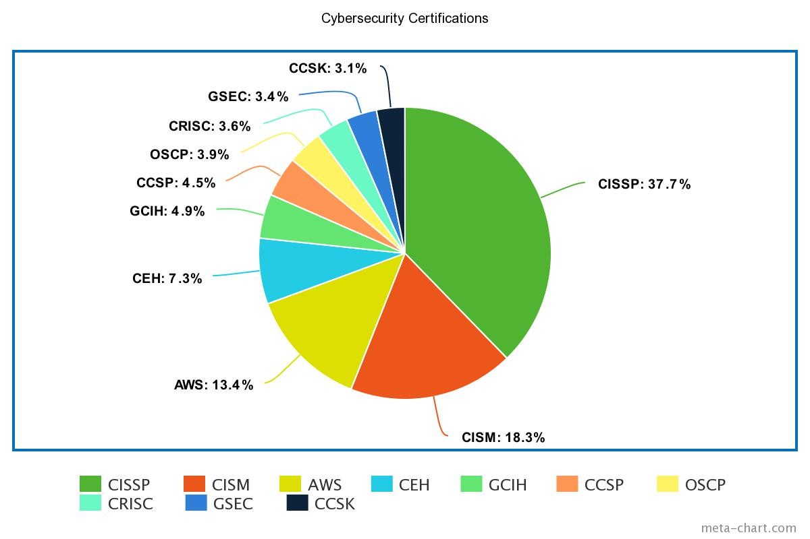
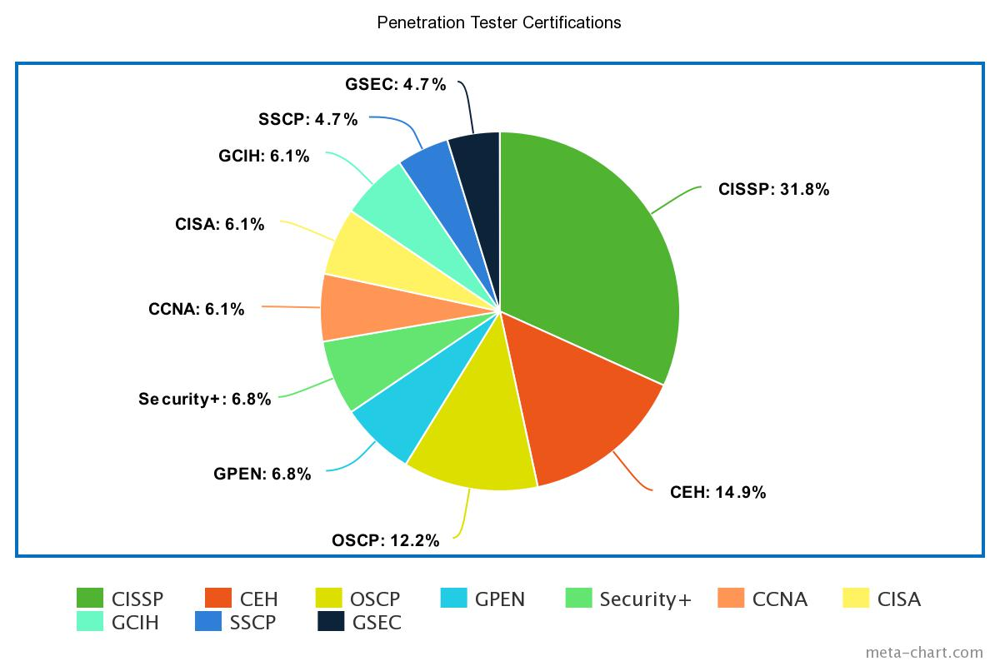

## Introduction

Cybersecurity certifications are a prominent way to develop your both your aptitude and employability. They serve as attestations by third-parties of your knowledge and competency, which signal to employers you're a qualified applicant. Some of the most commonly engaged vendors offering certifications include:

* CompTIA
* ISC2
* Microsoft
* AWS
* Cisco
* Offensive Security
* SANS Institute

However, there are many, many other offerings available that cover a whole host of subject-matter areas in cybersecurity. One of the most popularly referenced roadmaps out there is maintained by Paul Jerimy here:

_[Paul Jerimy's Certifications Roadmap](https://pauljerimy.com/security-certification-roadmap/)_

Certifications are generally distinct from "certificates", which tend to be issued by either Massive Open Online Courses (MOOCs) like EdX, Udemy, Udacity, LinkedIn Learning, etc. The latter are usually characterized as being significantly lower in cost (usually anywhere between $1 - $20 USD), issuing certificates of completion vs. having a standalone pass/fail exam credential, and significantly less impact on your employability. The most recent and popular example of this is the [Coursera-issued, Google-developed cybersecurity certificate](https://grow.google/certificates/cybersecurity/).

Other "certificate" programs may include university satellite campuses, which may provide micro- or nano- "degrees"; these generally are little better, except for potential transfer credit towards an actual undergraduate/graduate degree.

## How do I get them?

The exact process of acquiring a certification will vary between vendors. Some - such as CompTIA - issue certifications based on pass/fail multiple-choice exams that last several hours. Others - like Offensive Security - require the examinee to perform a practical application exam with a complementing mock report over the course of several days. In many cases, vendors sell accompanying training materials purchased separately from the exam vouchers. In general, certifications:

* Require anywhere between 3 to 6 months of studying, although this can vary considerably depending on the difficulty, your availability to study, and your own aptitude.
* Cost anywhere between a few hundred to a few thousand dollars USD for the exam, with even more for the accompanying study materials.
* Either never expire or must be renewed every several years to avoid expiring.
* Are proctored.

## Which ones are best?

Certifications are most impactful to your employability when they are explicitly listed on a given job listing you're applying to. In those cases, the employer is more likely to convert your application to an interview if you have one (or several) of the certifications that they list as "nice to have". Otherwise, if you have certifications that are not listed on job listing, then they merely help convey a narrative of your ongoing (re)investment into the profession; this impact, while still positive, is diminished.

Under ideal circumstances, employers would consistently list the same certifications for each respective job role. However, that's rarely (if ever) the case. Chasing after every certification out there in order to cover all of your bases is neither efficient nor a cost-effective strategy. The question then becomes:

**Which certifications are the most commonly asked for by employers?**

In March 2022, [I hastily wrote a Selenium-based python script that was designed to scrape LinkedIn jobs listings for any mentioned certifications](https://github.com/ahessmat/LinkedInfoSec). My goal was to look at the aggregate data to identify the certifications that were most frequently cited as being desirable. I updated the script - adjusting for Selenium version upgrades, enhancing performance, and providing more granular details for the user - and re-ran it to reflect changes in 2023.

> [!NOTE]
> For context, only the top 10 certifications by raw numbers were included in the creation of the graphs; percentages are relative to those top 10 (i.e. even a certification with only a few percentage points may have been named dozens of times more than those that didn't make the top 10). Data was scraped based off of the results yielded from LinkedIn based on supplied keywords and other parameters and was manually cleaned afterward; consequently, results may not reflect broader trends (i.e. non-LinkedIn sources).

### Cybersecurity jobs

_Results for "cybersecurity" jobs_

* The [Certified Information Systems Security Professional (CISSP)](https://www.isc2.org/certifications/cissp) was overwhelmingly the most requested certification across all job openings surveyed. The CISSP is a very broad, vendor-neutral certification that evaluates your knowledge of 8 distinct security domains. The exam is adaptive, with students incurring anywhere between 125 to 175 multiple choice and "advanced innovative" questions over the course of 4 hours. Importantly, the CISSP requires a minimum of five verifiable years of cummulative paid work experience in two of the eight domains (although 1 year may be waived in lieu of a college degree).
* Compared to 2022, demand for the CISM grew considerably (from 5.2% of overall jobs asking for certifications to 18.3%). By contrast, the demand for the CEH has cooled significantly (down to 7.3% from 20.8% last year).
* AWS certifications more broadly speaking collectively account for 13.4% of requested certifications; generally, cybersecurity employers did not explicitly discriminate on particular certifications amongst AWS' offerings.
* The data was inclusive of many different kinds of roles in cybersecurity, including SOC analysts, Application Security Engineers, Cybersecurity Architects, Incident responders, etc.
* More than half of all job openings surveyed did not specify any particular certifications explicitly as being desirable/preferential.

### Penetration Tester jobs

_Results for "penetration tester" jobs_

* After the CISSP, the [Offensive Security Certified Professional (OSCP)](https://www.offsec.com/courses/pen-200/) and [Certified Ethical Hacker (CEH)](https://www.eccouncil.org/train-certify/certified-ethical-hacker-ceh/) are the most in-demand certifications for penetration testers. The OSCP tests the examinees' ability to assess and exploit vulnerabilities present in systems, networks, and applications through a multi-day practical application exam and reporting process. The CEH tests examinees' knowledge more traditionally with multiple-choice question exams.

### SOC Analyst jobs

_Results for "SOC Analyst" jobs_

* After the CISSP, the ISC2's [Certified Cloud Security Professional](https://www.isc2.org/certifications/ccsp) and EC-Council's [Certified Cloud Security Engineer](https://www.eccouncil.org/train-certify/certified-cloud-security-engineer-course/) are the most in-demand certifications for SOC Analysts. Both certifications - as the names would suggest - emphasize a vendor-neutral understanding of securing cloud environments and reflect an ongoing push to migrate on-premises environments to the cloud.

### What about other roles?

I've made my **LinkedInfoSec** web-scraper open source! So you are welcome to drill into the data yourself as granularly as you'd like:

https://github.com/ahessmat/LinkedInfoSec

