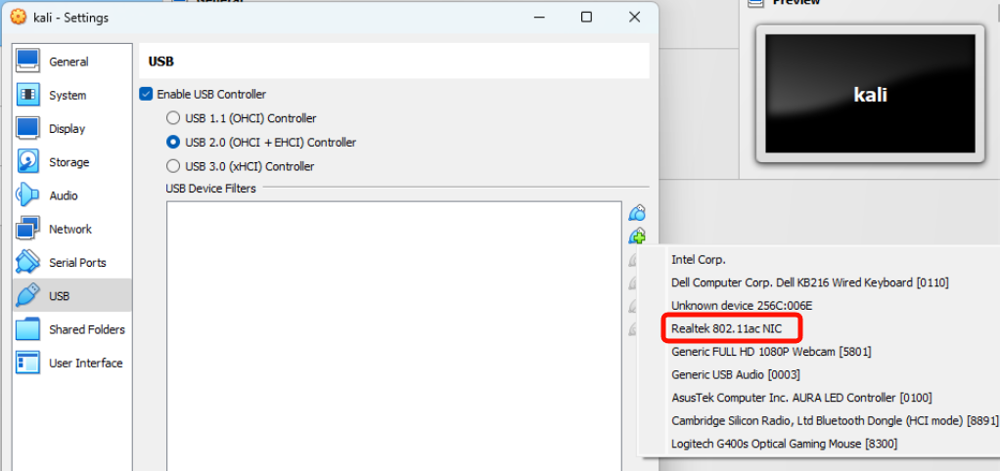
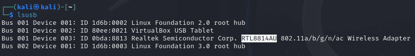

Recently, I was spurred to update my familiarity with doing some wireless attacks.

Unfortunately, my [ALFA AWUS1900 network card](https://www.amazon.com/gp/product/B01MZD7Z76/ref=ppx_yo_dt_b_search_asin_title?ie=UTF8&psc=1) wasn't immediately recognized by my Kali Linux VM; this isn't altogether uncommon - people report having compatibility issues with wireless network cards all the time. Issues can arise when trying to connect physical hardware to a virtualized machine - oftentimes tied to the device's drivers. What was irksome in my case was that this network card had worked with an earlier version of Kali Linux out-of-the-box, but was throwing errors with the *current* version (at the time of writing, Kali Linux 2024.1). Furthermore, remedial actions online appeared to be inconsistent with the issues I was facing.

So after some troubleshooting, I was able to solve my issues by performing the steps below:

First - since I was using Virtualbox as a hypervisor - I had to configure the VM to recognize the device:



After confirming that the USB device was connecting to the VM:

```bash
lsusb
```



I identified the chipset as being `RTL8814AU` and set about finding the driver update. Looking up the [device's driver support page](https://docs.alfa.com.tw/Support/Linux/RTL8814AU/#kali), we found we could get the necessary updates here:

```bash
git clone https://github.com/morrownr/8814au.git
```

Within this git repository, we are meant to run `install-driver.sh`. However, doing so was throwing the following errors:

```bash
Your kernel header files aren't properly installed.
Please consult your distro documentation or user support forums.
```

This is because - for reasons unknown to me - the linux kernel of `Kali Linux 2024.1` (6.6.9-amd64) doesn't have a `/lib/modules/6.6.9-amd64/build` file, which should point to a `/usr/src/6.6.9-amd64` directory (which likewise does not exist). Checking the `apt` repositories shows that there aren't any `linux-headers-6.6.9-amd64` entries, but there are `linux-headers-6.6.15-amd64`. So - just to keep things simple and tidy, I upgraded my kernel version.

First we run the command below to get the updated linux headers.

```bash
sudo apt install linux-headers-6.6.15-amd64
```

Then we update the kernel accordingly:

```bash
sudo apt install linux-image-6.6.15-amd64
```

This last command is necessary in order for the `uname -r` command to recognize the updated version (which matters, because `install-driver.sh` invokes that command).

After all of this, we can finally run the `install-driver.sh` file within the git repository downloaded earlier. Doing this and executing a `sudo reboot` command finally got the wireless card recognized.
