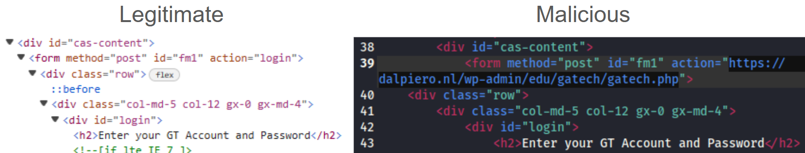
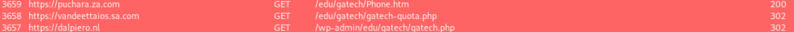
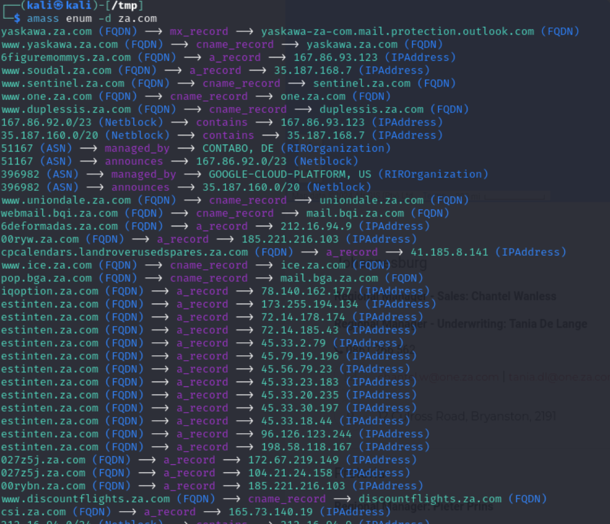
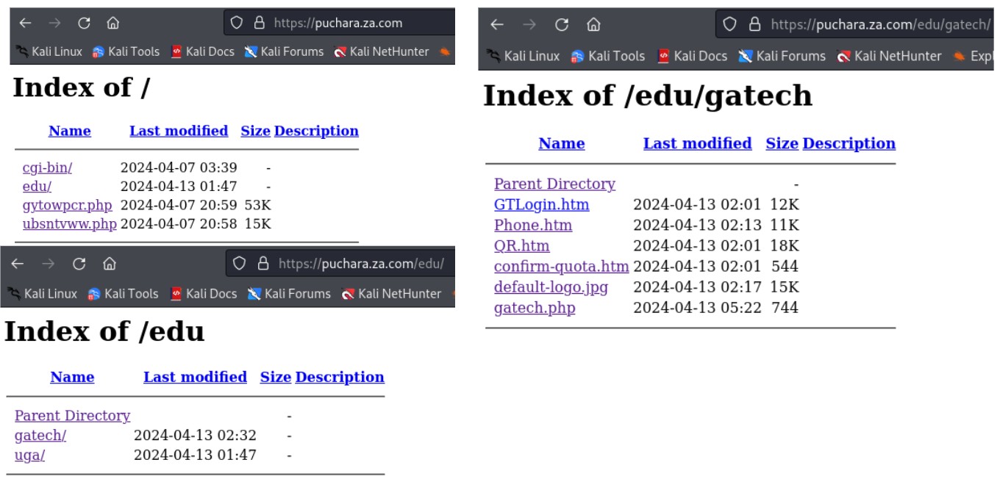

Recently, I encountered an interesting phishing atttempt that I wanted to share. Note that this phishing campaign is on-going, with students continuing to report similar instances as of writing this article. The attack against me originally took place late on Friday, 12 April 2024 and looked as such:


## Indicators

At-a-glance, the indicators to me that something was awry were:

* Alarmist language
* Non-verifiable, unspecific vagueries
* A lack of detailed information or supplemental messaging
* An Office of Information Technology (OIT) message being sent from a user (vs. their dedicated it@gatech.edu address or support@oit.gatech.edu address)
* A request to open/view an attachment (vs. a navigatable link)
* Since the message came from a student, a lack of using their Georgia Tech ID

## Looking into the email

On a lark, I started by looking into the headers belonging to the malicious email to learn some more information. My first goal was to determine whether or not the person who sent this email was themselves malicious (vs. being a victim caught along in perpetuating the phishing campaign). First, I wanted to look at the byte-by-byte characters of the sender's address to the assure that there weren't any homoglyphs being used (i.e. g00gle.com vs. google.com). It was the same, as expected. If there had been any variation from a non-gatech.edu domain, Outlook likely would have flagged it as having come from an external sender, but we want to be thorough.

The next thing I wanted to do was look at the email's headers. Email headers are additional information attached to an email message that provide details about the email's transmission and routing; they're not typically visible when reading an email from your inbox (including Outlook and Gmail), but can be accessed like so:


Below is a snippet of what such headers might look like:

```
Received: from SA1PR07MB8387.namprd07.prod.outlook.com (2603:10b6:806:1ae::24)
 by SN7PR07MB9602.namprd07.prod.outlook.com with HTTPS; Sat, 13 Apr 2024
 04:32:58 +0000
Authentication-Results: dkim=none (message not signed)
 header.d=none;dmarc=none action=none header.from=gatech.edu;
Received: from SA0PR07MB7676.namprd07.prod.outlook.com (2603:10b6:806:b6::13)
 by SA1PR07MB8387.namprd07.prod.outlook.com (2603:10b6:806:1ae::24) with
 Microsoft SMTP Server (version=TLS1_2,
 cipher=TLS_ECDHE_RSA_WITH_AES_256_GCM_SHA384) id 15.20.7409.46; Sat, 13 Apr
 2024 04:32:56 +0000
Received: from SA0PR07MB7676.namprd07.prod.outlook.com
 ([fe80::8368:1b05:e3da:fc23]) by SA0PR07MB7676.namprd07.prod.outlook.com
 ([fe80::8368:1b05:e3da:fc23%6]) with mapi id 15.20.7452.041; Sat, 13 Apr 2024
 04:32:56 +0000
Content-Type: application/ms-tnef; name="winmail.dat"
Content-Transfer-Encoding: binary
From: <---REDACTED FOR PRIVACY--->
Subject: IT-Desk: Mailbox Is Full- Incident #758558715-New-Messages May Return
Thread-Topic: IT-Desk: Mailbox Is Full- Incident #758558715-New-Messages May
 Return
Thread-Index: AQHajVt2zgR1kRgJ5UGH6ucNO8tLbQ==
Date: Sat, 13 Apr 2024 04:32:55 +0000
...SNIP...
```

We might be alarmed to see that the `Authentication-Results` shows no DKIM or DMARC checks being performed, but that's not necessarily indicative of a spoofed email (I would be alarmed if any results had come back as "FAILED", but that was not the case here). I did want to check the `Received` headers to see if the messaging had been sourced from anywhere unexpected; in brief, when you send an email the traffic is sent from your computer through to your router and on to your ISP. From there, the ISP looks for the addressee and sends it along. All along the way from submission to arrival, that traffic is being routed between many other points which are logged in the `Received` headers. There are certain headers we might expect coming from traffic between GaTech users (vs. originating from outside GaTech's mailserver network). All of the above headers checked out, so I'm pretty sure the sender of this email is themselves a victim.

My last check was to validate the student's listed ID. Georgia Tech provides a directory (https://directory.gatech.edu/) that you can use to look up students and staff. The email showed the senders full name, so it was trivial to validate that they existed (and that their email ID matched):


> [!NOTE]
> Note: The above checks don't definitively prove that the sender isn't themselves malicious, nor that the email wasn't otherwise spoofed. However, this was enough evidence to suggest to me that the sender *likely* wasn't voluntarily executing the attack, which was what I wanted to figure out. Some people have speculated that this is a coordinated research/class project (for example, **PUBP 6725** has a project deliberately designed around having students attempt to phish a TA), however - as we'll see in a bit - I don't believe that's the case.

On Sunday evening (14 April 2024), several other students began reporting seeing the same email. A few of them chose to share their emails with me to help with this research. Those emails showed similar results as above, albeit from different users across multiple departments.

## Looking into the payload

> [!WARNING]
> I should say upfront here that you should not voluntarily download and open attachments from unknown sources. This goes double for when you have reason to believe that the contents are malicious. I took precautionary mitigating measures to protect myself, my system(s), and data in the performance of my research.

At-a-glance, the attached file (`GTLogin.htm`) was a clone of the Georgia Tech login page:


However, inspecting the HTML shows a discrepancy in where the user's form data is submitted to upon hitting the "Login" button:



In essence, this is a look-a-like page designed to social engineer GaTech usernames/passwords, submitting that data to a malicious website for collection and follow-on action. To demonstrate, we can trivially spin-up a python HTTP server:

```python
from http.server import BaseHTTPRequestHandler, HTTPServer
from urllib.parse import urlparse, parse_qs

class MyServer(BaseHTTPRequestHandler):
    def do_POST(self):
        content_length = int(self.headers['Content-Length'])
        post_data = self.rfile.read(content_length)

        # Parse the POST data
        post_params = parse_qs(post_data.decode('utf-8'))

        # Here you can process the POST data as needed
        # For example, print it out:
        print("Received POST data:", post_params)

        self.send_response(200)
        self.send_header('Content-type', 'text/plain')
        self.end_headers()
        self.wfile.write(b'POST request received successfully')

def run(server_class=HTTPServer, handler_class=MyServer, port=8000):
    server_address = ('', port)
    httpd = server_class(server_address, handler_class)
    print(f'Starting server on port {port}...')
    httpd.serve_forever()

if __name__ == '__main__':
    run()
```

And edit `GTLogin.htm` to point at the server:

```html
<form method="post" id="fm1" action="http://127.0.0.1:8000">
```

_Demonstrating how the username and password of SOMEUSER:SOMEPASS is transmitted_

## Examining the server

I was curious about learning more about the malicious actor, so I thought to investigate the endpoint in greater detail.

The `*.nl` top-level domain (TLD) corresponds to sites in the Netherlands. The `dalpiero.nl` website itself appears as belonging to a Dutch chef who makes Italian food:


Some cursory OSINT also shows:

* The website appears to belong to a legitimate business
  * There's [an accompanying Facebook page](https://www.facebook.com/Dalpiero.nl/) and [instagram](https://www.instagram.com/dalpiero.nl/) that has a very long and engaged history for the business. This timeline is incongruent with the date/time stamps of the malware that we'll see later.
  * "Dal Piero" literally translates to "From Piero", the name of the business owner.
* The website is made with WordPress (although we might have inferred that by the `/wp-admin/` pathname listed in the malicious URL).
* [WHOIS records](https://www.sidn.nl/en/whois?q=dalpiero.nl) indicate that the website is registered by JoLe Web Design (JWD).
  * [JWD is ran by a single person](https://www.linkedin.com/company/jole-web-&-design/about/) who doesn't appear to have any particular relationship with GaTech.

Based on this data and the behavior of the malware/phishing attack, I think it's unlikely that this website is a front for the malicious activity. My assumption is that the website was compromised and that the malicious actor is using it to funnel the stolen usernames/passwords along. I've reached out to the business directly to notify them of the malicious activity and apparent compromise.

## Following the requests

My next step was to try and trace the requests back and see where the malicious activity was actually originating from. Using BurpSuite, it was trivial to observe the redirections:



When a user enters their credentials into the attached `GTLogin.htm` page, they submit their credentials to the `dalpiero.nl` PHP page, which redirects the request first to an intermediary `vandeettaios.sa.com` and then again over to `puchara.za.com`.

If you're not otherwise aware, the `*.sa.com` and `*.za.com` domains are owned by CentralNIC. CentralNIC creates unofficial TLDs by renting-out subdomains for others to use; it's an insecure practice for the consumer, but performing a trivial subdomain enumeration shows that plenty of businesses (both legitimate and otherwise) opt to use it:



The problem for us is that we lack the transparency afforded by registrars to see who owns `vandeettaios.sa.com` and `puchara.za.com`; officially, they're owned by the same people who own `sa.com` and `za.com`, respectively. The only people who might have any additional insights are the owners of those domains, but they've yet to respond ([and unlikely to soon](https://www.reddit.com/r/sysadmin/comments/v8u1nl/conclusions_after_manually_reviewing_spam/)). They offer [their own form of WHOIS lookups](https://www.centralnicdomains.com/services/whoisSearchPage), but it doesn't offer any insight.

> [!NOTE]
> Note: as of 15 April 2024, the routing appears to have changed. Now traffic passes from `GTLogin.htm` to `jdsuite.mx`, then `dalpiero.nl`, and then `puchara.za.com`.

Fortunately for us, the malicious actors have permitted directory listings on their pages, which allow us to view/download the contents hosted there:



Looking through the files, there's a variety of interesting things:

* The `gytowpcr.php` page appears to be some kind of login portal
* The `ubsntvww.php` page hosts an MD5 hashed key. My presumption is that this is related to `gytowpcr.php`, but I wasn't able to trivially crack the hash.

_Hash: b50b16e580ba1e49354b5b351aa8228c_

* The directories seem to explicitly be targeting GaTech; while there is a UGA directory, there's no contents in there yet. Perhaps GaTech is meant to be some kind of proof-of-concept?
* Notably, most of the files appear to be pretty new/recent based on the timestamps (some were less than an hour old from when I first received the email).

The contents of `/edu/gatech` aren't all that more interesting; they appeared to have a host of various derivative payloads/trickery designed for scraping up submitted details from students and hosted the pages/templates for what students would encounter if they were to fall for the scheme:

1. The victim receives the IT-Desk email instructing them to open the `GTLogin.htm` attachment.
2. Upon doing so, students submit their credentials to a malicious third-party, getting redirected several times until arriving at the `puchara.za.com` domain.
3. They ultimately are directed to the `QR.htm` and `confirm-quota.htm` pages, where they're made to voluntarily disclose more information (e.g. phone number, email/pass of other university accounts, etc.)
4. Finally, after submitting said form, they're redirected away back to their online Microsoft account (assuming they're still logged-in), none the wiser.

## Thoughts/Conclusions

I found it odd that all this attack chain appeared to be doing was scraping GaTech login information. It seems like a really niche objective and lacked some of the hallmarks of other online scams (notably: no requests for credit card or banking information, no social security numbers or addresses, etc.). That this phishing campaign so narrowly targets people affiliated with this university is also bizarre (i.e. why not other universities?). It also wasn't apparent to me how the attackers planned on circumventing MFA (though apparently they can, owing to the differing sources of spread).

With few exceptions, most people lose access to their GaTech email accounts in time (i.e. after graduating or otherwise separating from the university, your account is deactivated). Former students in good standing can setup Email Forwarding for Life, but that's still a limited service. As such, I'd imagine most people affiliated with the university have an alternative account that they tie other services towards (e.g. video streaming, banking, shopping, etc.), which would limit how to progress the attack. I suppose they might see to trying to perform some kind of credential-stuffing, but that seems ham-fisted, given the work that went into architecting the rest of this attack. Since students don't get to set their own user IDs, it's unlikely that they'd be using the same user ID for those other services anyway.

The attack chain also appears really brittle; the malicious URL listed in the original `GTLogin.htm` document I had became a broken link in just a few days time. As of 15 April 2024, victim traffic is routed through an alternate host (and a different PHP page on `dalpiero.nl`, with the one I originally investigated no longer existing). Put another way: if you didn't bother to check your email over the weekend and then only later fell for the first iteration of the phishing campaign, you'd probably be safe (however, I'd still rotate your password if you had). This feels quite clumsy.

While the architecture doesn't lend itself to being a de-fanged, student-lead project, I'm not quite sure what the endgame of the attackers is. Still, you should remain alert and ensure you protect yourself from possible harm, reporting the email to OIT if you encounter it.

If you'd like to share any additional insights you might have, feel free to reach out.

### Update 15 Apr 2024

Apparently, this is not the first time the OMSCS community has seen this exact phishing attack before. Someone shared a screenshot of a similar email from 2022:


