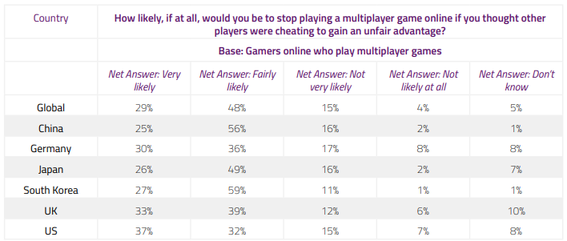
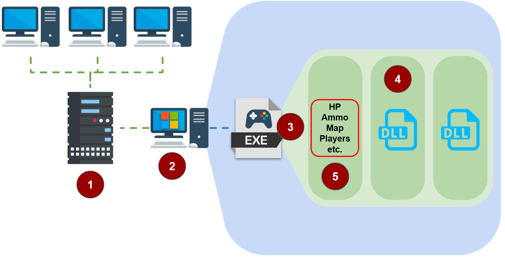
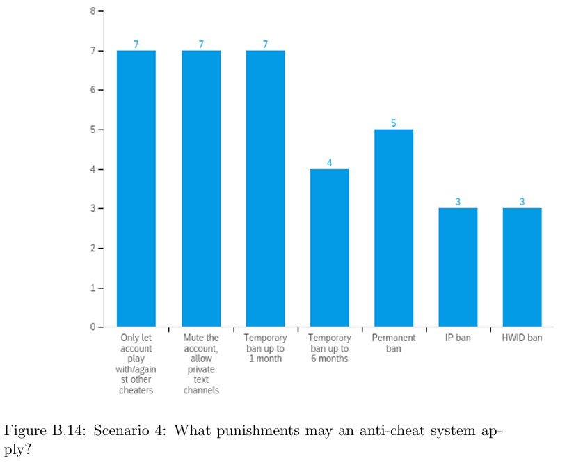

## Starting Point

I've recently become really interested in anti-cheat within video games. As someone who both works in and teaches cybersecurity, it strikes me as bearing a lot of similarities with some interesting nuances. The more I read about it, the more fascinating it sounds. In this blog post, I'm looking to capture some of my initial findings in Anti-Cheat (AC).

## Orientation

Cheating in multi-player video games is a long-standing problem that game developers have grappled with. Cheating can manifest in a variety of different ways from simply glancing-over at your opponent's side of the television in split-screen games to low-level, technologically complex memory manipulation methods to alter game state. 

Cheating has a real-world impact that extends well beyond a conferred advantage to the cheating player. Cheating - as [Irdeto's survey's have shown](https://irdeto.com/hubfs/resources/reports/global-gaming-report-2018.pdf) - has knock-on effects to the non-cheating playerbase and by extension, video game developers and studios. Non-cheating players don't like playing with cheaters, are less likely to spend money on in-game purchases (or buying the game altogether) if cheating is perceived as pervasive, and consequentially both player retention and game revenue are directly affected. [Saarinen's research](https://oulurepo.oulu.fi/bitstream/handle/10024/8796/nbnfioulu-201706022379.pdf?sequence=1&isAllowed=y) found cheating could cause a player to quit playing a game - and even a franchise - for good.

> Taken to the extreme, such behaviors lead to the tragedy of the commons: all game players become cheaters and then abandon the game, or corruption escalates and chaos ensues.
> [Blackburn, 2012](https://people.ece.ubc.ca/matei/papers/www2012.pdf)

_Source: IRDETO Global Gaming Survey: The Last Checkpoint For Cheating_

Calculating actual damages to the industry is difficult to quantify, as there is little data available to show precisely how many users have quit or been banned due to cheating; in [a lawsuit won by Blizzard Entertainment against cheat-distributor Bossland Hacks](https://www.courtlistener.com/docket/4154879/31/blizzard-entertainment-inc-v-bossland-gmbh/), the plaintiff asserted "Thousands of customers have cancelled World of Warcraft subscriptions citing bots as the reason for their cancellation" and that Blizzard had "...to spend large sums of money (and equally large amounts of time) attemping to remediate the damage...This includes creating new versions of the Blizzard games..., responding to player complaints, employing personnel to police the games to detect the use of \[cheats\], and 'banning'...users...". The sum total of the damages awarded in that case was over $8.5 million dollars.

Similar language is found in other related lawsuits, like in [Activision's win against cheat developer/distributor EngineOwning](https://www.courtlistener.com/docket/61688525/1/activision-publishing-inc-v-engineowning-ug/) ($14.5 million in damages):

> "Activision [has had] to expend substantial resources attempting to remediate the damage cause by the Cheating Software. This includes creating and releasing updates to the [Call of Duty] Games that counteract the Cheating Software, responding to player complaints, employing personnel to police the games to detect the use of the Cheating Software, and 'banning' (i.e. permanently deleting the accounts of) users who are using the Cheating Software."

Other lawsuits filed by video game studios against cheat developers point not at the damages owed from a loss of revenue from player retention, but to breaches in the Digital Millenium Copyright Act (DMCA), which prohibits the circumvention of a technological measure that effectively controls access to a copyrighted work. In [Bungie v. Aimjunkies](https://www.courtlistener.com/docket/59987462/89/1/bungie-inc-v-aimjunkiescom/), a judge arbitrated that the cheat developers - in reverse engineering and bypassing the developers obfuscation/AC software - had violated federal law ($2500 "per act of circumvention", or $255,000 in their case with a further $3,402,500 in damages for distributed sales violations).

Despite the willingness of game studios to pursue legal action against cheat vendors, there's still a healthy appetite for these cheats. According to [Collins et al](https://tomchothia.gitlab.io/Papers/AntiCheat2024.pdf), the combined revenue generation between 80 e-commerce cheat sites totalled between $12.8 million and $73.2 million annually in 2024. As of 7 May 2025, popular cheat forums like [unknowncheats.me](https://www.unknowncheats.me/forum/index.php) have active posts for some of the [most popular games](https://activeplayer.io/top-15-most-popular-pc-games-of-2022/), including Counter-Strike 2, Fortnite, and League of Legends; according to [third-party web traffic analysis](https://www.similarweb.com/website/unknowncheats.me/#overview), the forums like unknowncheats.me attract over 1.6 million visitors every month.

## How do cheaters cheat?

Let's start with describing what normal operative gameplay looks like on a PC:

1. Most multiplayer games observe the server-client model, where individual game clients connect to a common server to play together. An alternative we might see is peer-to-peer networking (common in fighting games like "Street Fighter", for example). However, [all of top 10 games in esports for the last several years](https://escharts.com/top-games?order=peak) (accounting for over 81% of all viewership) utilized client-server networking.
2. Players run their game clients on their device. Within PC games, the overwhelming majority ([over 96% at the time of writing this](https://steampowered.com/hwsurvey)) run on Windows OS; different devices and operating systems (e.g. Android, Consoles, etc.) are architected differently. The steps that follow align to a Windows-based PC client.
3. The player's game client starts up and is allocated virtual memory.
4. As a running process, dynamic link libraries (DLLs) are loaded as needed to facilitate the binary's execution, which might include things like leveraging Windows' API calls to interact with the OS and communicate back with the game server.
5. As gameplay goes on, values within the game client's memory are constantly updated to reflect the game state, including things like player health, ammunition, map layout, and locations of the player relative to other players/characters.

> [!TIP]
> Note to self: a potential area of research could look at comparing the cheat activity across device types (e.g. PC, mobile, and console). At-a-glance there doesn't appear to be much research in this area. How does mobile cheating compare to PC? To console?

Cheats of all different types work to subvert this model at every step.

* There are cheats which look to manipulate the contents of packets transferred from the client to the server. These packets may be designed either to aid the cheater (e.g. expediting leveling-up, increasing damage, etc.) or to hinder their opponents (e.g. increasing latency, denial-of-service, etc.). There are also cheats that target session handling (e.g. logging in multiple times simultaneously within the same account).
* There are cheats which make use of external hardware for direct memory access (DMA). These cheats utilize a second device to make read/write operations directly to memory without any OS supervision/interaction. This allows the device to arbitrarily change the values of the game at runtime (see 5, above).
* There are cheats which involve editing the bytes of the client binary, subverting the compiled game logic. This (operatively) is patching the game client into a different binary altogether, enabling the cheater to do things they shouldn't otherwise be able to do. There are also cheats which exploit in-game functionality or bugs, though these are typically patched-out in time.
* There are cheats which involve injecting DLLs into the game (often referred to as `internal` cheats), effectively loading arbitrary code into the running process and either change the clientside game memory values or otherwise alter the game in ways that enable the cheater to perform extraordinary feats.
* There are also cheats which leverage other software on the device to read/write to memory. These `external` cheats make use of process handles on the running game client to likewise do what `internal` cheats can, but are otherwise slower and more limited. There are also other forms of cheating - like automating user input or binding multiple keypresses to a single button - in order to simplify the rapid execution of complex, sequential commands (e.g. trivializing difficult move combos).

### "What about single-player games?"

Cheating certainly exists in single-player games, but is not nearly as problematic. Some single-player games have cheats deliberately built into them (so called "cheat codes") by the developers themselves for the players to use. Others may be [artifacts leftover from development](https://www.youtube.com/watch?v=iU6ayKVgvLQ), which had allowed developers to skip-about or focus-test particular areas of their game (Consalvo, "The Routledge Companion to Video Game Studies 2nd Edition, 2023). Unlike multi-player game cheats, which developers generally actively combat against, single-player game anti-cheat tends to be more playful and permissive:

* Banjo-Kazooie (Nintendo 64, 1998) would [delete the cheater's save file](https://www.youtube.com/watch?v=XCKyq6xMA5c) if they abused its built-in cheat mechanism.
* Metal Gear Solid: The Twin Snakes (GameCube, 2004) would [have a character directly address the cheater at a particular point in the game if it detected them using a modified controller](https://www.youtube.com/watch?v=EZPKMAUH3OE), forcing a game loss.
* The Witcher 3 (PC/Console, 2015) [summons a difficult boss monster to harass the cheater](https://www.youtube.com/watch?v=37unK-OKnzo) if it detects them abusing its in-game economy.
* Superman Returns (Console, 2006) [assigned cheaters a "Not so super" game achievement](https://www.youtube.com/watch?v=-c-VThGEoUk) (and on Xbox 360, a gamer score of 0) when they unlocked everything with a cheat code.
* Undertale (PC/Console, 2015) [had an alternate ending to the game](https://www.youtube.com/watch?v=PC1NyOIm03A), chastising the cheater if it detected them having altered its in-game memory.

Compared to multi-player games, there is less of a financial incentive for developers to consider and build-in Anti-Cheat into a single-player game. As [Lehtonen comments in their research](https://helda.helsinki.fi/server/api/core/bitstreams/89d7c14b-58e0-441f-a0de-862254f95551/content), "Cheating in single-player games is not interesting...as the effect of the cheating is only limited to the player themselves." Aside from the [psycho-social value in examining why a player might cheat in a single-player game](https://drive.google.com/file/d/1yheGUcoLi75gGCGAj6Fz29nI5NWLeJBM/view), the greater interest and body of work surrounding anti-cheat is thus more concerned with competitive multi-player games as an unsolved problem. 

> [!NOTE]
> There is a small but vocal group of single-player gamers who still do care about the use of cheats: [speed-runners](https://www.speedrun.com/). These are players who generally look to execute the game in as optimal a fashion as possible in order to hold world-record completion runs. Even so, there are some speed-runners who consider the use of in-game bug exploitation as valid (for the purposes of speed-running); such claims are based on the fact that the player is strictly using buggy functionality native to the game vs. introducing manipulation from third-party software/hardware. The competitive speed-running playerbase certainly *does* care about cheating (e.g. editing speed-run footage so as to appear faster), but - again - the impact of the cheating community within speed-runners is small and typically has little correlation with a game's revenue (and therefore doesn't incentivize developers to consider this an issue).

## Anti-Cheat

Given all of the above, Anti-Cheat (AC) has quite a few challenges to overcome. I propose splitting the problem of AC into three sections:

1. Prevention
2. Detection
3. Remediation

## Anti-Cheat: Prevention

Prevention is just as much about anti-cheat as it is game design. In this section, I highlight 2 particular forms of AC that are commonplace.

### Server-side Anti-Cheat

One of the most common forms of prevention as anti-cheat in multi-player games is to migrate as much of the game's functionality away from the client and to the server as possible. This alters the server's functionality from being a mere relay to an authority.

We suggested earlier that one vector for cheating was for a cheater to alter values within the game client's memory; a cheater could - by way of internal, external, or DMA-based cheating - alter the damage they'd ordinarily do to any arbitrary value they'd like (i.e. instead of 10, they attack for 100, 1000, etc.). In our previous multi-player game model, the server would receive that value from the game client and then apply it to the cheater's target (dealing the target that modified amount of damage).

In our new model, the player's game client wouldn't have that information present in memory; it would only communicate to the server that the player had attacked. The server then checks its own memory for the player's information/details, applies the normative damage, and then relays the update to the target game client.

There are - of course - drawbacks to this approach. 

First, this approach is more laborious on game developers. Implementing an authoritative server requires game developers not only to consciously architect client-server interactions around untrusted values, but around various permutations and presentations of those values. For example, what if the cheating client says they're attacking with a more powerful (though real) weapon than what they have? What if the cheating client says they're attacking repeatedly (many times more than what they're ordinarily assumed to do)? What if the cheating client says they're attacking a target they shouldn't be able to see? So on and so forth.

Second - though typically less problematic - is the operational overhead that this places on the server. Tracking/managing/verifying inputs from so many clients at-scale - particularly in more resource-intensive games like first-person shooters - places more onus on the server while still remaining fast.

Finally, unless the game is streamed entirely (which is being explored in efforts like Google Stadia, Xbox Cloud Gaming, Amazon Luna, etc.), there is still *some* information which resides on the game-client that can be exploited by the cheater. This form of server-side AC prevention merely checks the *correctness* of the values from the client, not how those values were produced. This still allows - for example - "aim bots", where cheaters have software automatically redirect their aim with precision at targets for optimum play (e.g. headshots).

### Proprietary Hardware

Another prevention method is the enforcement/constraint of proprietary hardware. Generally speaking, this means restricting game sales to consoles only. By preventing a multi-player game from being played on PC or Android devices, game developers limit the cheater-controlled options/expertise available. This mitigates (though does not outright prevent) cheats from spreading across the broader playerbase of a game.

## Anti-Cheat: Detection

Out of everything researched in this blog post, detection is one of the biggest and ongoing unsolved struggles within Anti-Cheat (AC). As a practice, AC developers research and evaluate how cheaters perform their cheats and update the AC to identify indicators of cheating; the cheaters - in turn - modify their cheat techniques in order to obfuscate their use of cheats and continue cheating. This arms race between cheaters and developers leads to an array of OPSEC practices similar to those exercised by anti-virus and malware developers.

The exact underpinnings of an AC are often considered proprietary trade secrets. However research, leaks. and public disclosures do offer some insights in AC trends. In our server-client model, this splits AC that can be implemented server-side and client-side.

### Server-Side AC

Server-side is where AC has maximal control. Cheaters cannot manipulate the memory of the game server (save from being the host themselves) and therefore are limited in what they can do to obscure their cheating once the data is passed from the client to the server. Examples of Server-Side AC include `VACnet`.

We can extend the prevention measures outlined earlier to include detection as well. Recall in our server-side prevention AC how all of the important details of our multi-player game are tracked/managed by an authoritative server; under this model, clients merely submit what they would *like* to do and the server determines whether that action is allowed. Naive implementation for detection here would simply be logging when a client requests to perform an action it isn't allowed to do.

However, we can (and should) do more. One of the limitations we noted in server-side cheat prevention was that the AC merely checks whether the passed values are valid, but not whether the process that produced those values was valid; it can't know that (at least, not without more information from client-side). Cheaters who read game-state from client memory can still produce cheats that give them an unfair advantage by conferring additional information that they shouldn't know (like where opponents are through obstacles) or by leveraging automation to perform actions at speeds humans can't (like instant skill shot alignment and difficult combos/dodges).

Server-side detection allows for the use of heuristics to evaluate not just whether a player's values are valid, but whether they're in-line with what we could expect a human to perform. Behavioral analysis coupled with machine learning can observe how unusual it is for a player to be reacting to fog-of-war, the time/speed/directness of sequential headshots, etc. We can even look at evaluating the player's own data against themselves (looking at sudden jumps in skill and ranking, for example).

> [!TIP]
> One interesting server-side AC example that I learned about was the [WatchDog AC](https://hypixel.fandom.com/wiki/Watchdog_Cheat_Detection) for the Minecraft Hypixel Server. In effect, the AC works by having players pursued by invisible targets; normal players won't see (and therefore won't interact with) these invisble targets. However, cheaters using cheats like `killaura` (where damage is applied to those near the cheater) and `aim bots` will. Through engaging these invisible foes, WatchDog delineates cheaters from players.

Still, server-side AC detection has its limits: the most performant players will - under behavioral analysis - look like cheaters. Their reaction times will be extraordinary, their aim better, their inputs faster, etc. Behavioral analysis can readily mark such players as false positives. Likewise, they cannot outright detect client-side cheats (just evaluate how people behave with the extra help). Finally, server-side AC detection is also resource-intensive *especially* for genres like first-person shooters (contributing to latency for all). 

### Client-Side AC

Client-side AC is another common approach used by games to detect cheating. By having AC installed on the device where the game is run, you're afforded an opportunity to collect and monitor a lot more information than you can just from server-side. Examples of client-side AC include `Battleye` ("Rainbow Six Siege"), `Vanguard` ("League of Legends"), and `Easy Anti-Cheat` ("Apex Legends").

Client-side AC tends to be more invasive in performing things like examining other running processes on the player's machine, reading DNS queries, and - increasingly - installing itself at the kernel-level (affording itself the highest levels of privilege on the machine). These capabilities allow the AC to monitor not only the game client itself, but also other outside entities that may be looking to influence/modify the game's memory. A client-side AC bears a lot of resemblance to anti-virus software insofar as how they are both designed to identify and respond to particular strands of software.

By running a client-side AC, we can potentially identify cheating software present on the device and respond accordingly.

However, client-side AC is not without its own challenges:

* Obviously, privacy advocates and security experts are leery about implicitly trusting opaque software at the kernel-level. The game "Genshin Impact" had such an AC that was exploited to allow [the mass deployment of ransomware](https://www.pcgamer.com/ransomware-abuses-genshin-impacts-kernel-mode-anti-cheat-to-bypass-antivirus-protection/); the ESEA League had an incident in 2013 where their AC was used to [deploy a bitcoin miner en masse](https://en.wikipedia.org/wiki/ESEA_League). Due to their elevated privileges, they are subject to scrutiny as [a privilege escalation vector](https://nvd.nist.gov/vuln/detail/CVE-2024-22830).
* Because it's impossible for client-side AC to predict/know every permutation of cheat-ware in existence, it's possible for it to mistakenly label/identify legitimate software as being used for cheating; alternatively, it's conceivable that software used for legitimate purposes can be re-purposed/used for cheating.
* There's also a performance hit put upon the client-side device where the AC gets installed. This can be problematic for players on lower-end hardware.

## Anti-cheat: Remediation

After mitigations and detections, there's still the matter of what to do with the discovered cheaters. This is not so straightforward a course of action as one might initially think it to be; as unilateral the stance of non-cheaters and developers are in decrying cheating, opinions differ on what to do with a caught cheater.

Non-cheating players also have more muddied stances when a cheater's actions are to their benefit. In [Kuo's research](https://par.nsf.gov/servlets/purl/10337606), they found that League of Legends players would tolerate toxic behavior from teammates they perceived as highly skilled. Likewise, [van de Ven's polling](https://cs.ru.nl/bachelors-theses/2023/Bryan_van_de_Ven___1024205___Cheating_and_anti-cheat_system_action_impacts_on_user_experience.pdf) of players showed over 53% of people would forgive or overlook a cheater who stopped another cheater from influencing their match.

By-and-large, most game studios ban the characters (if not the accounts altogether) of discovered cheaters. However, the duration and type of ban has varied from game-to-game; different communities and people within those communities interpret the function of a ban differently: is the action meant to reform a cheater into being scared straight (and therefore leniency should be applied)? Or would any kind of temporary ban be insufficient to curb such behavior?

[Paoli's research](https://mural.maynoothuniversity.ie/id/eprint/2903/1/ETIN_de_paoli_kerr_crimesandpunishment_2011.pdf) has shown that the answer is not always so clear cut: Cipsoft - the studio behind "Tibia" - initially tried to combat botters with a policy where accounts were hit with a 1 month ban followed by a 6 month probation period (during which a second offence triggered account deletion). This however was met with widespread complaints from their playerbase who believed they were effectively rewarding botters, since they could effectively both keep their spoils and "reset" their negative status by simply waiting; this resulted in players within their forums saying they needed to resort to botting themselves to keep up. Cipsoft eventually changed the probationary period to be a permanent one.

Game developers have mulled over creative applications of banning over the years, with various implementations observed:

* Runescape (PC, 2001) would ["sentence" cheaters to an in-game Botany Bay location](https://www.youtube.com/watch?v=YRqKGAMbgWU), where an in-game event would allow for a kind of kangaroo court sentencing (even allowing other players to throw rotten food at the cheater's character).
* Games like Max Payne 3 (PC/PS3/Xbox 360, 2012), Titanfall (PC/Console, 2024) and Fall Guys (PC/PS4, 2020) had dedicated cheater-only instances of their game, where detected cheaters could only play against other cheaters in a "[Cheater Pool](https://www.rockstargames.com/newswire/article/75o94113175127/the-max-payne-3-multiplayer-cheater-pool-is-live.html)"/"[Wimbledon of aimbot](https://www.rockpapershotgun.com/titanfall-cheat-detected-why-banned)"/"[Cheater Island](https://www.polygon.com/2020/9/14/21436257/fall-guys-cheater-island-big-yeetus-anti-epic-mediatonic-ultimate-knockout)"
* Call of Duty's `Ricochet` AC has over the years implemented various different punishments to impede cheater play like:
  * Rendering [all of the cheater's opponents invisible](https://www.callofduty.com/blog/2023/06/call-of-duty-ricochet-anti-cheat-season-04-update).
  * "[Quicksanding](https://www.callofduty.com/blog/2023/06/call-of-duty-ricochet-anti-cheat-season-04-update)" the cheater, making them appear to move slow.
  * Populating the cheater's game-client with [fake players](https://www.callofduty.com/blog/2023/06/call-of-duty-ricochet-anti-cheat-season-04-update).
  * [Disarming the cheater and randomly cutting out the character's parachute](https://www.callofduty.com/uk/en/blog/2024/10/call-of-duty-ricochet-anti-cheat-progress-report-black-ops-6).
* Rockstar Games - in reaction to cheaters loading an overpowered single-player vehicle into multi-player matches - would make [all of the cheater's vehicles turn into car bombs](https://wccftech.com/rockstar-deals-gta-exploiters-rockstar/), instantly killing the player.
* Pokemon Go implemented "shadowbans" on players, limiting them to [only be able to collect common collectibles](https://www.wired.com/2017/05/pokemon-go-cheaters-shadowban/) (vs. the rare/coveted ones).
* Escape From Tarkov put [in-game bounties on cheaters](https://www.escapefromtarkov.com/news/id/303), encouraging the playerbase to specifically target/harass the cheaters.
* The Steam platform utilizes the `VACnet` AC to mark player accounts with bans for cheating. Players so marked may continue playing their games, but just not on any `VACnet`-secured servers (which make up the majority). [Players can observe the ban markings of cheater accounts](https://vaclist.net/banned).

Various forms of player-based judgement have also been enacted, with the most creative being Riot Games' "Tribunal" system for League of Legends (note: the Tribunal system was discontinued in 2014). While the tribunal system was primarily geared towards disciplining toxic player behavior (vs. explicitly cheating), it marked an interesting experiment for the players to self-govern. The [initial results looked promising](https://arstechnica.com/gaming/2013/05/using-science-to-reform-toxic-player-behavior-in-league-of-legends/), but it was [fundamentally flawed in being slow and inaccurate](https://nexus.leagueoflegends.com/en-us/2018/08/ask-riot-will-tribunal-return/).

Another problem with bans - even permanent account bans - are how effective they are at resolving the problem of cheating. As Kuo points out in their work, bans only apply to the cheater's account - not the cheater. Cheaters may maintain or open multiple accounts in order to facilitate cheating (see related topic: "Smurfing"). While tracing exact numbers is challenging, [Riot Games has shown](https://cmsassets.rgpub.io/sanity/images/dsfx7636/news/216e2ae0023cb855ec5487aefa4f3ab885a45d38-1456x672.png) at least in one instance that they hardware ban at least 2000 repeat offenders *every day*.

> [!TIP]
> Note to self: there's a potential area of research here to look at the recidivism rates of cheaters. At what point is a cheater considered removed from the game?

## Conclusion

Like I said at the top: Anti-Cheat has become a real topic of fascination to me to research and explore. As some areas to explore in the future:

* I've already initiated some hands-on tutorials to better understand the low-level practice of video game cheats, starting with `Cheat Engine`.
* I'd like to try and architect my own anti-cheat solution, so as to better understand at a technical level how AC can be performed.
  * For this, there are a variety of options available to use as a sample game. Of the available options, I'm leaning towards a mix of `Team Fortress 2` (which earlier this year released the SDK for better fidelity) and custom game code.
  * As time progresses, I'll probably look to post more about this.
* It's probably in my comprehension interest to at least attempt to code-together a basic video game from scratch using one of the available popular engines.
  * For the time being, I'm leaning towards `Godot`.

