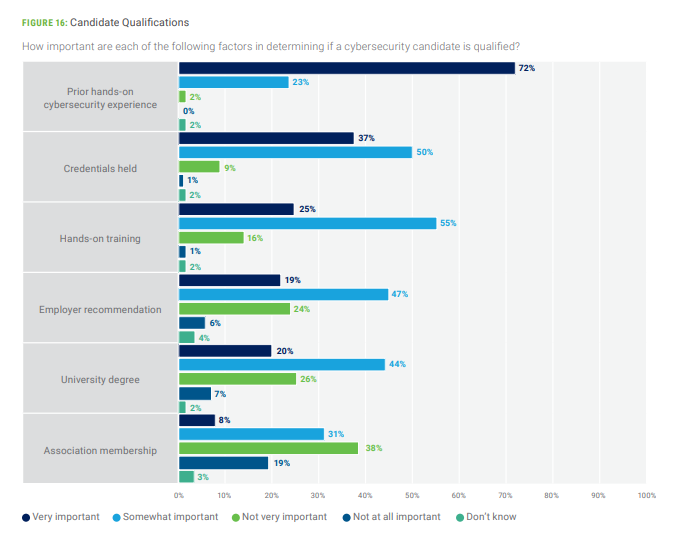

## Starting Point

At one point or another, most people looking to carve out a career in cybersecurity look to figure out whether or not they need to go to university for a degree (and if so, what kind). [According to the National Center for Science and Engineering Statistics](https://ncses.nsf.gov/760/assets/0/files/ncses-cwdi-supply-demand-report.pdf), "more than two-thirds of workers in cybersecurity fields hold a bachelor's degree or higher..."

However, pursuing a degree is a non-trivial decision, taking years to complete and - in the U.S. - [quite expensive](https://www.bestcolleges.com/research/average-student-loan-debt/#fn-3). As a result, not everyone has access to a university degree as an option. Naturally, this leads aspiring cybersecurity professionals to weigh alternate approaches. 

So what other viable options exist?

### Military Service

Military service is a tried-and-true consideration for making your way into cybersecurity as a career. In the U.S., the military training pipeline is designed such that it can take otherwise untrained, unskilled people and set them up into a cybersecurity role in a matter of weeks/months. [The U.S. Air Force purports to be able to do this in as short as 7.5 weeks](https://www.airforce.com/careers/intelligence/cyber-system-operations), for example. This approach not only provides you training and an applicable work history *directly* into cybersecurity, but also equips you with a government clearance (which can aid in attaining work with other agencies - such as the NSA - or federal contractors).

There are also a slew of benefits conferred to U.S. veterans, such as the Post-9/11 GI Bill (which cover the cost of tuition for a 4-year degree in almost every U.S. university) and the VA Home Lona (which allows prospective home buyers more affordable options for purchasing a house). Whether you opt to remain in the military for 20+ years or later choose to pivot out into the private sector, this is an option worth seriously considering.

* [Army](https://www.goarmy.com/careers-and-jobs/specialty-careers/army-cyber)
* [Navy](https://www.navy.com/careers-benefits/careers/intelligence-information-cryptology/)
* [Marine Corps](https://www.marines.com/resources/cyberspace-operations---occupational-field-17.html)
* [Air Force](https://www.airforce.com/careers/intelligence)
* [Space Force](https://www.spaceforce.com/enlisted-careers/cyber-operations)
* [National Guard](https://nationalguard.com/careers/cyber)
* [Coast Guard](https://www.gocoastguard.com/careers/enlisted/cms)

If you're interested in *enlisting* into the one of the above services, you'll need to study for the Armed Services Vocational Aptitude Battery (ASVAB) exam, which covers a range of topics including math, general sciences, language comprehension, and other areas. Each branch of service will have its own standard(s) for how well you need to perform on the exam, but all of them require you to perform quite well in order qualify for a cybersecurity role.

Unfortunately, *commissioning* into all of the service branches requires attaining a college degree, which we're not considering in this blog post. However, if you're a career-changer in possession of a different degree already, then this is also a viable route (even if your area of study is not related to cybersecurity).

Either way, you should speak with service recruiters if interested.

> [!WARNING]
> Obviously, not everyone wants (or is able) to serve in the U.S. military. Military service comes with a lot of "strings attached", so-to-speak. You should also be certain that your contract with the military assures a military occuptional specialty (MOS) aligned with cybersecurity; even still, a considerable amount of your time in the military can be expected not doing cybersecurity functions (vs. other day-to-day incidentals necessary for institutional operational functions). Moreover, serving in the military is a years-long commitment that you generally cannot back out of once you opt-in. Failing to complete your term-of-service honorably (e.g. an other-than-honorable or dishonorable discharge) can actively *hurt* your career prospects - and not just within cybersecurity. A decision to enlist/commission should not be made lightly.

### Cyber-adjacent employment

Another path that people have found success in is working first in cyber-adjacent lines of work, then specializing or otherwise pivoting into dedicated cybersecurity roles later. Examples of cyber-adjacent work includes (but isn't limited to): systems administration, network engineering, web development, software engineering, etc. Employers *strongly* prioritize a relevant work history among applicants, so cultivating work experiences in fields like Information Technology significantly improve your chances.

_2024 ISACA State of Cybersecurity Survey, employer preferences_

Moreover, [some employers have dedicated budgets set-aside for employees to tap into to further their education](https://www.investopedia.com/companies-pay-college-6829220). These kinds of funds typically incur a debt of service (i.e. a commitment to work for X years for the employer or the employee owes back some percentage of the loaned funds), with the debt forgiven once the employee has worked with them for so much time. Employers may also allow for those funds to be used for pursuing certifications, which is useful for pursuing some of the more expensive offerings out there (such as those offered by SANS).

Once you've acquired several years of experience this way, most will look to supplement their employability with things like certifications or - of course - a degree. You might also consider looking into things like CTF participation, homelabbing, and projects.

#### The Helpdesk

If you're just starting out, chances are you still might struggle to land one of the aforementioned cyber-adjacent roles; most software engineering positions require a computer science degree and are themselves quite competitive, for example. This begs the question of how you can start getting experience if you don't have experience.

More often than not, cybersecurity mentors frequently point to one particular role that you might consider: the helpdesk. In most organizations, the helpdesk technician is an IT role responsible for things like troubleshooting computer issues, installing/updating software, triaging trouble tickets, providing end-user support, maintaining operating systems, and more. Both the technical hard skills and the client-facing soft skills translate very well to an eventual career in cybersecurity.

There's plenty of other reasons why you might consider applying to the helpdesk as well:

* Most organizations have an IT department and - therefore - a helpdesk. This makes the role ubiquitous.
* Being the bottom rung on the IT hierarchy makes it a cyber-adjacent line of work with the lowest barrier of entry.
* As many seek to move up/out of the helpdesk, the position tends to experience the most churn. This makes the role more available to apply for.

Having said all that, it's important to note that it's not mandatory for anyone interested in working in cybersecurity to start at the helpdesk. It's just a common denominator for a lot of people at square zero.

> [!WARNING]
> While cyber-adjacent employment is definitely a great vehicle for fostering your employability, this is still a timetable on a scale of years (vs. months or weeks). Even then, there isn't really a guarantee of employment - there's no threshold that determines you're now qualified to apply to cybersecurity roles. This can be a really frustrating experience for folks looking to break in, especially when they've sometimes worked for 8+ years in IT already. A lot of people can get stuck in this position with a resume that reads well for yet-another cyber-adjacent position vs. a security-centric one. It's not uncommon for some people pursuing this option to invariably end up pairing their efforts with a degree-granting program eventually.

### Internal Lateral Moves

Another - though less reliable - option involves making pivots within your current employer. In this approach, you would seek to adopt more technical (and preferably security-centric) responsibilities into your existing day-to-day job. This might start with things as small as performing and logging inventories of assets to as large as drafting otherwise non-existant policy documentation for consideration/adoption, for example. The goal here is to try and create bullet-point opportunities for you to substantively add to your resume for a future move (making this option more conducive to stepping into the "cyber-adjacent" approach - mentioned above - vs. directly into cybersecurity).

Some employers will have employee-retention programs in place that are designed around supporting such moves; these kinds of programs allow for interested employees to apply to change roles from one position to another ([Google does this](https://igotanoffer.com/en/advice/google-internal-transfer), for example). This is another kind of internal move worth exploring if such a program exists for your current employer.

> [!WARNING]
> Like the other options listed above, this pursuit isn't without its own risks. Generally speaking, opportunities to internally pivot are limited and your own ability to pursue this option will be circumstantial. Even if you're able to embrace this kind of pivot, you'll still likely want to consider supplementing your employability with pursuits like a degree and certifications; if you're working in a non-cyber-adjacent field, you'll also want to look to eventually consider moving into a cyber-adjacent one.

## What else?

Interested in other ways to improve your employability? 

* Check out [this blog post](https://bytebreach.com/posts/hacking-helpers-learning-cybersecurity/) which lists a bunch of resources you can tap into to upskill and learn.
* Check out [this blog post](https://bytebreach.com/posts/what-certifications-should-you-get/) which highlights certifications you might want to consider.
