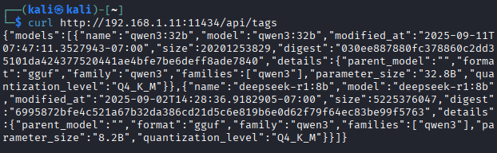
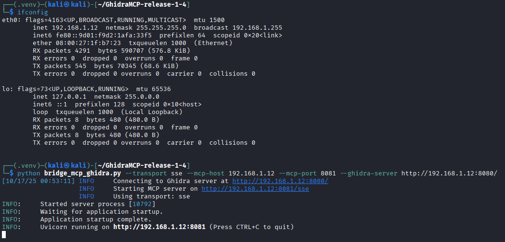
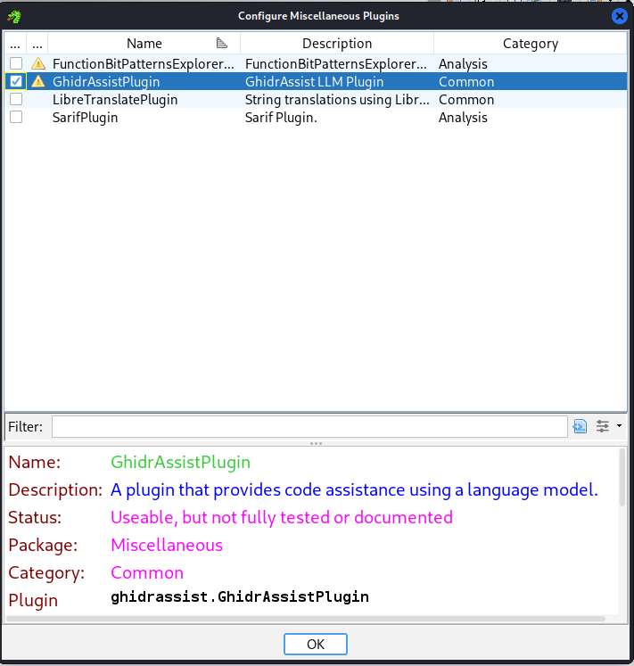
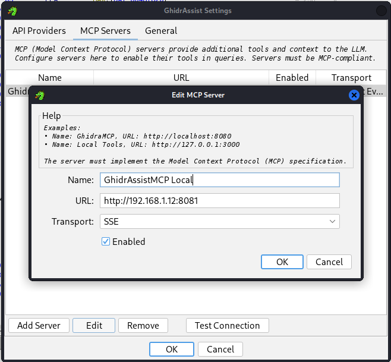
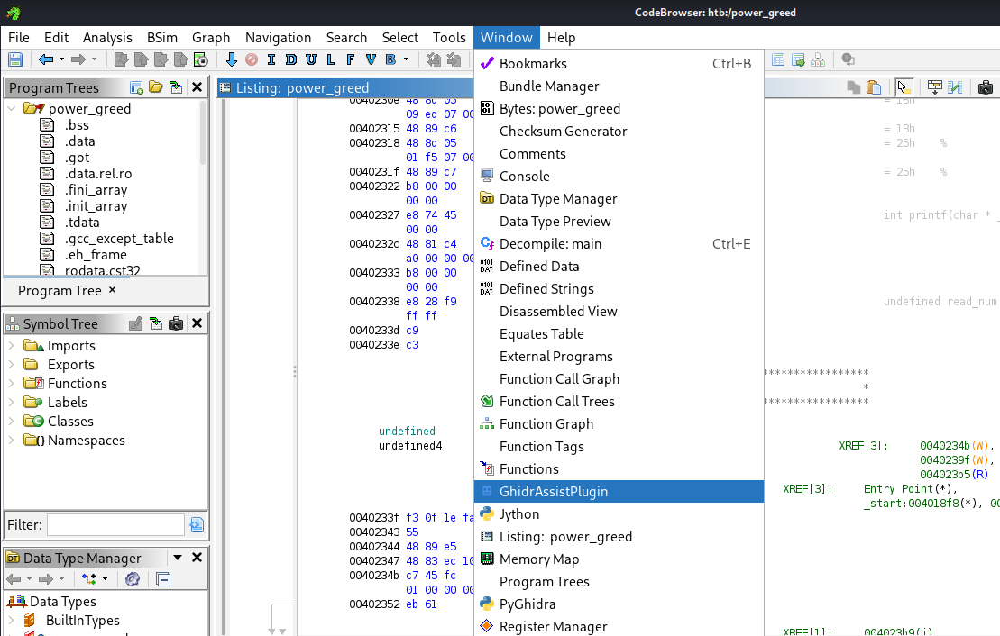

In this post, we're going to configure an environment that will support a locally-hosted LLM to aid in reverse engineering and binaries. For this, we'll be using:

* [Virtualbox](https://www.virtualbox.org/)
* [Ollama](https://ollama.com/) with a correspondingly appropriate GPU (in my case an NVIDIA GTX 3090)
* [A Kali Linux Virtual Machine](https://www.kali.org/get-kali/#kali-virtual-machines)
* [Ghidra](https://github.com/NationalSecurityAgency/ghidra)
* [GhidrAssist](https://github.com/jtang613/GhidrAssist)
* [GhidraMCP](https://github.com/LaurieWired/GhidraMCP)

# System Architecture

At a high-level, this is the architecture we're looking to build:


I'm using a Windows desktop machine with an NVIDIA GTX 3090 GPU. On this machine, I'll host a guest Kali Linux VM where all of the binary analysis will take place. To support this virtualized environment, we'll make use of the Virtualbox hypervisor. However, because Virtualbox doesn't support GPU passthrough (see my related post on the topic in building a [game anti-cheat test environment earlier in the year](https://bytebreach.com/posts/hyperv-ac-setup/)), we'll likewise need to host the local LLM directly on the host machine (vs. within Kali Linux). Within the Kali Linux VM, we'll run Ghidra to decompile our binary. Ghidra's functionality will be extended with GhidrAssist, which will let us query details about the binary against our LLM. The LLM - in turn - can make use of GhidraMCP and the MCP protocol to directly take investigative actions on the binary on our behalf.

# Host Machine Setup
First, we'll need to install Ollama. Ollama is an open-source tool that allows users to run LLMs on their own local machine vs. querying closed source models like OpenAI's chatGPT models.

> [!NOTE]
> NOTE: while our setup in this blog focuses more narrowly on using a locally-hosted LLM, the setup that follows can be trivially adjusted to use OpenAI or Anthropic models.

To do this, we simply need to [download Ollama](https://ollama.com/download) and then install it. After installation, we'll need to pick an appropriate model to install. GhidrAssist's maintainer asserts the DeepSeek-r1 models (and [DeepSeek-r1:32b specifically](https://old.reddit.com/r/ReverseEngineering/comments/1iluxm5/ghidrassist_an_llm_extension_for_ghidra_to_enable/mnspz73/)) work well for them. However, in my own testing I found that none of the DeepSeek-r1 models would support the MCP protocol.


In fact, DeepSeek-r1's lack of tool support is [a known point of friction for a lot of people](https://github.com/deepseek-ai/DeepSeek-R1/issues/9); some get it to work, but it's stability as of writing this post is questionable. Instead, I found the `qwen3:32b` model to work better. To fetch this model, open a terminal and download it using the following command:

```powershell
ollama pull qwen3:32b
```

# Guest Machine Setup
Pulling the ollama model will take some time, so while that's happening, let's get the Kali Linux VM setup. To start with, you'll need to download and install [VirtualBox](https://www.virtualbox.org/wiki/Downloads). You'll also need to pull a copy of [Kali Linux](https://www.kali.org/get-kali/#kali-virtual-machines) to get hosted by the hypervisor. Once both of these are pulled down and VirtualBox is installed, [follow these steps](https://www.kali.org/docs/virtualization/install-virtualbox-guest-vm/) to get the VM up-and-running.

Inside of the Kali Linux VM, we'll now need to install `Ghidra`, `GhidraMCP`, and `GhidrAssist`. First, we'll make sure our list of available packages is up-to-date:

```bash
sudo apt update
```

And then we'll install Ghidra:

```bash
sudo apt install ghidra
```

Following that, we'll pull the latest release from `GhidraMCP` (at the time of writing this, that'd be release 1.4):

```bash
cd ~
wget https://github.com/LaurieWired/GhidraMCP/releases/download/1.4/GhidraMCP-release-1-4.zip
unzip GhidraMCP-release-1-4.zip
```

As well as `GhidrAssist` (at the time of writing, release ghidra_11.4.2_PUBLIC_20250928):

```bash
cd ~
wget https://github.com/jtang613/GhidrAssist/releases/download/0.32.0/ghidra_11.4.2_PUBLIC_20250928_GhidrAssist.zip
unzip ghidra_11.4.2_PUBLIC_20250928_GhidrAssist.zip
```

Finally, we'll create a virtual environment with Python and download the requisite Model Context Protocol libraries:

```bash
python3 -m venv .venv
source .venv/bin/activate
pip install "mcp[cli]"
pip install requests
```

# First Contact

Now that we've got the big pieces together, let's get the LLM up and running.

On the Windows host machine, run `ipconfig` and note your IPv4 address (this will likely resemble something like `192.168.1.11`, though perhaps with a different last set of digits). You're going to need this later when setting up the MCP server on the Kali Linux machine.

Now run the following commands in a terminal like powershell:

```powershell
export OLLAMA_HOST=0.0.0.0
export OLLAMA_PORT=11434
ollama serve
```

> [!NOTE]
> Note: if you see an error like the one below, just use Task Manager to kill Ollama and then re-run the `ollama serve` command.


Back in the Kali Linux VM, we'll want to set one of the VM's network adapters to "Bridged". If powered down, we can do this through `Settings` -> `Network`. Otherwise if the VM is still powered on from earlier, then you can click on the `Devices` dropdown in the VM's top-left window, then `Network`, and then `Network Settings`. Either way you go about it, setting the network adapted to "Bridged" will assign your guest VM an IPv4 address in the same subnet as the host.

Next, we'll confirm that the VM is able to reach and communicate with the LLM. Let's issue the following command from a terminal within Kali Linux:

```bash
curl http://<WINDOWS IPv4>:11434/api/tags
```

Referencing our earlier example, we would expect a successful call to look like:



For `ollama`, the `/api/tags` endpoint lists (among other things) the available models locally loaded. If we get a response like the one above back, then we know that the VMs are networked together appropriately.

# Setting up MCP

Within the Kali Linux VM, navigate into the `GhidraMCP` directory you unzipped and run the `bridge_mcp_ghidra.py` file such that it points back at the Kali Linux guest VM:

```bash
python bridge_mcp_ghidra.py --transport sse --mcp-host KALI_LINUX_IPv4 --mcp-port 8081 --ghidra-server http://KALI_LINUX_IPv4:8080/
```



> [!NOTE]
> Note: we need to explicitly specify the Kali Linux VM IPv4 because the MCP server isn't being hosted on the same machine that's running the LLM. If we didn't (or used a more generalized 0.0.0.0 address), then the LLM wouldn't be able to directly interact with Ghidra.

# Setting up GhidrAssist

Our last step in this is getting the `GhidrAssist` plugin up-and-running. We'll start by booting-up `Ghidra` by running the following command in Kali Linux:

```bash
ghidra
```

Then we'll click on `File` and `Install Extensions`:


And after, enable `GhidraMCP` and `GhidrAssist`:


After importing a given binary into a `CodeBrowser` window, we'll need to enable it for analyzing that binary. We'll click on `File` and then `Configure`:


Then in the `Configure Tool` panel that pops up we'll select `Configure` within `Miscellaneous`:


We'll then click on the toggle box to enable `GhidrAssistPlugin`, and then `OK`:



Nearly there! Our last step is to configure the `GhidrAssist` plugin so it knows what LLM to call and where to direct the LLM when it needs to use tools to interact with Ghidra directly. We'll start by clicking on the `Tools` dropdown menu within `CodeBrowser`, and then `GhidrAssist Settings`:


After that, `Add` a new API and configure it to point to the Ollama LLM. The important settings are `Type` (OLLAMA), `Model` (matching whatever you loaded into ollama at the start, like `qwen3:32b`), `Max Tokens` (variable, depending on your GPU. I set it to 8000), and `URL` (the Windows Host IPv4 and ollama port). The `Name` and `Key` are arbitrary.

> [!NOTE]
> Note: the `Key` would matter if we were using a closed-source model, like from `OpenAI` or `Anthropic`. In those instances, we'd use the API key.

Below is an example of what this might look like:


After that, you can click on `Test` against the model to verify connectivity.

Finally, we'll click on the `MCP Servers` tab in the `GhidrAssist Settings` menu and then `Add Server` to setup the server to match what we had set in our `bridge_mcp_ghidra.py` script:



And we can likewise `Test Connection` to ensure it's working.

We can now open the `GhidrAssist` within `CodeBrowser` by clicking on the `Window` dropdown and selecting `GhidrAssistPlugin`:



# Using GhidrAssistPlugin

One of the first things you'll want to do is review the `Analysis Options` system context. This is a kind of system prompt which prefixes calls to the LLM. By default, it's pretty good. However, if you plan on using this for reviewing CTF (pwn) binaries, it may help to adjust it slightly to provide it that added context.

Beyond that, there's several other menu tabs you might consider:

* `RAG Management`
    * In case you want to enhance the context of your analysis with other documents, you can do that here! This lets you add arbitrary documents for the LLM to reference.
* `Custom Query`
    * You can consider this as being akin to a chat window directly with the LLM. It has 2 toggle options in case you want the chat to use either RAG, MCP, or both. In practice, I've found this to be a little unwieldy with locally-hosted models.
* `Actions`
    * I haven't really been able to consistently apply this. I *think* this is meant to connect with `GhidraMCP` in order to perform some typical reverse engineering initial actions (like renaming unknown functions or variables within Ghidra). In practice however, I haven't observed it do much.
* `Explain`
    * Of all the menu tabs, this one was the most useful. As you click about assembly instructions/functions in Ghidra, the current address offset updates in this panel. At any point you can take a minute to click on either `Explain Line` if you don't understand what the particular Assembly operation is doing or `Explain Function` if you want the model to tackle the bigger context.

And that's it!

This has been pretty neat to play with. Enjoy!
