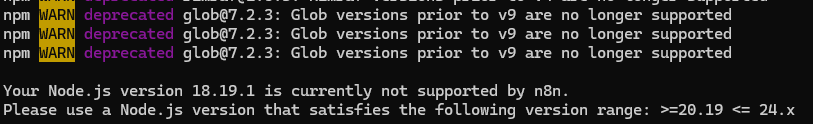
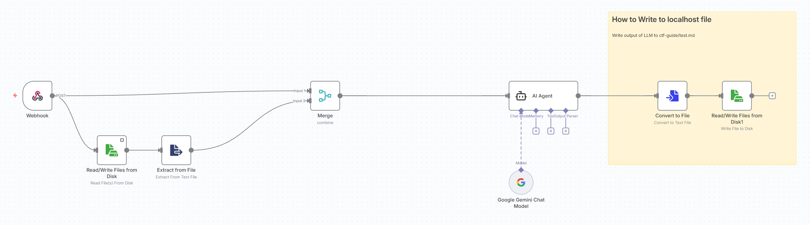
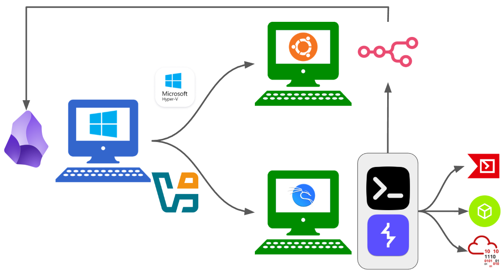

The first thing we need to do is get n8n locally installed and running. I chose to locally-host n8n for several reasons:

1. It's free and - as someone who has never used n8n before - I was leery about shelling out cash for a service I was unfamiliar with.
2. I didn't want to host it within a VM because I wanted the workflows potentially accessible by other machines (and potentially services on my own Windows host).
3. I'm not really hampered by frequent travel (or the need for constant uptime), so I don't really need to rely on a VPS provider like n8n itself or Hostinger.

To get n8n installed, we first needed to get `wsl` (Windows Sysbsystem for Linux) installed on our Windows machine. Opening a `powershell` terminal and running `wsl --install` works, as does installing it through the `Microsoft Store`. Either way, you can then use the `wsl` command to install your choice of Linux Subsystem (and as of writing this post there are a fair number available):

| NAME | FRIENDLY NAME |
|:----:|:-----:|
|AlmaLinux-8                     |AlmaLinux OS 8|
|AlmaLinux-9                     |AlmaLinux OS 9|
|AlmaLinux-Kitten-10             |AlmaLinux OS Kitten 10|
|AlmaLinux-10                    |AlmaLinux OS 10|
|Debian                          |Debian GNU/Linux|
|FedoraLinux-43                  |Fedora Linux 43|
|FedoraLinux-42                  |Fedora Linux 42|
|SUSE-Linux-Enterprise-15-SP7    |SUSE Linux Enterprise 15 SP7|
|SUSE-Linux-Enterprise-16.0      |SUSE Linux Enterprise 16.0|
|Ubuntu                          |Ubuntu|
|Ubuntu-24.04                    |Ubuntu 24.04 LTS|
|archlinux                       |Arch Linux|
|kali-linux                      |Kali Linux Rolling|
|openSUSE-Tumbleweed             |openSUSE Tumbleweed|
|openSUSE-Leap-16.0              |openSUSE Leap 16.0|
|Ubuntu-20.04                    |Ubuntu 20.04 LTS|
|Ubuntu-22.04                    |Ubuntu 22.04 LTS|
|OracleLinux_7_9                 |Oracle Linux 7.9|
|OracleLinux_8_10                |Oracle Linux 8.10|
|OracleLinux_9_5                 |Oracle Linux 9.5|
|openSUSE-Leap-15.6              |openSUSE Leap 15.6|
|SUSE-Linux-Enterprise-15-SP6    |SUSE Linux Enterprise 15 SP6|

While reaching for `kali-linux` is tempting (I'm going to want to experiment with that later), I think I'll go with `Ubuntu` instead. Running `wsl --install -d Ubuntu` will have WSL fetch the distribution and get it setup; afterwards, you'll need to reboot the Windows host machine in order to use it.


Per the install instructions on the [n8n Github repo](https://github.com/n8n-io/n8n), we can install it using `npx` (Node Package Execute, a package runner within `npm`, the `Node` package Manage). First I updated the `apt` repository listings within WSL:

```bash
sudo apt update
```

And then I install node:

```bash
sudo apt install npm`
```

I ran into a problem here, however: the version of `npm` (and by extension, Node.js) within Ubuntu's `apt` repositories did not default to the most current version of Node.js; when I tried to install n8n, I got a warning as such:



Fortunately, the fix is trivial - we simply install a version that *does* meet the requirements and use that:

```bash
cd ~
curl -o- https://raw.githubusercontent.com/nvm-sh/nvm/v0.39.7/install.sh | bash
nvm install 22
nvm use 22
```

Then - finally - we can spin-up our local n8n instance:

```bash
npx n8n
```

This spins-up a locally-hosted n8n server accessible along `http://localhost:5678`:


At this point, we just create an account and get cracking!

# A bearbones n8n proof-of-concept

The first thing I wanted to do was just connect some n8n nodes together to get a rough idea of how the service works and what I could do. Ultimately, I ended up with something that looked like this:



This workflow is crude, but at a high-level: on receiving a POST request with data (i.e. an update like the results of an `nmap` scan), the workflow would get triggered to start. The trigger prompts a file read, which reads in the current existing draft of the CTF notes (since we don't want to completely overwrite what is already discovered) and merges that information in with the new data received in the POST request. All of this data is ingested by the AI Agent node, which includes a prompt to update the information collected thus far. Finally, the output of the model is written back to the original file, overwriting what previously existed.

Some lessons learned in assembling this together:

* It was bizarrely unintuitive as to how you were meant to read/write file data to local files. I think this is because the use cases for n8n aren't really geared for local file operations (vs. interacting with a plethora of other interconnected web applications via API calls). Eventually I figured out how to extract my file data via a combination of nodes (`Read Files from Disk` + `Extract from File` to get the raw text and `Convert to File` + `Write Files from Disk` to update the markdown files).
* I'm probably not using the `AI Agent` node appropriately. It feels like there are some missing elements (like tool usage) that I'm not really taking advantage of.
* Once I got everything connected, testing with faux POST requests felt *great*. File (re)writes were happening consistently in an acceptable manner and everything operated really smoothly.

# n8n config

While it's possible to simply write to markdown files, my existing approach was pretty hack-y; I had to hard-code which file(s) to read/write to and combine several nodes together in order to achieve some basic read/write function. I wanted to be able to dynamically choose which files would be most appropriate via the POST request and for operations to be handled via an API. To help with that, I thought to use the `Local REST API` community plugin developed by Adam Coddington for Obsidian, which gives us a programmatic way to inventory our vault.

...or so I thought.

Doing this lead to learning about one of the biggest points of friction (and a lot of learning takeaways). When I set up the `Local REST API` up, I was confused because while I could access the API through my browser (i.e. `http://127.0.0.1:27124/`), I couldn't reach it from n8n. The n8n service was accessible from `http://localhost:5678`, so why couldn't it find the Obsidian API?

The key issue rested in the fact that I had launched Obsidian directly from my Windows machine while n8n had been launched from within WSL. It turns out that WSL (or in my case specifically, WSL2) [is *technically* running through Hyper-V](https://learn.microsoft.com/en-us/windows/wsl/faq), the Windows Type-1 hypervisor. This was surprising to me, since typically Virtualbox and Hyper-V can't be configured to operate simultaneously. When you invoke WSL, Hyper-V subtly configures some portforwarding rules in order to make the processes in the virtualized Linux subsysytem *appear* to be running directly from the Windows host (but - in fact - are not).

This wasn't *too* bad, since I figured I could theoretically alter the host that the `Local REST API` plugin was serving from `127.0.0.1` to `0.0.0.0`. However, that only solves communications between processes running on the Windows Machine and WSL; remember, we ultimately want this to support CTF engagements, which I typically run on a Virtualbox VM. So now this effort is connecting processes running on (3) machines: Obsidian on the Windows host, n8n on WSL, and everything else in a Kali Linux VM. Some considered solutions:

* I tried setting the VM to get assigned a Network Address within the `Bridged Adapter` "Hyper-V Virtual Ethernet Container Adapter". But that just caused the VM to crash on startup.
* [I tried configuring WSL to be issued a non-vEthernet address by configuring a `.wslconfig` file and changing the default `networkingMode`](https://learn.microsoft.com/en-us/windows/wsl/wsl-config#wslconfig). Unfortunately, WSL2 now has deprecated bridged networking and - at most - supports a `mirrored` mode which in testing didn't workout.
  * Altering WSL's `N8N_HOST` environment variable to `0.0.0.0` didn't allow even the Windows host to access n8n along any other IPv4 address other than localhost.
* I tried port forwarding traffic received along the Windows host IPv4 to localhost, but ended up disabling *any* traffic from getting routed appropriately to n8n.

## WSL network configuration

After a little more digging, it turned out I had to combine all of these things. Below are the steps I had to do:

1. With `wsl` powered-down, I navigated to `%userprofile%` (i.e. `C:\Users\<you>`) and made a `.wslconfig` file. **NOTE:** this file does *not* exist by default. The `.wslconfig` file defines `wsl` configurations to run at start-up each time. Ours will be formatted as such:

```
ini

[wsl2]
networkingMode=mirrored
```

> [!NOTE]
> NOTE: if `wsl` is active at all, you'll need to power it down completely. To list active distributions, run `wsl --list --running`; any response other than "*There are no running distributions.*" means there is still an instance up.

2. With `wsl` still powered-down, you need to adjust the Hyper-V firewall to allow traffic to reach n8n. By default, the `DefaultInboundAction` setting is configured to `Block`, preventing anything (other than the Windows machine) from reaching apps running in `wsl`. [Per Microsoft's documentation](https://learn.microsoft.com/en-us/windows/wsl/networking), you need to configure it by running the following command in an `Administrator` powershell terminal: 

```powershell
Set-NetFirewallHyperVVMSetting -Name '{40E0AC32-46A5-438A-A0B2-2B479E8F2E90}' -DefaultInboundAction Allow
```

The above can be validated by running the following powershell command:

```powershell
Get-NetFirewallHyperVVMSetting -PolicyStore ActiveStore -Name '{40E0AC32-46A5-438A-A0B2-2B479E8F2E90}'
```


3. Power-on `wsl`. Once on, check the IPv4 addresses assigned to the distribution by running `ip addr`. It should match the IPv4 addresses assigned to your Windows machine (the latter of which can be checked by running `ipconfig`).

4. Open up `~/.profile` and append `export N8N_HOST=0.0.0.0` to the end of the file. This ensures any future instances where you boot-up a `wsl` shell overrides [the default environment variable for n8n](https://docs.n8n.io/hosting/configuration/environment-variables/deployment/). The end result will look like:


5. After saving the changes, run `source ~/.profile` in order to have your current `wsl` shell enact the changes.

6. You can now start n8n by running `npx n8n start` within wsl. This serves-up n8n's webserver locally; now networked machines (like our Virtualbox Kali Linux VM with a bridged network adapter) can submit POST requests to n8n's webhooks.


The above steps will allow a Virtualbox VM networked through a bridged adapter to interact with a locally-hosted n8n instance ran via WSL.

## n8n and Obsidian

All of the above is great and all, but what about the Obsidian API?

Compared to the above, this is pretty trivial: since we're locally hosting n8n, we simply need to have an `HTTP Request` node point to `http://127.0.0.1:27123` (after enabling non-encrypted HTTP traffic for simplicity). Per [the Obsidian plugin's documentation](https://coddingtonbear.github.io/obsidian-local-rest-api/), there's a variety of API endpoints we could consider. For this workflow however, I'm just interested in 2:

* `GET /vault/{filename}`
* `PUT /vault/{filename}`

With these endpoints, we can make the workflow more modular by having our webhook parse out filenames (1 workflow, multiple challenges) and not have to make the Obsidian vault reside at a particular location on our host machine with a statically-set filepath. We can *also* account for the absence of a file (i.e. starting a new challenge and no named markdown file is present), because the `PUT` call automatically creates such a file if none is present.

# Feeding the Webhook

So with the n8n workflow provisionally configured, the next step is to figure out a way to feed it via the webhook. Since the intent is to try and have our work passively fed (as much as can be helped) to this, I came up with 2 approaches for feeding it: 1 through CLI and 1 through BurpSuite.

## CLI input

The first thing I needed was the ability to log CLI input/output. 

I had originally thought to make use of `.bash_history` (or rather, `.zsh_history` in Kali Linux), but that only includes commands that are passed through bash - and it does *not* include the output. I ended up learning about the `script` command, which is installed on `Kali Linux` by default. The `script` command records all of the bytes that are passed into and out of the shell, which allows us to effectively capture stdin/stdout; logging by default is stored to a `typescript` file where the command is invoked. Better still: by calling `script -af`, it will capture the bytes as they are written (vs. waiting for an `exit` command, terminating the `script` session, and then writing everything). Theoretically we could have multiple terminal windows `script`-ing to the same `typescript file also (though we'd need to be mindful that running commands concurrently would result in a corrupted log).

With my activity getting logged in real-time, I could simply run a python script in a while-loop monitoring the `typescript` file. Initially, I had thought to make the python script issue `POST` requests whenever it detected any changes in the `typescript` file. However, this wouldn't work for (2) reasons:

1. Commands passed to the CLI don't always resolve immediately. I'd prefer to try and pass the entire command + output together to the webhook, if possible.
2. Because `script -af` adjusts with the bytes you pass it, it will update the `typescript` file as you type; this could result in instances where the webhook would receive incomplete commands (i.e. `pytho` vs. `python3 file.py`).

As such, I made the script have timed interval checks (in seconds, set by the user at runtime) to allow commands to resolve. I also had the script check for the presence of droplines, which would help mitigate passing content to the webhook that may not be complete. Finally - to conserve LLM usage - I had the script pass only the new/updated content to the webhook (vs. the entirety of all the commands). The resulting script looks like:

```python
import os
import time
import argparse
import requests  # ensure: pip install requests

LOG_FILE = "./typescript"
BAK_FILE = "./typescript.bak"
WEBHOOK_URL = "http://N8N_WEBHOOK_URL/endpoint"


def meaningful_contents(path):
    """
    Return file contents up to the last newline.
    Trailing partial lines (e.g., typing before Enter) are ignored.
    """
    if not os.path.exists(path):
        return b""
    with open(path, "rb") as f:
        data = f.read()

    if not data:
        return b""

    last_nl = data.rfind(b"\n")
    if last_nl == -1:
        return b""
    return data[: last_nl + 1]


def send_webhook(ctf, exercise, log_chunk_text):
    """
    Send POST to the webhook with JSON payload.
    """
    payload = {
        "ctf": ctf,
        "exercise": exercise,
        "log_chunk": log_chunk_text,
    }

    try:
        resp = requests.post(WEBHOOK_URL, json=payload, timeout=5)
        print(f"[WEBHOOK] Status: {resp.status_code}")
    except Exception as e:
        print(f"[WEBHOOK] Error: {e}")


def main():
    parser = argparse.ArgumentParser(
        description="Watch the typescript file for meaningful changes and POST updates."
    )

    parser.add_argument(
        "-t",
        "--time",
        type=int,
        default=60,
        help="Interval between checks (seconds). Default: 60",
    )
    parser.add_argument(
        "-c",
        "--ctf",
        type=str,
        default=None,
        help="Name of the CTF (e.g. --ctf hackthebox)",
    )
    parser.add_argument(
        "-e",
        "--exercise",
        type=str,
        default=None,
        help="Name of the exercise/challenge (e.g. --exercise eighteen)",
    )

    args = parser.parse_args()
    interval = args.time
    ctf_name = args.ctf
    exercise_name = args.exercise

    print(f"Starting typescript watcher (interval={interval}s, ignoring partial lines)...")
    if ctf_name:
        print(f"  CTF: {ctf_name}")
    if exercise_name:
        print(f"  Exercise: {exercise_name}")

    while True:
        if not os.path.exists(LOG_FILE):
            print("typescript does not exist. NO CHANGE")
        else:
            current = meaningful_contents(LOG_FILE)
            previous = meaningful_contents(BAK_FILE)

            if current == previous:
                print("NO CHANGE")
            else:
                print("CHANGE DETECTED!")

                # Compute new appended data
                if previous and current.startswith(previous):
                    new_data = current[len(previous):]
                else:
                    new_data = current

                if new_data:
                    text = new_data.decode("utf-8", errors="replace")

                    print("=== NEW DATA SINCE LAST READ ===")
                    print(text.rstrip("\n"))
                    print("=== END NEW DATA ===")

                    # POST to webhook
                    send_webhook(ctf_name, exercise_name, text)

                # Update snapshot
                with open(BAK_FILE, "wb") as f:
                    f.write(current)

        time.sleep(interval)


if __name__ == "__main__":
    main()

```

## BurpSuite

This one was a little trickier.

The problem I had here wasn't the technical piece; Portswigger has made BurpSuite really extensible with its plugins. What was at issue here was sending *too much* data to the webhook. In a perfect world, I would pass everything that BurpSuite caught to an AI Agent for it to ingest and identify issue on-the-fly. The problem with this in practice (at least at the time of writing this) is that would be prohibitively expensive and waste an inordinate amount of resources computing along data that isn't germane.

I figured I wouldn't pass Burp Scan results to the webhook - since those are made plainly available for me to see already within the Burp UI; I wouldn't need an additional machine's review to interpret those. I also figured it was unnecessary for it to capture all of the HTTP Proxy traffic, since that would invariably log things that wouldn't matter - wasting compute. By this same logic, it *definitely* shouldn't log Intruder attempts, as that could easily balloon the amount of irrelevant data. Instead, I focused on Burp's Repeater function, which I use for more targeted request manipulation. This would cut thousands (or tens of thousands) of POST requests to the webhook down to dozens.

Even still this was too many. Relaying every single Repeater request often involved only small variations/changes in data, inevitably duplicating the bulk of the request/response that would get sent to the webhook. While I could manually toggle the plugin as being loaded/unloaded through the Extensions tab, this was more of an impediment than what it was worth. As a result, I adjusted my focus on manually trigger the webhook.

I couldn't figure out a way to put a "Send to Webhook" button directly into the Repeater interface, nor could I configure Burp's global hotkey set to do the same (Burp does allow hotkeying after opening the right-click menu and navigating into the appropriate Extensions sub-menu, but this didn't feel like good UI).

### Custom Actions

As of 2025, BurpSuite added a kind of plugin-lite -like capability to Repeater in the form of [Custom Actions](https://portswigger.net/burp/documentation/desktop/tools/repeater/http-messages/custom-actions). In brief, custom actions are scripts that run directly in Repeater to perform operations on data; some of the examples it provides out-of-the-box include performing reverse DNS lookups, retrying requests without cookies, unicode-decoding selected text, etc. The nice thing about these custom actions is that it provides a button directly in the Repeater interface to run it.


My preliminary custom action looks like so:

```java
// --- CONFIGURATION ---
String WEBHOOK_URL = "http://YOUR_N8N_WEBHOOK_HERE";
String SECRET = "NAME_OF_OBSIDIAN_FILE_TO_WRITE_TO";
int MAX_REDIRECTS = 5;
// ---------------------

// 1. SETUP INITIAL REQUEST
burp.api.montoya.http.message.requests.HttpRequest currentRequest = requestResponse.request();
burp.api.montoya.http.message.HttpRequestResponse finalResponse = null;

// 2. REDIRECT LOOP
for (int i = 0; i <= MAX_REDIRECTS; i++) {
    
    // Send the request
    finalResponse = api.http().sendRequest(currentRequest);
    
    // Check Status Code
    int status = finalResponse.response().statusCode();
    
    // If NOT a redirect (or if we hit the limit), we are done. Stop looping.
    if (status < 300 || status >= 400 || i == MAX_REDIRECTS) {
        break;
    }
    
    // If it IS a redirect, prepare the next hop
    String location = finalResponse.response().headerValue("Location");
    if (location == null) break; // Error in server response
    
    // Resolve URL (Handle relative paths like "/login")
    try {
        java.net.URI currentUri = new java.net.URI(currentRequest.url());
        java.net.URI nextUri = currentUri.resolve(location);
        String nextUrl = nextUri.toString();
        
        // Build next request (Always switch to GET for standard redirects)
        currentRequest = burp.api.montoya.http.message.requests.HttpRequest.httpRequestFromUrl(nextUrl)
                            .withMethod("GET");
                            
        // (Optional) simple cookie passing could go here, but omitted for brevity
                            
    } catch (Exception e) {
        break; // URL parsing failed
    }
}

// 3. PREPARE LOGGING PAYLOAD (Of the FINAL response)
String reqString = finalResponse.request().toString();
String resString = finalResponse.hasResponse() ? finalResponse.response().toString() : "No Response";
String url = finalResponse.request().url();

// Manual JSON escaping
reqString = reqString.replace("\\", "\\\\").replace("\"", "\\\"").replace("\n", "\\n").replace("\r", "\\r");
resString = resString.replace("\\", "\\\\").replace("\"", "\\\"").replace("\n", "\\n").replace("\r", "\\r");

String jsonPayload = "{\"url\": \"" + url + "\", \"request_raw\": \"" + reqString + "\", \"response_raw\": \"" + resString + "\", \"source\": \"Bambda Auto-Follow\"}";

// 4. PUSH TO WEBHOOK
api.http().sendRequest(
    burp.api.montoya.http.message.requests.HttpRequest.httpRequestFromUrl(WEBHOOK_URL)
        .withMethod("POST")
        .withHeader("Content-Type", "application/json")
        .withHeader("X-Burp-Challenge", SECRET)
        .withBody(jsonPayload)
);
```

# Putting It All Together

To put it all together, I made one more adjustment to the n8n workflow, ([which can reviewed in detail here, if you like](https://n8dex.com/0aZRkdkn)) in order to handle parsing inputs from BurpSuite distinctly from the CLI. When viewed as a whole, the end result of this mini-project would resemble something like below:



1. The windows machine hosts the WSL distribution (via Hyper-V) and the Kali Linux VM (via Virtualbox). It also has Obsidian running.
2. WSL stands up n8n
3. Kali Linux runs custom logging software (the Custom Actions in Repeater and the Python + script logger), logging actions performed by us as we engage and work a CTF.
4. As actions occur, an n8n webhook receives POST requests from the custom logging software.
5. The n8n workflow processes the POST request information, updating an appropriate challenge page within the Obsidian vault.

## Overengineered?

While I ultimately got this to work, I'm not sure whether this really *helps* solve CTF problems (or rather, if this is any more preferable than simply copy/pasting select outputs to a simple LLM chat interface). I *do* really like the auto-notetaking elements of this functionality, as that's something that can be a pain to do/organize; again however, I don't think this is really doing anything that a simple copy/paste couldn't likewise accomplish.

I think the real benefits that came from this exercise were simply getting more familiar with the myriad of technologies at play. Namely:

* n8n
* WSL
* Burpsuite plugins and custom actions
* Obsidian plugins

A more simplified deployment of this architecture would be to just throw everything into the Kali Linux VM from the start: n8n, obsidian, everything. That would do away with virtually all of the networking troubles I battled in this post. Moreover, I think that a more useful n8n workflow would be something that evaluated the notes I created (including screenshots, which were not included in making this workflow) and suggested various prescriptive next-steps (which this current workflow does as kind of an after-thought).

## Future Research

Some next steps I want to do would be to create something I actually *want* to utilize in support of a CTF, possibly following or building on the ideas above. I also want to explore Burp's recent AI capabilities - which may be an effective alternative. Something else I want to do is mess around further with n8n's AI agents functionality, which I believe I've only scraped the surface of, failing to include memory of tools to the node.

Until then, that's all!