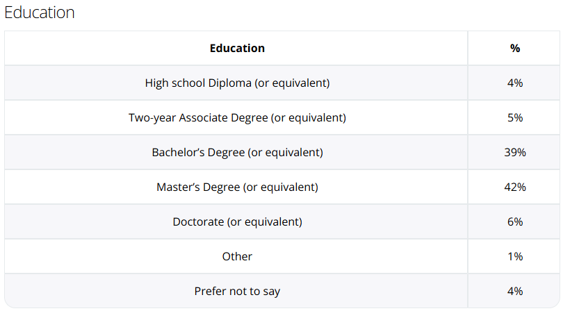
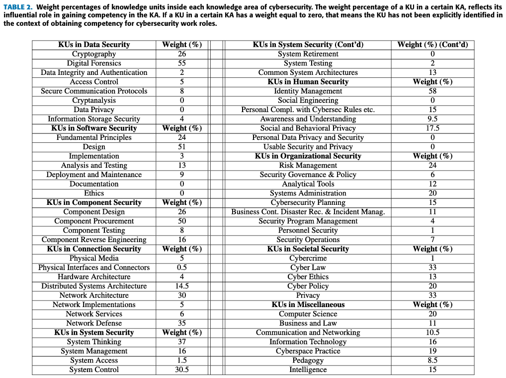

In this post, we're going to look at options to consider when pursuing a degree to support your entry into professional cybersecurity. While it's worth mentioning that [you don't necessarily need a degree in order to have a career in cybersecurity](https://bytebreach.com/posts/do-i-need-a-degree/), pursuing one significantly mitigates long-term risk to your career prospects.

## The Data

As cybersecurity becomes more-and-more professionalized, surveys show that employers are increasingly turning to a university degree as a differentiator among applicants. Per [ISACA's State of Cybersecurity 2025 report](https://www.isaca.org/state-of-cybersecurity), a majority of employers worldwide require entry-level cybersecurity professionals to have a university degree (as high as 82% in India to as low as 44% in Europe). [Research out of Northern Michigan University](https://files.eric.ed.gov/fulltext/EJ1246234.pdf), reported 60% of entry level cybersecurity jobs listings on Dice.com as requiring a college degree in a related field.

Even for jobs listings that don't explicitly prefer a degree, the pool of prospective applicants is becoming more educated; while previous decades romanticized the closeted renegade hacker going pro, data shows that there are more-and-more graduates with degrees entering the workforce than in years past (making the non-degree job-seeker's job hunting experience tougher than ever); [according to datausa.io](https://datausa.io/profile/cip/computer-information-systems-security), the number of Computer & Information Systems Security degrees awarded *per year* has more than tripled in the last decade. The [2024 US National Center for Science and Engineering Statistics evaluation of cybersecurity workforce and demand](https://ncses.nsf.gov/760/assets/0/files/ncses-cwdi-supply-demand-report.pdf), reported more than 2 out of 3 workers surveyed held a bachelors degree or higher. This marries-up with the [U.S. Office of Personnel Management's Cyber Workforce Dashboard](https://www.opm.gov/data/data-products/cyber-workforce-dashboard/), reporting roughly a combined 61% of the U.S. federal cybersecurity workforce as having at least a bachelors degree.

Even if you were fortunate enough to find work without a degree, pursuing your degree is still likely in your best interest in the long-term. Layoffs happen; a [December 2025 Cybersecurity Talent & Workforce Shortage Stats report](https://programs.com/resources/cybersecurity-talent-shortage-stats/#cybersecurity-employee-perspectives) showed 1 in 4 professionals observed lay-offs within their cybersecurity teams. [ISC2's Cybersecurity Workforce Study](https://www.isc2.org/Insights/2025/12/2025-ISC2-Cybersecurity-Workforce-Study) reflects the same.

### The Intangibles

There are - of course - any number of other benefits that come from pursuing a degree as well. A non-exhaustive list:

* `Recruitment`; many employers look to universities for early-career talent, often in the form of internships (which may later convert to full-time employment after graduation). Landing these forms of work is what enables college students to bypass working for years in cyber-adjacent lines of work.
* `A peer network`; most of your student cohort will likely go through and experience the same professional (and some personal) milestones as you age. This baked-in network is valuable to establish while you're a student.
* `Novel research opportunities`; depending on your institution, faculty may be involved with interesting and cutting-edge research. Becoming involved with their labs to co-author papers or lead presentations at conferences is a great differentiator.
* `Cross-disciplinary coursework`; at least at the undergraduate level, most institutions require their degrees to involve some number of "general education" requirements which allows for an interdisciplinary education in areas like the law, business, politics, AI, machine learning, etc. These are topics you may not be formally exposed to in the workforce otherwise.
* `A dedicated learning environment`; some people might take this for granted, but having a space and an instructor to pose questions is a huge. Compared to independently studying in-between work-shifts or other responsibilities, this is an incredible asset for learning the complicated topics that comprise cybersecurity.

## What Type of Degree?

Given the aforementioned survey results, studying up to the bachelors level is preferable. An associates degree by itself puts you behind most of your peers in the professional space while a graduate degree - with few exceptions - has reduced return-on-investment (as [less than a quarter of jobs even list a graduate degree as even "nice to have"](https://files.eric.ed.gov/fulltext/EJ1246234.pdf)). 

> [!TIP]
> **"When is a graduate degree worth considering?"**
> For most degree-holders, the priority should always be on cultivating a pertinent work history (vs. doubling-down on formal education) owing to the diminishing (though non-zero) returns. This is especially true if your undergraduate degree was in a related discipline. However, there are a handful of reasons someone might reasonably consider it:
> * If you're interested in working professionally in academia.
> * If you're aiming for a particular [payband within the US federal gov't](https://www.opm.gov/policy-data-oversight/pay-leave/pay-systems/general-schedule/).
> * If it helps with immigrating/working abroad (i.e. a stdent visa in a school resident to the country you want to eventually live in).
> * If your undergraduate degree was in an unrelated field of study and you're a career-changer.
> * If you weren't able to attain internships or otherwise foster your work history during your undergraduate studies and need the additional time to do so.
> * If you have a full-ride scholarship.

### Major Area of Study Recommendations

As cybersecurity is largely a technical discipline, you generally want to pursue similarly technical subject-matter areas including (but not limited to):

* Cybersecurity
* Computer Science
* Information Technology
* Information Assurance
* Software Engineering
* Computer Engineering

...and so on.

These kinds of programs will ensure that you are at least minimally introduced to common core concepts that are applicable to the professional domain, include access to relevant coursework, and be sufficiently academically rigorous as to prepare you for interviewing.

### Does the major matter?

In the abstract, not so much (and certainly less-and-less as your career matures after graduation); this can be offset through cultivating a pertinent work history in cyber-adjacent lines of work. So if you find yourself already enrolled in university in an unrelated discipline, it's probably more costly than its worth to defer graduation in order to change majors; under this circumstance, it may be more appropriate to pursue a graduate degree (see note in green, above).

Having said that, there are some reasons why you might want to scrutinize your choice of major - especially as a newly admitted student. Unlike more generalized academic disciplines (e.g. Computer Science), cybersecurity doesn't have a uniformly adopted "core" curricula that is unilaterally taught at the undergraduate level. 

* Some programs are spun-off of existing departments (i.e. CompSci, IT, etc.).
* Some model their curricula off of third-party vendor certifications (popularly: [Western Governors University or WGU](https://www.wgu.edu/online-it-degrees/cybersecurity-information-assurance-bachelors-program.html) and [SANS](https://www.sans.edu/cyber-security-programs/bachelors-degree/))
* Others adopt an awkward schema of dropping academically intensive coursework (e.g. mathematics and algorithm analysis) for more holistic ones (e.g. psychology, criminal justice, business, etc.). This is typical in Bachelors of Arts (BA) programs, for example.

> [!TIP]
> The point here is that dedicated "cybersecurity" degrees can have really different curricula program-to-program (let alone institution-to-institution). If you find yourself split between majors, make sure you're choosing a program because it offers something for you that's attractive (vs. avoiding a program because it's perceived as "hard"); the former serves your future, the latter devalues your tuition.

## Does where I go to school matter?

Yes and no.

Most people who ask this question frame it in terms of whether or not they'll somehow be barred from working with particular employers (e.g. Big Tech, Finance, the government, etc.) or particular roles (e.g. red teaming, SOC analysts, etc.) because they went to some low-ranked school. That's not the case: technical recruiters (with rare exceptions) do not screen applicants based on the awarding institution. Granted, more prominent universities do tend to attract recruiters from those employers to their career fairs more than smaller universities do, but that doesn't preclude you from applying.

How your choice of institution *does* matter are in the myriad of factors - both passive and active - which shape the opportunities you'll have available to you coming up and out of university. Things like faculty (who can serve not just as instructors, but also research mentors and future employer references), student clubs & organizations (which can set you up to compete at the (inter)national level in capture-the-flag events and networking affiliations), and any number of partnerships or arrangements the university might have with external vendors/employers as additional resources to you as a student. Because anyone can attain a comparable degree from *anywhere*, it's these nuances that should drive you to answer the question "why *this* university?"

