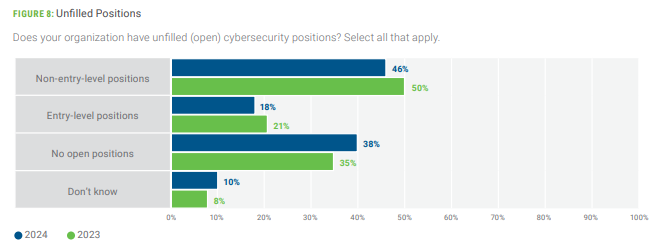
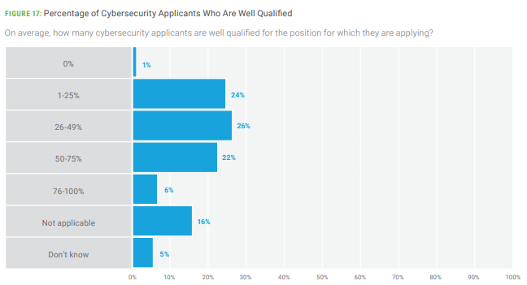

If you're interested in working in cybersecurity, you've probably seen at some point or another the plethora of articles, blogs, videos, etc. suggesting that there is a growing gap in the cybersecurity workforce. A cursory Google search turns up results like:

* [The US Bureau of Labor Statistics](https://www.bls.gov/ooh/computer-and-information-technology/information-security-analysts.htm#tab-6) reports a gap of 173,000 open positions annually and a growth in the industry of 33%.
* [The LightSail Talent Report](https://lightcast.io/resources/research/quarterly-cybersecurity-talent-report-oct-24) listed 265,000 cybersecurity workers being needed as of Q3, 2024.
* [ISC2](https://www.isc2.org/Insights/2024/09/Employers-Must-Act-Cybersecurity-Workforce-Growth-Stalls-as-Skills-Gaps-Widen) reporting a gap of 4.8 million workers globally.
* [Cyberseek](https://www.cyberseek.org/heatmap.html) shows more than 450,000 jobs unfilled nationally (US).

So while the exact figure of how many job openings there are is variable, the general sentiment is that cybersecurity at-large as a professional domain is both unsaturated and growing.

So why then are there so many people reporting difficulties job hunting? Each week, the [/r/cybersecurity subreddit](https://old.reddit.com/r/cybersecurity/) with over 1 million readers lists posts and comments of job seekers struggling to find work. [This poll](https://www.reddit.com/r/cybersecurity/comments/12viym4/amount_of_applications_sent_before_landing_a/) by Night-Knight23 showed more than 15% of non-observer respondents had submitted more than 250 job applications before landing a role; 1 in 4 non-observer respondents took more than 100 job applications. One particularly dejected individual disclosed [applying to over 1000 jobs in 10 months](https://old.reddit.com/r/cybersecurity/comments/1ff84y9/im_tired_of_applying_for_jobs_rant/) without finding work.

There's a couple of interleaving explanations that are likely contributors to these conflicting experiences:

# Experience is King

One of the most commonly parroted responses is that cybersecurity is often viewed by employers as requiring experience even for early-career roles. Each year, [ISACA prepares a State of Cybersecurity report](https://www.isaca.org/resources/reports/state-of-cybersecurity-2024) which includes - among other things - survey data from employers/hiring managers. Consistently year-over-year, employers *strongly* weigh an applicant's work experience above all else:

_Candidate Qualifications_

This generally coincides with demographic information from the 2024 report; less than 10% of workers are under the age of 35. That's just slightly more than what the [Office of Personnel Management](https://www.opm.gov/data/data-products/cyber-workforce-dashboard/) reports for the US federal gov't workforce (11.7% under 35). If we extrapolate the data to suggest that older == more experienced, then the assertion that "experience is king" might be true; put another way, an older workforce might *suggest* that more experienced workers tend to fill the open roles (though causation != correlation, there could be other factors explaining the elevated age statistic). This aligns with at least [one anonymous redditor](https://old.reddit.com/r/cybersecurity/comments/1eramou/the_problematic_perception_of_the_cybersecurity/lhxf81c/) who said:

> *As someone who hires cybersecurity professionals...(w)hen articles talking about cybersecurity jobs and the surplus, I would say its true for senior roles, not so much for junior roles...There aren't many actual "entry level" security roles because ideally the person has been in IT/networking/development for some time before getting into security.*

Generally speaking, I encourage folks interested in pursuing a career in cybersecurity to start cultivating work experiences as soon as possible for this reason. This includes internships/workstudy for students, cyber-adjacent employment (e.g. helpdesk, webdev, etc.), and/or military service.

# Types of vacancies

Most of the workforce gap surveys mentioned at the top of this blog do not provide more granular data as to what kinds of roles are opening up / left unfilled; this tends to leave the impression on the aspiring cybersecurity professional that the job *they* are envisioning is awaiting them. Subsequently, there's disappointment/disillusionment when they realize the kinds of work they thought were open to them are not.

[Cyberseek](https://www.cyberseek.org/heatmap.html) does make an effort with its heatmap to try and map out the types of openings, pointing to such categories as:

* Oversight and Governance (314k open)
* Implementation and Guidance (293k open)
* Design and Development (233k open)
* Protection and Defense (206k open)
* Cyberspace Effects (133k open)
* Investigation (16k open)
* Cyberspace Intelligence (11k open)

> [!NOTE]
> Above numbers are as of 12 Feb 2025

Cyberseek does disclose however that any single job opening can align to more than one of these categories (i.e. there are not 1.2 million unique open positions). Additionally, opening up these categories reveals certain sub-categories that job seekers might not think classically as being cybersecurity jobs (vs. cyber-adjacent). This includes instances like "Technical Support" and "Systems Administration" to "Product Support Management" and "Partner Integration Planning".

# Macroeconomic Conditions

The early-career cybersecurity job hunt has always been hard, but it's important to contextualize the labor market with relation to the broader economy. Typically organizations have viewed cybersecurity as a *cost-sink* vs. a revenue-generating asset; this - in turn - contributes to leaner budgets for cybersecurity teams for discretionary hiring budgets. When employers face economic hardship, so too does the cybersecurity job market.

From 2020-2022, we observed one of the most labor-friendly job markets in decades - denoted at the time as the so-called "[Great Resignation](https://en.wikipedia.org/wiki/Great_Resignation)". Interest rates were low, businesses were borrowing/growing fast, and one could generally jockey for better employment conditions relatively easily. Once the Fed began to raise interest rates to combat inflation, there came a cascading series of dominos that made job hunting much harder:

* [Waves of layoffs in Technology](https://layoffs.fyi/) roles flooded the job market with experienced professionals.
* The advent of LLMs as we know them popped up right at the end of this period, causing roiling changes to employment inside and out of cybersecurity still to this day.
* President Trump's administration has been making motions to shutter/close huge swathes of Federal jobs.

Below is an excellent chart tracked by the [Federal Reserve Bank of St Louise](https://fred.stlouisfed.org/series/IHLIDXUSTPITOPHE) that tracks the number of IT Operations and Helpdesk Job Postings on Indeed: 

<iframe src="https://fred.stlouisfed.org/graph/graph-landing.php?g=1DDBz&width=670&height=475" scrolling="no" frameborder="0" style="overflow:hidden; width:670px; height:525px;" allowTransparency="true" loading="lazy"></iframe>

Note how the current number of listings to date are fewer than even pre-pandemic numbers (let alone the boom we experienced from 2020-2022).

All told, the cybersecurity job market is not immune from economic recessions and bear-ish markets. So while there may be job roles that are unfilled, employers may not necessarily be in a position to actually employ people who are willing/able to fill them.

# Offshoring

Within ISC2's [2024 Cybersecurity Workforce Study](https://www.isc2.org/Insights/2024/10/ISC2-2024-Cybersecurity-Workforce-Study), there was an interesting insight made in the below graphic:

They note that the global number of cybersecurity roles grew only 0.1%, staying relatively flat. However, North America, Europe, and South America collectively lost roughly 51,000 jobs while the Middle East, Africa, and the Asia-Pacific gained roughly 65,000. 

This is backed by others polling sentiment as well. According to Karat's' latest [Tech Hiring Trends report](https://connect.karat.com/hubfs/Karat_2024_Hiring_Trends_Report.pdf), 81% of US engineering leaders say they plan to hire abroad compared to 73% last year. Meanwhile, Indian leaders reported an average hiring target up 19% year-over-year.

# No Saturation...Yet

The good news in all of this is that despite all of these issues, the myth that the professional domain is over-saturated with qualified professionals doesn't appear to be true. Despite all of the layoffs in Technology, [the unemployment rate for tech occupations is still low at 2.2%](https://archive.today/Jcd0e), which suggests most of the the workforce was reabsorbed. 

According to [eSentire's Cybersecurity Jobs report](https://www.esentire.com/resources/library/2023-official-cybersecurity-jobs-report), there are just over 94,000 CISSP holders nationwide, but more than 134,000 job openings requiring the certification; there are also just over 37,000 CISA holders nationwide, but more than 87,500 jobs advertised requesting the certification. Moreover, just because people hold those certifications doesn't mean they are actively looking for work, so the gap is likely wider than that.

Job seekers worried when seeing hundreds of applicants apply for the job they want on LinkedIn also need not be worried, [as most appear to be unqualified applicants](https://old.reddit.com/r/cybersecurity/comments/1icx6y4/struggling_to_find_a_job_with_over_600700/m9v46jl/). Most reviewers find more than 50% of applicants are not well qualified for the positions that they apply for, with most saying it takes 3-6 months to find a qualified applicant to employ for entry-level positions.

However, one thing to keep an eye on in the coming years are the number of new graduates emerging. Computer & Information Science degree graduates were already at record highs in 2022 ([there were double the number of bachelors degrees conferred compared to just five years prior](https://nces.ed.gov/programs/digest/d23/tables/dt23_325.35.asp)). We're just now starting to see signs of even greater numbers coming, largely owed to the optimism that these students had at the time of their enrollment (circa the 2020-2022 boom times). We should anticipate an increase in the number of degree-holding applicants competing for early-career roles compared to recent history.

# Takeaways

This blog isn't meant to be doom and gloom about the industry, nor is it meant to discourage aspiring cybersecurity workers from pursuing the professional domain. Rather, I just want to temper expectations and contextualize some individual experiences against the data backdrop. Cybersecurity has been - and still is - a great field to work in, offering a huge range of opportunities for you to find your niche and carve out your space. It just might take time before you find yours.
