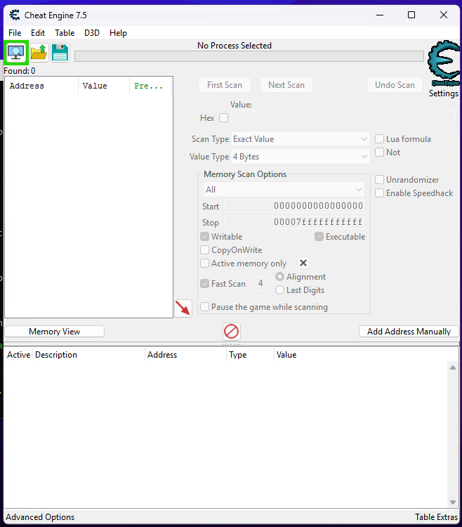
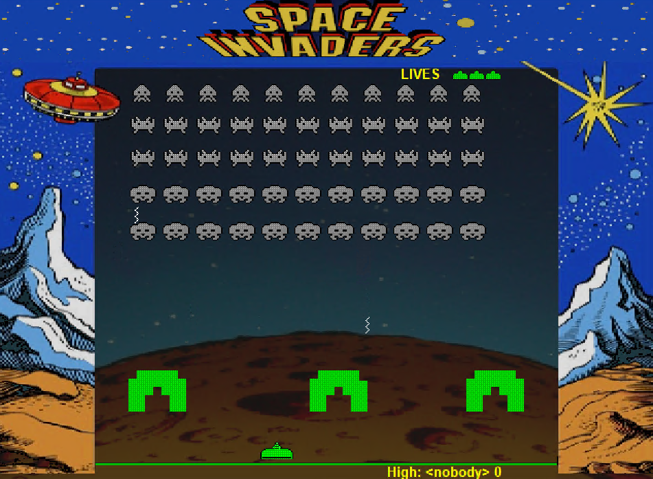
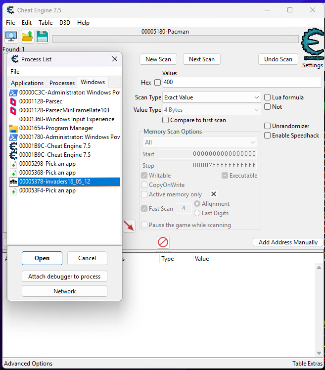
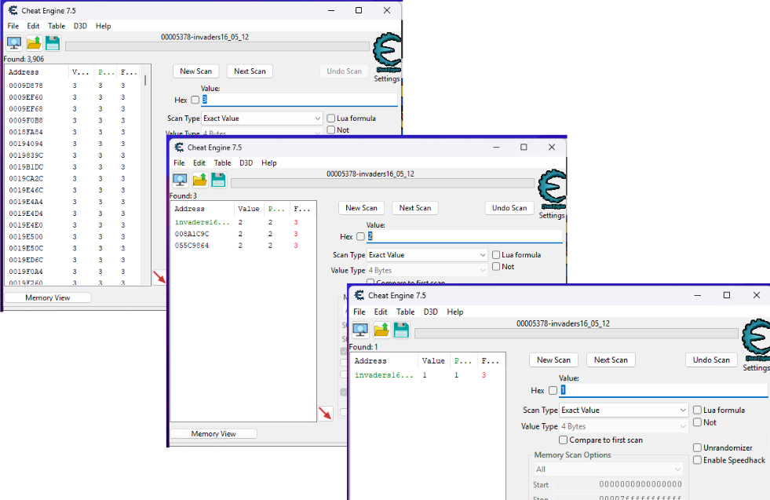
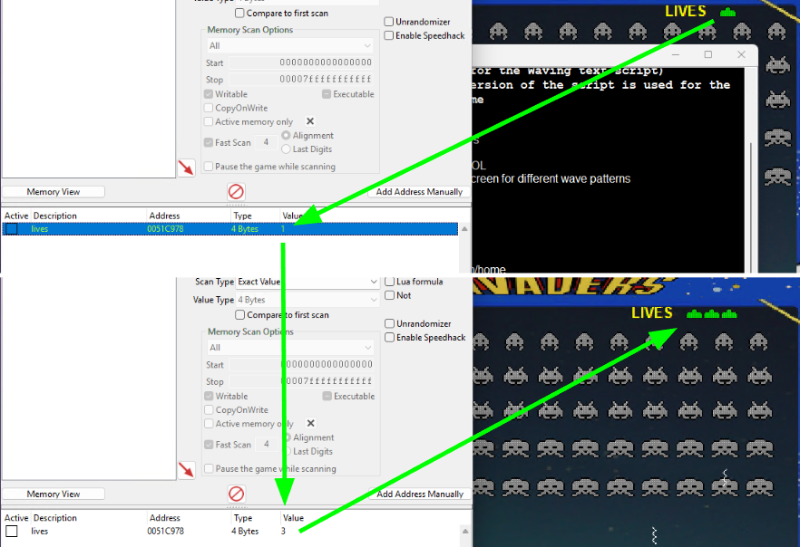
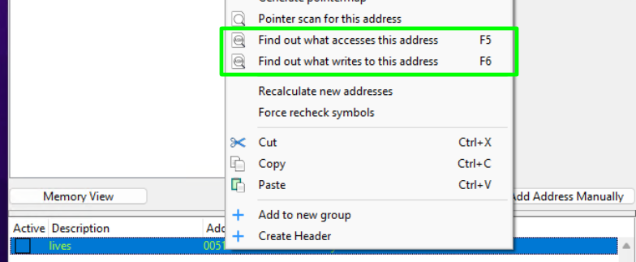
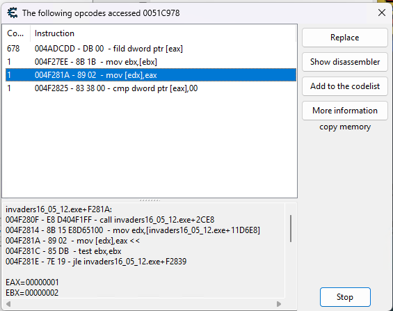

## Intro

In my ongoing efforts to better understand video game cheating and anti-cheats, I thought to chronicle my hands-on lessons learned in a series of posts; this is the first in said series.

## Setup

I don't trust cheat developers or their software. As such, I want to segregate my own host machine apart from any testing/learning environment I configure. I'm plenty comfortable managing virtual machines (VMs) in Type 2 hypervisors like `VirtualBox` or `VMware`, but unfortunately those products won't cut-it for this effort. Because a lot of interesting cheats involve working with 3D games, any virtualized environment will probably need to utilize my machine's GPU.

Previously, I had gotten around this in [my experiments with Windows' Hyper-V capability](). While this works, I don't *love* it. Setting-up Hyper-V is doable, but felt cumbersome. It also is largely incompatible with the aforementioned Type 2 hypervisors, which I use *all the time*. The one thing I really liked about it was how trivial it was to spin-up/down Windows VMs.

> [!NOTE]
> Learning/testing for PC cheats will almost always take place on a Windows OS (as [that is overwhelmingly the operating system games are spec'd to](https://store.steampowered.com/hwsurvey)).

While [experimenting with WSL to get n8n working](), I learned about [Windows Sandbox](https://learn.microsoft.com/en-us/windows/security/application-security/application-isolation/windows-sandbox/). Windows Sandbox was a feature released back in 2018 with Windows 10, providing users a safe, light, and ephemeral Windows VM purpose-built for testing unknown software. Starting Windows Sandbox is quick (only a few seconds) and - upon closing the session - the entire instance is removed from the system.

Enabling Windows Sandbox is straightforward:

1. Search for "Turn Windows features on or off" in the Start menu
2. Scroll down to find "Windows Sandbox" and check the box
3. Click OK and restart your computer when prompted

If the option appears grayed out, you may need to enable virtualization features in your system's BIOS/UEFI settings.

Paired with the [chocolatey software package manager](https://chocolatey.org/), it's pretty quick/easy to spin-up a test environment, fetch the requisite software needed, and then tear it down when I'm finished. For early stage testing, this is *perfect*. Testing showed I could leave a Windows Sandbox instance open for days at a time with WSL and Virtualbox machines running in parallel without sign of instability to any of them. The only real hang-up I had was mouse movement, but that is trivially overcome through Parsec, as I discovered [when working with the Hyper-V environment]().

> [!NOTE]
> While graphically my games work fine, [mouse movement is wildly interpreted](https://youtu.be/Sx7-o9krbuc?t=836) in the virtualized sandbox. This is because of how Windows uses RDP for its virtualized environments for enhanced quality-of-life (e.g. a shared clipboard for copy/pasting); the consequence of this is that games ran within that environment get mixed up between absolute vs. relative mouse movements, causing seemingly erratic camera swings. Parsec overcomes this through its own remote protocol; setting up an account and installing the Parsec desktop client on both my host/guest machine makes this pretty smooth sailing.

After booting-up my Windows Sandbox, I install the chocolatey package manager by running the following through `powershell` (which - on a Windows Sandbox - is an admin user by default):

```powershell
Set-ExecutionPolicy Bypass -Scope Process -Force; [System.Net.ServicePointManager]::SecurityProtocol = [System.Net.ServicePointManager]::SecurityProtocol -bor 3072; iex ((New-Object System.Net.WebClient).DownloadString('https://community.chocolatey.org/install.ps1'))
```

Then we can run my ac-setup powershell script to get the Sandbox configured. Some of the utilities within the script can take a minute to install, but commenting everything out except what's needed (cheat engine, parsec, and a game) will significantly speed things up. After that, connect to the machine through Parsec and you're up-and-running.

## Cheat Engine

`Cheat Engine` is where a lot of would-be game hackers start. It's a powerful piece of kit that helps trivialize a lot of the work that would go into reverse engineering a game dynamically. At the time of writing, `choco` has cheat engine available up to version 7.5 (the last edition that was open source).



### Memory Modifying

One of the first things you learn when using Cheat Engine is how to scan and modify memory at runtime. This is a cornerstone for cheat engine (and reverse engineering games more generally). Below are a couple resources to consider:

* This [video by GuidedHacking](https://www.youtube.com/watch?v=YaFlh2pIKAg), using `Assault Cube`
* This [text-based tutorial from Game Hacking Academy](https://gamehacking.academy/pages/1/05/), using `The Battle for Wesnoth`
* This [module available on Hack The Box Academy](https://academy.hackthebox.com/course/preview/game-hacking-fundamentals), which uses a custom version of Pacman

Any of these three will cover more/less the same content, though the third comes with a limited distribution of an ad-free version of CheatEngine 7.5.

To walkthrough the basics of this, we'll start with a basic arcade game like `Space Invaders`.

```
choco install spaceinvaders
```

> [!NOTE]
> Note: running this remake of space invaders will prompt you to install `DirectPlay`, but that's not really necessary. We can go ahead and select "Skip this installation".



We'll start this tutorial by attaching `Cheat Engine` to the running game process...



...and then starting the game. Once the game is running, we'll choose something easy for us to track first, like the number of lives we have. At the start of the game, we know we have 3 lives, so we can set Cheat Engine to do a `New Scan` with a value of 3. Doing this has Cheat Engine scan the running process' memory for all instances where a value of "3" is stored in memory. Naturally - this turns up with a lot of results, as there might be any number of other reasons a "3" is stored in a process: save state, location telemetry, textual data, etc. This is reflected in the Address table along the left-hand side of Cheat Engine

The great thing about Cheat Engine however is that it allows that information to be stored for subsequent scans. Try letting your player get hit by an alien attack (dying in the process). You'll have lost a life (from 3 to 2); update the value in Cheat Engine and run the `Next Scan`. Observe how the number of addresses has dropped because Cheat Engine checked all of the previous locations in memory that had previously stored "3" and should now store "2". Iterating on this process should eventually yield one single place in memory for us to work with.

> [!TIP]
> Note: Space Invaders is mercifully slow. It's pretty trivial for you to hide behind a wall while the process is running to stay alive. That said, we can also pause the game (`f1`) in-between our subsequent scans.



Now that we've found the address, we can `right-click` on it and `Add selected addresses to the addresslist`, below. Think of this as Cheat Engine saving this particular memory address for us (as there might be any number of values in memory we want to cheat with, as we'll see later). We can update any of the fields by double-clicking on them (e.g. setting `Description` to "lives"); let's try updating the `Value` field back to 3.



After resuming the game, we can see the number of lives is automatically updated to 3. We can mess around with this value to be arbitrary. Make it 5, 10, 100, and so on; we can set it as large as 4294967295 (the largest size for an unsigned 32-bit integer, aka "-1"). However, values any larger than about a dozen or so causes a graphical glitch.

### Memory Indexing and Pointers

Let's take this a step further. By right-clicking on the saved address, we can have a Windows debugger attach to the running process and watch for instances where the process accesses and/or writes to this memory address.



Choosing what accesses this address includes both read/write operations. Choosing what writes to this address only logs write operations. Continuing to let the game play, let's voluntarily take another hit and see what happens.


In this case we can see precisely the operation that decremented our number of lives. By contrast, below is a snapshot of what we might see if we were to watch for what *accesses* that address instead:



Now - at this stage - I don't know intrisically what's happening here, but the `mov[edx], eax` assembly operation is a kind of "store" operation, where the value currently held in the EAX register (1) is getting written to the memory address (the address we discovered earlier) pointed by the EDX register.

Why does this matter? Well, there's a lot we can eventually look to do with these things, but let's speak to them at a high level:

* First, we can use these instances to investigate and find the `entity objects` that they belong to.
  * An `object` is an instance of a `class` (i.e. you might have a `player` class that creates `player` objects). An `entity` is a particular type of said `object` (i.e. you might have my local `player` entity vs. my enemy `player` entities, all of which are objects belonging to the `player` class).
  * This is useful for quickly mapping other potentially useful memory addresses of interest to us; space invaders is a pretty basic game, but maybe we could find something like a player's speed, their ammunition, their damage values, and so on.
* We may be able to consider altering/editing the operations such that we never take damage (i.e. ignore this operation) or worse: when I take damage it actually hurts the enemies instead!

## Counterstrike 1.6

I wanted to apply what I'd learned to a game I hadn't been hand-walked through yet, but one a little closer to what I was expecting to go through: `CounterStrike 1.6`.

I downloaded a copy from [csget.me](https://csget.me/) and iterated over the above. A couple lessons learned immediately popped-out:

1. Obviously, I'm not wanting to step on other players' fun, so all of my exploitation was done locally with bots.
2. I'm a far cry from my aptitude that I once was as a teenager; so I helped myself out by enabling the `pause` function (`pausable 1`). This helped prevent bots from accidentally killing me while I was fiddling around with Cheat Engine.
3. On my first pass with the Cheat Engine, I was trying to just catch/set my health value to be arbitrary. I found however that the 4-6 addresses I scanned to didn't appear to set my health. They would either immediately be reverted (which could suggest a number of things, but I took it to mean I didn't have the true address in the process memory) or only altered the game's UI HP (vs. the actual HP of the game). After looking around online, I found that the HP value may not be constrained to just being a 4 byte value. After adjusting the Memory Scan Options to `all`, I found *many* other options.
4. Parsing through all of the values returned was insane. There are dozens upon dozens of values to check and test. My hamfisted shortcut was just to select all of the addresses and mass-set them (which worked). However, I found the last dynamic address to be the one that would set all the others.

One thing I'm left to ponder right now is what value this is whether or not this version of Counterstike uses an authoritative server. As I [explained here](), one way to counteract cheating in videogames is through the use of an authoritative server; instead of just trusting clients from dictating what they're doing is valid, clients say what they intend to do and the server validates whether the action is valid or not. Since I'm locally hosting the same server that I'm connected to as a client, I'm not sure if I'm editing a value within the client, the server, or both.

Either way, interesting!
